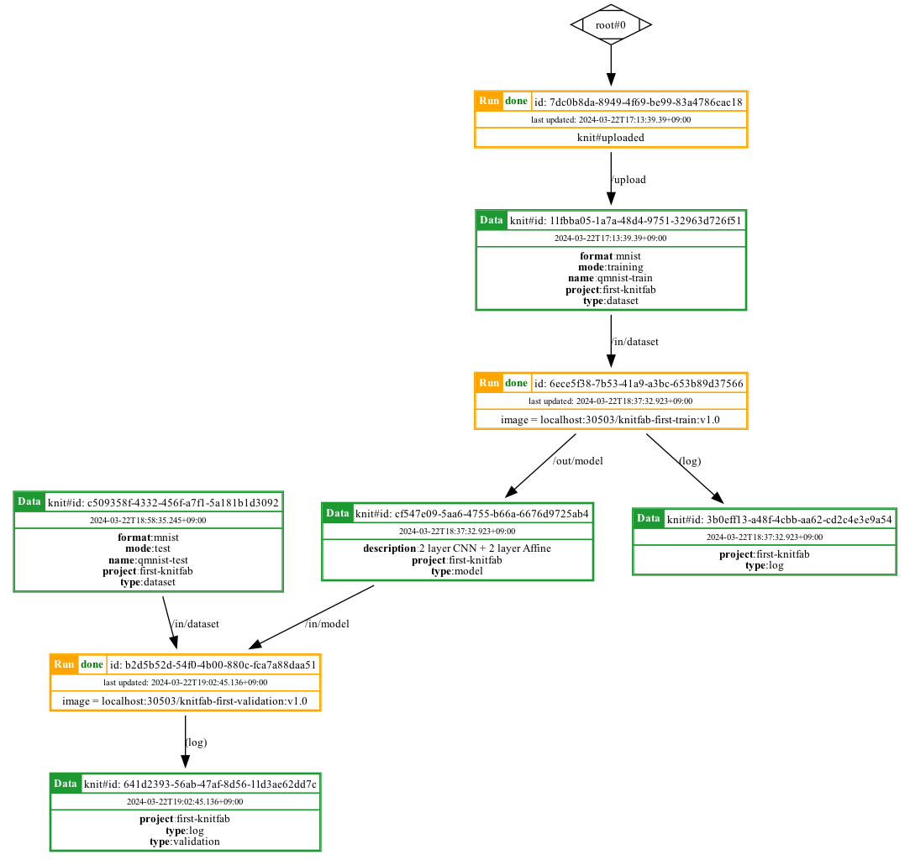

はじめに
=======

Knitfab にようこそ！

本書では、簡易的な Knitfab のインストールと、単純な機械学習タスクを題材にした Knitfab のチュートリアルを扱う。

> [!Caution]
>
> 本チュートリアルは、Apple Silicon や ARM 系の CPU を搭載しているコンピュータではうまく機能しない。

他言語版/Translations
---------------------

- en: [./getting-started.en.md](./getting-started.en.md)

Knitfab とは
------

Kntifab とは、

- タグベースワークフローエンジンをもつ
- 自動リネージ管理システム

をもった MLOps ツールだ。

ユーザが実験を *"プラン"* (後述)し、必要なデータをそろえれば、 Knitfab は自動的にその実験を実行する。
またその際に、実験ごとに入力と出力を記録して、履歴を遡れるようにする。

これによって、全実験の全履歴が有機的に関連付けられるようになる。

### コンセプト

#### Knitfab における「機械学習タスク」

Knitfab では、機械学習タスク (あるいは、プログラム) を「入力をとって、出力を与える何らかの処理」として一般化して捉える。
（以下では、この意味で「機械学習タスク」という表現を用いる。）

その実体は、kubernetes 上で実行されるコンテナである。

#### タグ

Knitfab が扱うリソースには、*"タグ"* というキー：バリュー型のメタデータをつけることができる。

タグ付けできるリソースには、"タグ" を任意の数設定できる。

#### データ

機械学習タスクに入力されたり出力されたりするものは、すべて *"データ"* である。

Knitfabでは、"データ" は「"タグ" のついたディレクトリ」だと考える。

ユーザは Knitfab に対して "データ" をアップロードしたり、既存の "データ" に "タグ" を再設定したりできる。

データの実体は、kubernetes の Persistent Volume Claim および Persistent Volume である。

#### プラン

*"プラン"* は、「どういう入力を、どういう機械学習タスクに与えて、どういう出力を得るのか」を定義したものである。

機械学習タスクは、コンテナイメージとして設定する。

入力と出力は "データ" をマウントするファイルパスであり、それぞれ "タグ" を設定できる。

入力のタグは「その入力にセットしていい "データ" 」を決めるものである。Kntifabは、そのプランの入力の "タグ" をすべて持っている "データ" を、その入力としてセットする。

出力のタグは、その出力 "データ" に自動セットされる "タグ" である。Knitfabは、そのプランを"ラン"として実行し、出力が得られたら出力タグをただちにセットする。
（出力データに別のタグを手動でセットすることはもちろん可能である。）

#### ラン

*"ラン"* は、Knitfab 内で実行する具体的な機械学習タスクである。

ランは、"プラン"の定義に従って生成される。

Knitfabは、プランの各入力（入力タグ）をチェックし、そこにセットできる "データ" が全て揃ったらランを実行する。ユーザが "ラン" を直接実行することはできない。

ランの実体は kubernetes の Job である。


Knitfab（簡易版） をローカル環境にインストールする
------

本章では、Knitfab をローカルPCなどに簡易的にインストールして、「ちょっと試してみる」ための手順を説明する。

> [!Warning]
>
> ここで紹介する方法でインストールされた Knitfab は簡易版であり、データ保存場所を kubernetes に頼っている。したがって、それを構成する kubernetes pod が再起動しただけで情報（ "データ" やリネージなど）を喪失する可能性がある。
>
> 正式に運用することを目的とするのであれば、 admin-guide に従って Kntifab を構築してほしい。

### インストールに必要な環境とツール

必要な環境は次のものである。

- 読者が自由にしてよい kubernetes クラスタ

必要なツールは次のものである。

- bash
- helm
- curl
- wget

インストーラスクリプトは bash のシェルスクリプトとして書かれている。
curl と helm はインストーラが内部的に利用する。

#### 一時的な kubernetes クラスタを作成する

実験用に、自由に作って壊せる kubernetes クラスタを構築する方法を紹介する。

たとえば、 [minikube](https://minikube.sigs.k8s.io/docs/) を利用できる。

minikube は、ローカルな kubernetes クラスタを構築するためのツールである。
すなわち、あなたが作業に使っているコンピュータ内に、kubernetes クラスタを構築する。
また、その kubernetes クラスタはあなた専用のものなので、不要になれば簡単に削除できる。

minikube を使ってクラスタを起動するには、

```
minikube start --memory 4G --container-runtime=containerd
```

のようにする。 **メモリは 4GB 程度は必要** である。それ以外は、必要に応じてオプションを調整されたい。
オプションの詳細は minikube のドキュメントを参照されたい。

### インストールする

1. インストーラを手に入れる
2. インストーラから、デフォルトの設定ファイルを生成させる
3. インストールする

#### インストーラを入手する

インストーラは https://github.com/opst/knitfab/installer/installer.sh である。

これを適当なディレクトリにダウンロードする。

```
mkdir -p ~/devel/knitfab-install
cd ~/devel/knitfab-install

wget -O installer.sh https://raw.githubusercontent.com/opst/knitfab/main/installer/installer.sh
chmod +x ./installer.sh
```

#### デフォルトの設定ファイルを生成させる

ダウンロードしたインストーラについて、

```
./installer.sh --prepare
```

を実行すると、 `./knitfab_install_settings` ディレクトリに Knitfab のインストール設定が生成される。
**この設定は「 Knitfab が管理している情報を永続化しない」ように記述されている。**
したがって、 Knitfab を構成する pod を削除・再起動すると、情報の不整合が生じたり情報が喪失したりする場合がある。
あくまで一時的な利用に留めることをおすすめする。

#### インストールする

作成したインストール設定を利用して、実際に Knitfab をインストールする。

```
./installer.sh -n ${NAMESPACE} -s ./knitfab_install_settings
```

`${NAMESPACE}` は、これから Knitfab をインストールしようとする kubernetes のネームスペースを任意に（ユーザの好みの名前を）指定する。
なお、この ${NAMESPACE} は kubernetes の名前空間となるものなので、kubernetesの仕様により、
使える文字は半角英小文字と数字、ハイフン '-' のみであり、英・数字ではじまり、英・数字で終わる文字列でなければならない。

スクリプトは順次必要なコンポーネントのインストールを進行する。
あわせて、この Knitfab に対する接続設定を含むディレクトリが `./knitfab_install_settings/handouts` に生成される。

以上がエラーなく終了すれば、インストールは完了である。

> [!Note]
>
> もし、デフォルトの kubeconfig 以外の kubeconfig が使いたいなら、`--kubeconfig` フラグで与えることができる。
>
> ```
> ./installer.sh --kubeconfig ${KUBECONFIG} -n ${NAMESPACE} -s ./knitfab_install_settings
> ```

### アンインストールする

インストーラは `./knitfab_install_settings` 内にアンインストーラ (`uninstaller.sh`) も生成する。
これを実行すればアンインストールができる。

```
./knitfab_install_settings/uninstaller.sh --hard
```

オプション `--hard` は、データベースやイメージレジストリも含めて、すべての Knitfab リソースを破棄することを意味する。


CLI ツール: knit
-----------------

Knitfab に対する操作は CLI コマンド `knit` を介して行う。
以降のチュートリアルに先立ち、 `knit` コマンドを入手する必要がある。

ツールは https://github.com/opst/knitfab/releases から入手できる。
使用する環境にあったバイナリをダウンロードしてほしい。

たとえば、

```
mkdir -p ~/.local/bin

VERSION=v1.0.0  # or release which you desired
OS=linux        # or windows, darwin
ARCH=arm64      # or amd64

wget -O ~/.local/bin/knit https://github.com/opst/knitfab/releases/download/${VERSION}/knit-${OS}-${ARCH}
chmod -x ~/.local/bin/knit

# and prepend ~/.local/bin to ${PATH}
```

チュートリアル1: Knitfab でモデルを訓練する
-------

チュートリアルとして、ごく簡単な実験についてウォークスルーしながら、Knitfab の動きを紹介する。

詳細な利用法については、 user-guide を参照されたい。

### 前提

このウォークスルーはインストール済の Knitfab にアクセスできることに加え、次のツールがあることを前提としている。適宜インストールして欲しい。

- docker
- graphviz の dot コマンド

#### docker の設定

docker の設定をおこなう。

Knitfab はクラスタ内にコンテナイメージのレジストリをデプロイする。
このレジストリはプライベートなものだ。このため、ユーザ独自のカスタムなイメージを利用した実験を行う場合でも dockerhub などに公開することなく実験を進める事ができる。

ただし、そのためには、docker コマンドに対してこのレジストリの CA 証明書を信頼させる必要がある。
詳細は docker のドキュメントを参照されたい。: https://docs.docker.com/engine/security/certificates/#understand-the-configuration

次のようにすることで、Knitfab が使っている TLS 証明書を docker が信頼するようになる。

```
cp -r /path/to/handout/docker/certs.d /etc/docker/certs.d
```

> [!Caution]
>
> この操作は、お使いのシステム上の docker の挙動に対してグローバルな影響がある。
> もしコンピュータを複数のユーザで共有しているのならば、あらかじめ他のユーザの同意を得るようにしてほしい。

> [!Note]
>
> もし dockerd を colima や minikube のような仮想環境上で実行しているなら、
> このあとの操作はその仮想環境において実施する必要がある。

### 作業ディレクトリを作成する

これから始める機械学習タスクプロジェクトのファイルを格納するディレクトリを作成して、そこに移動しよう。

任意のディレクトリでよいが、ここでは `first-knitfab-project` とする。
他の名前のディレクトリを使う場合は、これ以降の説明では適宜読み替えてほしい。

```
mkdir -p ~/devel/first-knitfab-project
cd ~/devel/first-knitfab-project
```

### knit コマンドの初期化

最初に、Knitfab への接続情報を knit cli の設定として取り込む必要がある。

> [!Note]
>
> もしあなた以外に管理者のいる kntifab に接続しようとしているなら、管理者からハンドアウトを受け取ってほしい。

Knitfab をインストールしたときに生成されたハンドアウト(`handout`)に `knitprofile` というファイルが含まれているので、これを取り込む。
次のようにする。

```
knit init /path/to/handout/knitprofile
```

これで、このディレクトリでの knit を使った作業は、このハンドアウトを生成した Knitfab に接続して実施されるようになった。

これで、Knitfab を使い始める準備ができた。

### "データ" を投入する

今回は [QMNIST](https://github.com/facebookresearch/qmnist) を利用して、ディープラーニングによる手書き数字の分類器をつくってみよう。
QMNIST は、facebookresearch による手書き数字データセットだ。MNIST という有名なデータセットがあるが、それを拡張・整理したものである。

QMNIST を Knitfab に投入するために、まずは上記 QMNIST データセットをダウンロードし、画像とラベルが組になるようにディレクトリに格納しよう。以下のように、訓練用・テスト用をそれぞれダウンロードする。

```
mkdir -p data/qmnist-train data/qmnist-test

wget -O data/qmnist-train/images.gz https://raw.githubusercontent.com/facebookresearch/qmnist/master/qmnist-train-images-idx3-ubyte.gz
wget -O data/qmnist-train/labels.gz https://raw.githubusercontent.com/facebookresearch/qmnist/master/qmnist-train-labels-idx2-int.gz

wget -O data/qmnist-test/images.gz https://raw.githubusercontent.com/facebookresearch/qmnist/master/qmnist-test-images-idx3-ubyte.gz
wget -O data/qmnist-test/labels.gz https://raw.githubusercontent.com/facebookresearch/qmnist/master/qmnist-test-labels-idx2-int.gz
```

続いて、訓練用データセットを "データ" として Knitfab にアップロードする。

```
knit data push -t format:mnist -t mode:training -t type:dataset -t project:first-knitfab -n ./data/qmnist-train
```

各オプションの意味は次の通りである。

- `-t`: "データ" に "タグ" を設定する
- `-n`: ディレクトリ名を `name:...` というキーをもった "タグ" として登録する

これによって、訓練用データセット "データ" として Knitfab に登録された。
このときコンソールに表示されるのは、登録された "データ" のメタデータである。

```json
{
    "knitId": "11fbba05-1a7a-48d4-9751-32963d726f51",
    "tags": [
        "format:mnist",
        "knit#id:11fbba05-1a7a-48d4-9751-32963d726f51",
        "knit#timestamp:2024-03-22T08:13:39.39+00:00",
        "mode:training",
        "name:qmnist-train",
        "project:first-knitfab",
        "type:dataset"
    ],
    "upstream": {
        "path": "/upload",
        "tags": [],
        "run": {
            "runId": "7dc0b8da-8949-4f69-be99-83a4786cac18",
            "status": "done",
            "updatedAt": "2024-03-22T08:13:39.39+00:00",
            "plan": {
                "planId": "4b48ceff-fbaf-4c47-b4e9-77bcc5eb8a41",
                "name": "knit#uploaded"
            }
        }
    },
    "downstreams": [],
    "nomination": []
}
```

キー `"knitId"` の値が、この "データ" を識別する ID である。また、同じ値が "タグ" `knit#id` の値としても登録されている。

### 機械学習タスクを実行するプログラムを書く

QMNIST を訓練するサンプルスクリプトが `./scripts/train.py` に用意してあるので、これを使おう。

これは、pytorch を使って書かれており、次に示す深層学習モデルを QMNIST の訓練用 "データ" で訓練するスクリプトである。

```python
class MyMnistModel(torch.nn.Module):
    def __init__(self):
        super().__init__()
        self.layers = torch.nn.Sequential(
            torch.nn.Conv2d(1, 16, kernel_size=3, padding=1),  # 1x28x28 -> 16x28x28
            torch.nn.ReLU(),
            torch.nn.Conv2d(16, 32, kernel_size=3, padding=1),  # 16x28x28 -> 32x28x28
            torch.nn.ReLU(),
            torch.nn.Flatten(),
            torch.nn.Linear(32 * 28 * 28, 1024),
            torch.nn.ReLU(),
            torch.nn.Linear(1024, 10),
        )

    def forward(self, x):
        logit = self.layers(x)
        return logit
```

これを最初の機械学習タスクとして、Knitfab 上で動かすことを目指す。

なお、この訓練スクリプトは次のような設定となっている。

- 乱数シードは `0` に固定してある。
    - 標準ライブラリ, numpy, pytorch のいずれも同様である。
- 訓練用データには 6 万件の画像:ラベル組が含まれているが、このうちランダムな 5 万件を訓練用、残りをバリデーション用に分割している。
- ミニバッチ訓練をしていて、バッチサイズは 64 である。
- また、全体で 3 エポック訓練するように設定してある。

#### ローカルで動作検証する

Knitfab で動かす前に、まずはこれを Knitfab の外で動かして、何が起きるか確認しておこう。

このチュートリアルには、この訓練スクリプトを Docker イメージとしてビルドするための Dockerfile もバンドルされている。
Docker コンテナとして動作を検証しよう。訓練スクリプト用のイメージは、次のコマンドでビルドできる。

```
docker build -t knitfab-first-train:v1.0 -f scripts/train/Dockerfile ./scripts
```

このコマンドは、`./scripts/train.py` を実行できる Docker イメージをビルドして、それに `knitfab-first-train:v1.0` という別名 (タグ) をつけている。

Dockerfile の内容は次のとおりだ。

```Dockerfile
FROM python:3.11

WORKDIR /work

RUN pip install numpy==1.26.4 && \
    pip install torch==2.2.1 --index-url https://download.pytorch.org/whl/cpu

COPY . .

ENTRYPOINT [ "python", "-u", "train.py" ]
CMD [ "--dataset", "/in/dataset", "--save-to", "/out/model" ]
```

上記では依存ライブラリをインストールし、`./train.py` を実行している。GPU 環境を想定していないので、pytorch は CPU 版を指定した。
`train.py` は 2 つのコマンドラインフラグをとっている。

- `--dataset /in/dataset` : 訓練用データセットの所在は (コンテナ内の) `/in/dataset` である
- `--save-to /out/model` : モデルパラメータを保存する先は (コンテナ内の)  `/out/model` である

したがって、この 2 つのファイルパスに対してデータセットとモデルの書き出し先とをマウントしながら起動すればよい。

```
mkdir -p ./out/model

docker run --rm -it \
    -v "$(pwd)/data/qmnist-train:/in/dataset" \
    -v "$(pwd)/out/model:/out/model" \
    knitfab-first-train:v1.0
```

ホストマシン側では `./out/model` にモデルが書き出されるように設定した。
また、コンテナ側の `/in/dataset` には、先程 QMNIST の訓練用データセットをダウンロードしたディレクトリを指定した。
次のようなログが得られれば成功である。

```
data shape:(60000, 28, 28), type: uint8
label shape:(60000,), type: uint8
**TRAINING START** Epoch: #1
Epoch: #1, Batch: #0 -- Loss: 2.3024802207946777, Accuracy: 0.046875
Epoch: #1, Batch: #100 -- Loss: 2.154975175857544, Accuracy: 0.29842202970297027
Epoch: #1, Batch: #200 -- Loss: 0.667496919631958, Accuracy: 0.5030317164179104
Epoch: #1, Batch: #300 -- Loss: 0.3974001109600067, Accuracy: 0.6195494186046512
Epoch: #1, Batch: #400 -- Loss: 0.2097681164741516, Accuracy: 0.6856296758104738
Epoch: #1, Batch: #500 -- Loss: 0.3507159948348999, Accuracy: 0.7278255988023952
Epoch: #1, Batch: #600 -- Loss: 0.18445907533168793, Accuracy: 0.7567595673876872
Epoch: #1, Batch: #700 -- Loss: 0.31259363889694214, Accuracy: 0.7791993580599144
**TRAINING RESULT** Epoch: #1 -- total Loss: 597.214958243072, Accuracy: 0.79342
**VALIDATION START** Epoch: #1
**VALIDATION RESULT** Epoch: #1 -- total Loss: 44.73237031698227, Accuracy: 0.9127
**SAVING MODEL** at Epoch: #1
**TRAINING START** Epoch: #2
...(snip)...
```

動作確認としては 1 エポックも見れば十分なので、中断(`Ctrl+C`)してしまおう。

> [!Note]
>
> ログの最初に OpenBLAS に由来する警告メッセージが表示されるかもしれないが、無視してよい。

### Knitfab に機械学習タスクを登録する

動作が確認できたら、これを使って Knitfab に機械学習タスクを任せてみよう。

これには 2 つのステップを踏む。

1. Docker イメージを Knitfab のクラスタ内イメージレジストリに登録する
2. "プラン" の定義をイメージから作成して、Knitfab に登録する

#### Docker イメージを Knitfab に登録する

先程作成した Docker イメージに、新しくタグをセットしよう。

```
docker tag knitfab-first-train:v1.0 ${YOUR_KNITFAB_NODE}:${PORT}/knitfab-first-train:v1.0
```

`${YOUR_KNITFAB_NODE}` には、使っている Knitfab クラスタを構成するノード (どれでもよい) の IP アドレスを指定してほしい。

> ノードの IP は
>
> ```
> kubectl get node -o wide
> ```
>
> などとすることで調べられる。
>

`${PORT}` はイメージレジストリのポート番号である。デフォルトでは `30503` になっているはずだ。

イメージにタグがついたなら、続いてこれをレジストリに送信する。

```
docker push ${YOUR_KNITFAB_NODE}:${PORT}/knitfab-first-train:v1.0
```

#### プラン定義をイメージから作成して、Knitfab に登録する

さて、Knitfab に対して、いま `docker push` したイメージをどう使いたいのか、ということを伝える必要がある。
このために、"プラン" の定義を作成して、それを Knitfab に送信しよう。

"プラン" 定義のひな型は `knit` コマンドを使って生成できる。

```
docker save ${YOUR_KNITFAB_NODE}:${PORT}/knitfab-first-train:v1.0 | \
    knit plan template > ./knitfab-first-train.v1.0.plan.yaml
```

> [!Note]
>
> イメージが少々大きい (1GB+) ので、しばらく時間がかかる。

`knit plan template` コマンドが Docker イメージを解析して、"プラン" 定義のひな型を書き出す。
次のようなファイルが `./knitfab-first-train.v1.0.plan.yaml` として書き出されているはずである。

```yaml
# image:
#   Container image to be executed as this plan.
#   This image-tag should be accessible from your Knitfab cluster.
image: "${YOUR_KNITFAB_NODE}:${PORT}/knitfab-first-train:v1.0"

# inputs:
#   List of filepath and tags as input of this plans.
#   1 or more inputs are needed.
#   Each filepath should be absolute. Tags should be formatted in "key:value"-style.
inputs:
  - path: "/in/dataset"
    tags:
      - "type:dataset"

# outputs:
#   List of filepathes and tags as output of this plans.
#   See "inputs" for detail.
outputs:
  - path: "/out/model"
    tags:
      - "type:model"

# log (optional):
#   Set tags stored log (STDOUT+STDERR of runs of this plan) as data.
#   If missing or null, log would not be stored.
log:
  tags:
    - "type:log"

# active (optional):
#   To suspend executing runs by this plan, set false explicitly.
#   If missing or null, it is assumed as true.
active: true

# resource (optional):
# Specify the resource , cpu or memory for example, requirements for this plan.
# This value can be changed after the plan is applied.

# There can be other resources. For them, ask your administrator.

# (advanced note: These values are passed to container.resource.limits in kubernetes.)
resouces:

  # cpu (optional; default = 1):
  #   Specify the CPU resource requirements for this plan.
  #   This value means "how many cores" the plan will use.
  #   This can be a fraction, like "0.5" or "500m" (= 500 millicore) for half a core.
  cpu: 1

  # memory (optional; default = 1Gi):
  #   Specify the memory resource requirements for this plan.
  #   This value means "how many bytes" the plan will use.
  #   You can use suffixes like "Ki", "Mi", "Gi" for kibi-(1024), mebi-(1024^2), gibi-(1024^3) bytes, case sensitive.
  #   For example, "1Gi" means 1 gibibyte.
  #   If you omit the suffix, it is assumed as bytes.
  memory: 1Gi


# # on_node (optional):
# #   Specify the node where this plan is executed.
# #
# #   For each level (may, prefer and must), you can put node labels or taints in "key=value" format.
# #   Labels show a node characteristic, and taints show a node restriction.
# #   Ask your administrator for the available labels/taints.
# #
# #   By default (= empty), this plan is executed on any node, if the node does not taint.
# on_node:
#   # may: (optional)
#   #   Allow to execute this plan on nodes with these taints, put here.
#   may:
#     - "label-a=value1"
#     - "label-b=value2"
#
#   # prefer: (optional)
#   #   Execute this plan on nodes with these labels & taints, if possible.
#   prefer:
#     - "vram=large"
#
#   # must: (optional)
#   #   Always execute this plan on nodes with these labels & taints
#   #   (taints on node can be subset of this list).
#   #
#   #   If no node matches, runs of the plan will be scheduled but not started.
#   must:
#     - "accelarator=gpu"
```

一部、うまくない部分があるから、訂正しよう。

- イメージ名の `${YOUR_KNITFAB_NODE}` の部分を `localhost` に書き換える
  - これで、あなたのコンテナを実行する Knitfab にとっての `localhost` にあるイメージ、という意味合いになる。
- 入力 `/in/dataset` に次の "タグ" を追加する
    - `"project:first-knitfab"`
    - `"mode:training"`
- 出力 `/out/model` に次の "タグ" を追加する
    - `"project:first-knitfab"`
    - `"description:2 layer CNN + 2 layer Affine"`
- ログに次の "タグ" を追加する
    - `"project:first-knitfab"`

入力側の "タグ" は、先程 `knit data push` したデータを使うように、 "データ" と同じ "タグ" をここにも指定した。
出力側には「何が書き出されているか」ということを記録するために、プロジェクトの名前 (`project`) とモデルの概略 (`description`) を書いた。

全体としては、次のような "プラン" 定義が得られる。今回は関係ないコメントアウト部分は削除した。

```yaml
# image:
#   Container image to be executed as this plan.
#   This image-tag should be accessible from your Knitfab cluster.
image: "localhost:${PORT}/knitfab-first-train:v1.0"

# inputs:
#   List of filepath and tags as input of this plans.
#   1 or more inputs are needed.
#   Each filepath should be absolute. Tags should be formatted in "key:value"-style.
inputs:
  - path: "/in/dataset"
    tags:
      - "project:first-knitfab"
      - "type:dataset"
      - "mode:training"

# outputs:
#   List of filepathes and tags as output of this plans.
#   See "inputs" for detail.
outputs:
  - path: "/out/model"
    tags:
      - "project:first-knitfab"
      - "type:model"
      - "description: 2 layer CNN + 2 layer Affine"

# log (optional):
#   Set tags stored log (STDOUT+STDERR of runs of this plan) as data.
#   If missing or null, log would not be stored.
log:
  tags:
    - "project:first-knitfab"
    - "type:log"

# active (optional):
#   To suspend executing runs by this plan, set false explicitly.
#   If missing or null, it is assumed as true.
active: true

# resource (optional):
# Specify the resource , cpu or memory for example, requirements for this plan.
# This value can be changed after the plan is applied.

# There can be other resources. For them, ask your administrator.

# (advanced note: These values are passed to container.resource.limits in kubernetes.)
resouces:

  # cpu (optional; default = 1):
  #   Specify the CPU resource requirements for this plan.
  #   This value means "how many cores" the plan will use.
  #   This can be a fraction, like "0.5" or "500m" (= 500 millicore) for half a core.
  cpu: 1

  # memory (optional; default = 1Gi):
  #   Specify the memory resource requirements for this plan.
  #   This value means "how many bytes" the plan will use.
  #   You can use suffixes like "Ki", "Mi", "Gi" for kibi-(1024), mebi-(1024^2), gibi-(1024^3) bytes, case sensitive.
  #   For example, "1Gi" means 1 gibibyte.
  #   If you omit the suffix, it is assumed as bytes.
  memory: 1Gi
```

これを、次のコマンドで Knitfab に送信する。

```
knit plan apply ./knitfab-first-train.v1.0.plan.yaml
```

すると、登録された "プラン" の情報が表示されるだろう。次のような内容であるはずだ。

```json
{
    "planId": "2a701485-2194-4503-8a09-1916bba7e5d1",
    "image": "localhost:30503/knitfab-first-train:v1.0",
    "inputs": [
        {
            "path": "/in/dataset",
            "tags": [
                "mode:training",
                "project:first-knitfab",
                "type:dataset"
            ]
        }
    ],
    "outputs": [
        {
            "path": "/out/model",
            "tags": [
                "description:2 layer CNN + 2 layer Affine",
                "project:first-knitfab",
                "type:model"
            ]
        }
    ],
    "log": {
        "Tags": [
            "project:first-knitfab",
            "type:log"
        ]
    },
    "active": true,
    "resources": {
        "cpu": "1",
        "memory": "1Gi"
    }
}
```

キー `planId` がこの "プラン" を一意に特定する ID である。

### 待つ

ここまできたら、あとは待つだけである。

時々 `knit run find -p ${PLAN_ID}` を実行して、"ラン" が生成されていること、状態が変化してゆくことを監視しておこう。
`${PLAN_ID}` には、`knit plan apply` の結果に含まれている planId を指定してほしい。

次のようなコンソール出力が得られるだろう。

```json
[
    {
        "runId": "6ece5f38-7b53-41a9-a3bc-653b89d37566",
        "status": "running",
        "updatedAt": "2024-03-22T09:10:08.084+00:00",
        "plan": {
            "planId": "2a701485-2194-4503-8a09-1916bba7e5d1",
            "image": "localhost:30503/knitfab-first-train:v1.0"
        },
        "inputs": [
            {
                "path": "/in/dataset",
                "tags": [
                    "mode:training",
                    "project:first-knitfab",
                    "type:dataset"
                ],
                "knitId": "11fbba05-1a7a-48d4-9751-32963d726f51"
            }
        ],
        "outputs": [
            {
                "path": "/out/model",
                "tags": [
                    "description:2 layer CNN + 2 layer Affine",
                    "project:first-knitfab",
                    "type:model"
                ],
                "knitId": "cf547e09-5aa6-4755-b66a-6676d9725ab4"
            }
        ],
        "log": {
            "Tags": [
                "project:first-knitfab",
                "type:log"
            ],
            "knitId": "3b0eff13-a48f-4cbb-aa62-cd2c4e3e9a54"
        }
    }
]
```

このうちキー `runId` がこの "ラン" を一意に特定する。

`status` が上例のように `running` になっていれば、この "ラン" は計算を始めている。

訓練のログは

```
knit run show --log ${RUN_ID}
```

で読むことができる。値 `${RUN_ID}` は、 `knit run find` で見つかった runId である。指定した ID の "ラン" についてログを表示できる。

### モデルをダウンロードする

訓練されたモデルを手元にダウンロードしよう。

改めて "ラン" の状態を調べて、 `"status": "done"` になっていることを確認して欲しい。

```
knit run show ${RUN_ID}
```

さて、次のような内容がコンソールに書き出されているはずである。

```json
{
    "runId": "6ece5f38-7b53-41a9-a3bc-653b89d37566",
    "status": "done",
    "updatedAt": "2024-03-22T09:37:32.923+00:00",
    "exit": {
        "code": 0,
        "message": "Completed"
    },
    "plan": {
        "planId": "2a701485-2194-4503-8a09-1916bba7e5d1",
        "image": "localhost:30503/knitfab-first-train:v1.0"
    },
    "inputs": [
        {
            "path": "/in/dataset",
            "tags": [
                "mode:training",
                "project:first-knitfab",
                "type:dataset"
            ],
            "knitId": "11fbba05-1a7a-48d4-9751-32963d726f51"
        }
    ],
    "outputs": [
        {
            "path": "/out/model",
            "tags": [
                "description:2 layer CNN + 2 layer Affine",
                "project:first-knitfab",
                "type:model"
            ],
            "knitId": "cf547e09-5aa6-4755-b66a-6676d9725ab4"
        }
    ],
    "log": {
        "Tags": [
            "project:first-knitfab",
            "type:log"
        ],
        "knitId": "3b0eff13-a48f-4cbb-aa62-cd2c4e3e9a54"
    }
}
```

このうち `outputs` にかかれている内容が、この "ラン" が実際に出力した "データ" である。
`knitId` が Knitfab 内の "データ" を一意に特定する ID を示している。

モデルを書き出したのは `"path": "/out/model"` である出力だった。
その `knitId` を指定して、 "データ" としてモデルをダウンロードする。

```
mkdir -p ./knitfab/out/model
knit data pull -x ${KNIT_ID} ./knitfab/out/model
```

こうすると、ディレクトリ `./knitfab/out/model/${KNIT_ID}` に、出力された "データ" の内容が書き出されることになる。

チュートリアル2: モデルの性能を評価する
------------------

### 必要なツール

このセクションでは、新しく `dot` (graphviz) を利用する。
必要に応じインストールしてほしい。

### 評価スクリプトの動作確認

`./scripts/validation.py` を使うと、モデルを使った推論ができる。
これも `validation/Dockerfile` を使ってコマンド起動用のイメージをビルドできる。

```
docker build -t knitfab-first-validation:v1.0 -f ./scripts/validation/Dockerfile ./scripts
```

この Dockerfile の内容は次の通り。

```Dockerfile
FROM python:3.11

WORKDIR /work

RUN pip install numpy==1.26.4 && \
    pip install torch==2.2.1 --index-url https://download.pytorch.org/whl/cpu

COPY . .

ENTRYPOINT [ "python", "-u", "validation.py", "--dataset", "/in/dataset", "--model", "/in/model/model.pth" ]
```

訓練側とよく似ている。違う点は

- 実行するスクリプトファイル名が `validation.py` である。
  - これが評価用スクリプトである。
- コマンドラインフラグから `--save-to` がなくなり、代わりに `--model` が増えている。
  - このファイルパスからモデルを読み込む。

さらに、`validation.py` は `--id` という引数を渡すとその画像番号の画像についてのみ推論するようにできている。

まずはこのイメージを使って、本当に推論がうまくいっているのか様子を見てみよう。
評価用データセットとモデルをマウントして動作を見ればよいので...

```
docker run -it --rm -v "$(pwd)/data/qmnist-test:/in/dataset" -v "$(pwd)/knitfab/out/model/${KNIT_ID}:/in/model" knitfab-first-validation:v1.0 --id IMAGE_ID
```

としたらよい。(`${KNIT_ID}`の部分は自分の環境に合わせて適宜書き換えて欲しい)

たとえば `--id 1` とすると、

```
img shape torch.Size([60000, 28, 28])
label shape torch.Size([60000])
=== image ===


            ####
         ########
        #########
        ###    ###
        ##     ##
              ###
              ###
             ###
            ####
           ####
           ###
          ####
          ###
         ####
        ####
        ###
        ###           ####
        ##################
        ################
             #####


=== ===== ===
Prediction: tensor([2]), Ground Truth: 2
```

このような結果が得られるだろう。その ID の画像がアスキーアートとして表示され、続いて予測(Prediction)と正解(Ground Truth)が示されている。

上記の例では画像内容も、モデルの予測と正解も"2"で一致しているので、正しく推論できているようだ。

では次に、このモデルをテスト用データセットで評価するタスクを Knitfab で実施してみよう。

やるべきことは訓練時とかわらない。

- データセットを Knitfab に登録する (`knit data push`)
- イメージを `docker push` する
- "プラン" 定義を作成して、Knitfab に登録する (`knit plan apply`)

### データセットを登録する

今回はテスト用データセットを "データ" として登録しよう。

既にダウンロードまでは済んでいるので、あとは登録するだけである。

```
knit data push -t format:mnist -t mode:test -t type:dataset -t project:first-knitfab -n ./data/qmnist-test
```

### 評価用イメージを push する

ビルドは先程したので、これに Knitfab のクラスタ内レジストリ用にタグをセットして `docker push` したらよい。

```
docker tag knitfab-first-validation:v1.0 ${YOUR_KNITFAB_NODE}:${PORT}/knitfab-first-validation:v1.0

docker push ${YOUR_KNITFAB_NODE}:${PORT}/knitfab-first-validation:v1.0
```

### プランを作成して登録する

作成したイメージに基づいて、"プラン" のひな型を得よう。

```
docker save ${YOUR_KNITFAB_NODE}:${PORT}/knitfab-first-validation:v1.0 | knit plan template > ./knitfab-first-validation.v1.0.plan.yaml
```

次のような内容のファイルが得られる。

```yaml
# image:
#   Container image to be executed as this plan.
#   This image-tag should be accessible from your Knitfab cluster.
image: "${YOUR_KNITFAB_NODE}:${PORT}/knitfab-first-validation:v1.0"

# inputs:
#   List of filepath and tags as input of this plans.
#   1 or more inputs are needed.
#   Each filepath should be absolute. Tags should be formatted in "key:value"-style.
inputs:
  - path: "/in/dataset"
    tags:
      - "type:dataset"
  - path: "/in/model/model.pth"
    tags:
      - "type:model.pth"

# outputs:
#   List of filepathes and tags as output of this plans.
#   See "inputs" for detail.
outputs: []

# log (optional):
#   Set tags stored log (STDOUT+STDERR of runs of this plan) as data.
#   If missing or null, log would not be stored.
log:
  tags:
    - "type:log"

# active (optional):
#   To suspend executing runs by this plan, set false explicitly.
#   If missing or null, it is assumed as true.
active: true

# resource (optional):
# Specify the resource , cpu or memory for example, requirements for this plan.
# This value can be changed after the plan is applied.

# There can be other resources. For them, ask your administrator.

# (advanced note: These values are passed to container.resource.limits in kubernetes.)
resouces:
  # cpu (optional; default = 1):
  #   Specify the CPU resource requirements for this plan.
  #   This value means "how many cores" the plan will use.
  #   This can be a fraction, like "0.5" or "500m" (= 500 millicore) for half a core.
  cpu: 1

  # memory (optional; default = 1Gi):
  #   Specify the memory resource requirements for this plan.
  #   This value means "how many bytes" the plan will use.
  #   You can use suffixes like "Ki", "Mi", "Gi" for kibi-(1024), mebi-(1024^2), gibi-(1024^3) bytes, case sensitive.
  #   For example, "1Gi" means 1 gibibyte.
  #   If you omit the suffix, it is assumed as bytes.
  memory: 1Gi
# # on_node (optional):
# #   Specify the node where this plan is executed.
# #
# #   For each level (may, prefer and must), you can put node labels or taints in "key=value" format.
# #   Labels show a node characteristic, and taints show a node restriction.
# #   Ask your administrator for the available labels/taints.
# #
# #   By default (= empty), this plan is executed on any node, if the node does not taint.
# on_node:
#   # may: (optional)
#   #   Allow to execute this plan on nodes with these taints, put here.
#   may:
#     - "label-a=value1"
#     - "label-b=value2"
#
#   # prefer: (optional)
#   #   Execute this plan on nodes with these labels & taints, if possible.
#   prefer:
#     - "vram=large"
#
#   # must: (optional)
#   #   Always execute this plan on nodes with these labels & taints
#   #   (taints on node can be subset of this list).
#   #
#   #   If no node matches, runs of the plan will be scheduled but not started.
#   must:
#     - "accelarator=gpu"
```

これを訂正して、意味のあるものにしよう。

- イメージ名の `${YOUR_KNITFAB_NODE}` を `localhost` に書き換える。
- 1 番目の入力について
  - タグを追加する
    - `"mode:test"`
    - `"project:first-knitfab"`
- 2 番目の入力が誤っている。
  - `path` にはディレクトリを指定する必要がある。ファイル名を除去する。
  - タグを追加/訂正して、訓練で生成されたモデルパラメータを含む "データ" を取り込むようにする。
    - `"type:model.pth"` -> `"type:model"`
    - `"project:first-knitfab"`
- ログについて:
  - タグを追加する
    - `"project:first-knitfab"`
    - `"type:validation"`

全体として、次のようになる。

```yaml
# image:
#   Container image to be executed as this plan.
#   This image-tag should be accessible from your Knitfab cluster.
image: "localhost:${PORT}/knitfab-first-validation:v1.0"

# inputs:
#   List of filepath and tags as input of this plans.
#   1 or more inputs are needed.
#   Each filepath should be absolute. Tags should be formatted in "key:value"-style.
inputs:
  - path: "/in/dataset"
    tags:
      - "type:dataset"
      - "mode:test"
      - "project:first-knitfab"
  - path: "/in/model"
    tags:
      - "type:model"
      - "project:first-knitfab"

# outputs:
#   List of filepathes and tags as output of this plans.
#   See "inputs" for detail.
outputs: []

# log (optional):
#   Set tags stored log (STDOUT+STDERR of runs of this plan) as data.
#   If missing or null, log would not be stored.
log:
  tags:
    - "type:log"
    - "type:validation"
    - "project:first-knitfab"

# active (optional):
#   To suspend executing runs by this plan, set false explicitly.
#   If missing or null, it is assumed as true.
active: true

# resource (optional):
# Specify the resource , cpu or memory for example, requirements for this plan.
# This value can be changed after the plan is applied.

# There can be other resources. For them, ask your administrator.

# (advanced note: These values are passed to container.resource.limits in kubernetes.)
resouces:
  # cpu (optional; default = 1):
  #   Specify the CPU resource requirements for this plan.
  #   This value means "how many cores" the plan will use.
  #   This can be a fraction, like "0.5" or "500m" (= 500 millicore) for half a core.
  cpu: 1

  # memory (optional; default = 1Gi):
  #   Specify the memory resource requirements for this plan.
  #   This value means "how many bytes" the plan will use.
  #   You can use suffixes like "Ki", "Mi", "Gi" for kibi-(1024), mebi-(1024^2), gibi-(1024^3) bytes, case sensitive.
  #   For example, "1Gi" means 1 gibibyte.
  #   If you omit the suffix, it is assumed as bytes.
  memory: 1Gi
```

この内容で Knitfab に登録する。

```
knit plan apply ./knitfab-first-validation.v1.0.plan.yaml
```

すると、Knitfab は先程生成したモデルパラメータと、新しく指定したデータセットの組み合わせから "ラン" を生成して実行する。

- `knit run find -p ${PLAN_ID}` で監視してみよう。
- `knit run show --log ${RUN_ID}` でログを見てみよう。

そのうちに、評価を実施している "ラン" が `"status": "done"` になるだろう。
改めてログを読んで、訓練がうまくいったことを確認しよう。

```
Accuracy (at 10000 images): 0.9629
Accuracy (at 20000 images): 0.96095
Accuracy (at 30000 images): 0.9602
Accuracy (at 40000 images): 0.9604
Accuracy (at 50000 images): 0.95974
Accuracy (at 60000 images): 0.95985

=== Validation Result ===
Accuracy: 0.95985
```

チュートリアル3: リネージを見渡す
---------------

最後に、ここまでの実験によって生成されたリネージを確認しよう。

ある "データ" に関するリネージ全体は

```
knit data lineage -n all ${KNIT_ID} | dot -T png -o ./lineage-graph.png
```

で調べることができる。

`knit data lineage` は、指定した `${KNIT_ID}` を起点にして dot フォーマットでリネージグラフを書き出すコマンドである。

これを grapphviz の `dot` コマンドに通して、png ファイルとして書き出させると、次のような画像としてリネージグラフを観察できる。



まとめ
-----

これで本書の内容は終了である。

> [!Note]
>
> 必要に応じ、Knitfab や kubernetes クラスタをアンインストール/破棄してほしい。

本書で扱った内容は:

- Knitfab の簡易的なインストールを実施した。
- Knitfab を使ってモデルの訓練をした。
- Knitfab を使ってモデルの評価をした。
- Knitfab では、モデルの訓練も評価も、「 "データ" と "プラン" を登録するだけ」で自動的に実施される。

さらなる詳細については、ユーザガイドならびに運用ガイドを参照して欲しい。
