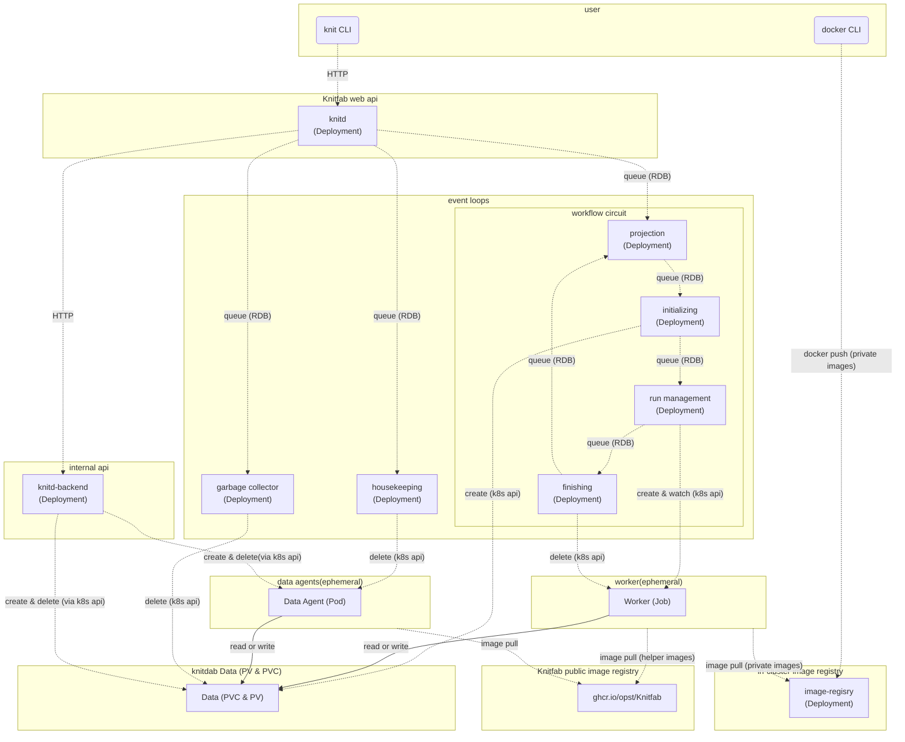

Knitfab Administration Guide: 2.Deep Dive <!-- omit in toc -->

Table of Contents
- [1. Cluster Information to Disclose to Users](#1-cluster-information-to-disclose-to-users)
  - [1.1. Connection information for the cluster's Internal image registry](#11-connection-information-for-the-clusters-internal-image-registry)
  - [1.2. Resources that can be specified in the `resources` field of a Plan and their limits](#12-resources-that-can-be-specified-in-the-resources-field-of-a-plan-and-their-limits)
- [2. Representation of Each Element in Kubernetes](#2-representation-of-each-element-in-kubernetes)
  - [2.1. Data Entity](#21-data-entity)
  - [2.2. Plan Entity](#22-plan-entity)
  - [2.3. Run Entity](#23-run-entity)
- [3. Configuration of Knitfab in Kubernetes](#3-configuration-of-knitfab-in-kubernetes)
  - [3.1. Deployments and services](#31-deployments-and-services)
  - [3.2. daemonset](#32-daemonset)
  - [3.3. Other resources](#33-other-resources)
- [4. Routine Monitoring](#4-routine-monitoring)
- [5. Troubleshooting](#5-troubleshooting)
  - [5.1. The Run is stuck in the "starting" state and never transitions to "running" or fails immediately.](#51-the-run-is-stuck-in-the-starting-state-and-never-transitions-to-running-or-fails-immediately)
  - [5.2. Frequent system-side pod failures](#52-frequent-system-side-pod-failures)
  - [5.3. There is a problematic pod. So, want to restart it](#53-there-is-a-problematic-pod-so-want-to-restart-it)
  - [5.4. Want to add a node](#54-want-to-add-a-node)
- [6. Backup and Restore](#6-backup-and-restore)
  - [6.1. Backup](#61-backup)
  - [6.2. Restore](#62-restore)
- [7. Extend Knitfab](#7-extend-knitfab)
  - [7.1. WebHooks](#71-webhooks)
  - [7.2. Lifecycle Hooks](#72-lifecycle-hooks)
  - [7.3. Register Extended Web API](#73-register-extended-web-api)
  - [7.4. Add Custom Data Import Process](#74-add-custom-data-import-process)


# 1. Cluster Information to Disclose to Users

Some features of Knitfab depend on the configuration of the installed Kubernetes cluster.
In order for users to effectively utilize these features, they must be provided with information about the cluster's configuration.

As the administrator who has set up Knitfab, it is important to disclose the appropriate information to users.

## 1.1. Connection information for the cluster's Internal image registry

While it can be inferred by examining the `docker/certs.d` directory within the handout, it is advisable to explicitly guide users on the host and port of the cluster's internal image registry.

## 1.2. Resources that can be specified in the `resources` field of a Plan and their limits

Knitfab has a feature called `resources` in its Plan definition, which declares the computational resources used by the Run based on that Plan.

Even if CPU or memory values are specified in a Plan that are not available in the cluster, the Run based on such a Plan cannot be executed.

It is advisable for administrators to disclose the range of possible values to users as much as possible.

In addition, in Kubernetes, if there are nodes with GPUs, the GPUs are exposed as schedulable resources.
The specific resource names that can be specified (e.g., `nvidia.com/gpu`, `amd.com/gpu`) depend on the node configuration.
If such extended resource names are available, it should also be disclosed to the users.

### 1.2.1. Labels available for `on_node` in a Plan: labels and taints of node

Knitfab has a feature called `on_node` in Plan definitions that utilizes labels and taints set on Kubernetes nodes.

Administrators should disclose to users the labels that can be used with the `on_node` feature and their respective meanings.

> [!Note]
>
> **Recommended taints and labels Configuration by Knitfab**
>
> If you set a taint on a node, set a label with the same key-value pair.
>

#### 1.2.1.1. Labels of K8s node

[label](https://kubernetes.io/docs/concepts/overview/working-with-objects/labels/) of a node in Kubernetes refers to metadata for a node. Labels have a key-value structure.
In Kubernetes, it is possible to impose constraints on Pods to "always or preferentially run on nodes with a certain label" ([node Affinity](https://kubernetes.io/docs/concepts/scheduling-eviction/assign-pod-node/#node-affinity)).

#### 1.2.1.2. Taints of K8s node

[taint](https://kubernetes.io/docs/concepts/scheduling-eviction/taint-and-toleration/) of a node in Kubernetes is a constraint that prevents pods from being scheduled on a node.
In contrast, a toleration is an attribute that allows pods to ignore taint. By assigning tolerations to pods, only pods with toleration can be scheduled on nodes with taint.

Taints can be set along with key-value pairs, similar to labels, to specify the strength of the taint (NoSchedule, PreferNoSchedule).

For example, if you want to ensure that tasks that do not specifically require GPUs are not scheduled on nodes with GPUs, you need to set a taint on the node.

#### 1.2.1.3. How "on_node" in "Plan" uses labels and taints

As described in the user guide, Knitfab allows the use of the `on_node` attribute in plan definitions.
This attribute specifies where the Runs based on the Plan can be executed on which nodes, and it is used as toleration and node affinity values in Kubernetes.

The `on_node` in plan definitions is written as follows:

```yaml
on_node:
  may:
    - "key=value"
  prefer:
    - "vram=large"
  must:
    - "accelarator=gpu"
```

`may`, `prefer`, and `must` are all arrays of values that follow the same format as Kubernetes node labels.
`may` represents permission for node placement, `prefer` represents preferred node placement, and `must` represents mandatory node placement.

Specifically, these are translated as the following worker attributes:

- `may`:
    - `toleration`: Labels with `NoSchedule`
- `prefer`:
    - `toleration`: Labels with `NoSchedule` and `PreferNoSchedule`
    - `nodeAffinity`: Labels with `preferredDuringSchedulingIgnoredDuringExecution`
- `must`:
    - `toleration`: Labels with `NoSchedule` and `PreferNoSchedule`
    - `nodeAffinity`: Labels with `requiredDuringSchedulingIgnoredDuringExecution`

The recommendation to "set the same label on the node if you set a taint" is because the `on_node` feature reuses the same label for tolerations and node affinity.

# 2. Representation of Each Element in Kubernetes

## 2.1. Data Entity

In Kubernetes, Data is represented by a PersistentVolumeClaim (PVC) and the associated bound PersistentVolume (PV).

Knitfab records the name of the PVC, which represents the Data, in the RDB. The Tags set to the Data are written in the RDB.

## 2.2. Plan Entity

The entity of a Plan is a record stored in the RDB. However, this record includes the name of the container image.

## 2.3. Run Entity

The Run entity has two aspects.

One is the lineage information recorded in the RDB. It records the input, output, and combination of Plans.

The other aspect is the computation performed on Kubernetes. This is achieved by launching a Job called a Worker.
There is a maximum of one Worker per Run. It is launched when needed and destroyed when no longer needed.


# 3. Configuration of Knitfab in Kubernetes

This section explains the Kubernetes-specific components of Knitfab.

Knitfab consists of several deployments, daemonsets, and services.

## 3.1. Deployments and services

The following **static components** make up Knitfab:

| Daemonset | Description | Service | NodePort |
|:---------:|:-----------:|:-------:|:-------:|
| knitd | Knitfab API server | knitd | ✔ (30803) |
| knitd-backend | Internal API server for Knitfab | knitd-backend | |
| database-postgres | Relational database | database | |
| image-registry-registry | Cluster internal image registry | image-registry | ✔ (30503) |
| csi-nfs-controller | Enables NFS as a Persistent Volume (derived from csi-driver-nfs) | | |
| projection-leader | Generates Runs | | |
| initialize-leader | Prepares to launch Runs | | |
| run-management-leader | Launches and monitors Runs | | |
| finishing-leader | Disposes of stopped Runs | | |
| garbage-collecion-leader | Disposes of unnecessary PVCs | | |
| housekeeping-leader | Disposes of other abandoned resources | | |

Services with a ✔ in the NodePort column are intended to be accessed from outside the cluster. The default port numbers are indicated in parentheses.
Users interact with the knitd service to access the Knitfab API (via CLI). They also push custom images to the image-registry service.

The flow of messages between components is illustrated in the following diagram.



Communication is represented by dotted lines, while file read/write within containers is represented by solid lines.
The data folw to RDB and the Kubernetes API has been omitted for simplicity. It is depicted as if it were a means of communication between components.

Users send requests to knitd using the `knit` CLI. knitd then manipulates records in the RDB accordingly.

Each component of the event loops periodically monitors the RDB to find the tasks it needs to perform. In particular, the collection of event loops labeled as the "workflow circuit" drives the workflow using the following sequence:

- Generating a Run from a Plan or Data (projection),
- Allocating a PVC as the physical entity of the output Data (initializing),
- Starting and monitoring the Run as a Worker until completion (run management),
- Disposing of the finished worker while completing the Run (finishing)

This Worker is one of the **dynamic components** of Knitfab, with the Job as its entity.
The main component of the Worker is the user-defined container, but it also utilizes images provided by Knitfab's public registry (`ghcr.io/opst/Knitfab`).

The housekeeping event loop searches for Data Agents that are stopped but not yet disposed of, and discards them.

The garbage collector event loop periodically deletes PVCs and PVs that have been marked for deletion by knitd.

The Data Agent mentioned in the diagram is another **dynamic component** of Knitfab. This entity is a Pod.
When users upload or download Data, the task is subcontracted from knitd to knitd_backend. The knitd_backend launches a Data Agent that mounts a PVC as per the request, and further subcontracts the specific read and write operations. The Data Agent, once no longer needed after the read and write operations, is typically disposed of by knitd_backend. The image of the Data Agent is provided by Knitfab's public registry (`ghcr.io/opst/Knitfab`).

Users push their privately created container images to the cluster's internal image registry using `docker push`. When a Worker is launched, the user-defined image will be pulled from the image registry. Other containers that make up the Worker are provided by Knitfab's public registry.

> [!Warning]
>
> As mentioned earlier, dynamic components are launched by pulling images from `ghcr.io/opst/knitfab`.
>
> Therefore, if there is no internet access or if there is a problem with ghcr.io, there is a possibility of failure in launching the dynamic components.

## 3.2. daemonset

- vex: Automatically scales up if the capacity of the PVCs mounted by pods on that node becomes insufficient.

However, NFS does not place much significance on the capacity of PVCs, so this daemonset is not currently very meaningful.

## 3.3. Other resources

Additionally, when installing Knitfab, the following resources are created:

- StorageClass: To enable the creation of PersistentVolumes using NFS.
- PersistentVolume, PersistentVolumeClaim: Used as storage for the RDB and cluster internal image registry.
- Role, RoleBinding, ServiceAccount: Used to access the Kubernetes API.
- ConfigMap, Secret: Configuration files for knitd, knitd-backend, authentication information for the RDB, and TLS certificates.
- PriorityClass: PriorityClass for the Workers (explained later).

# 4. Routine Monitoring

You should perform routine monitoring similar to regular system monitoring. Specifically, monitor:

- Node computing resources (memory usage, CPU usage, load average)
- Network traffic
- NFS storage capacity

If there is a shortage of node computing resources, the cause is important. If a large number of Workers are being launched, it may be normal in a sense. Simply wait for the experiments to proceed sequentially. Alternatively, if possible, adding nodes may improve throughput (the number of completed Runs per unit of time).

Pay attention to the NFS storage capacity. If it becomes insufficient, it will prevent the recording of Data generated by user experiments. It is important to maintain sufficient capacity.

# 5. Troubleshooting

When a user reports that Knitfab is not functioning properly, it is important to investigate the following points:

## 5.1. The Run is stuck in the "starting" state and never transitions to "running" or fails immediately.

### 5.1.1. Possible cause 1: The Worker Pod may not be starting successfully.

Ask the user for the Run ID of the specific Run. Then Execute

```
kubectl -n ${NAMESPACE} get pod
```

to investigate the status of the running Pods.

The Pod of the problematic Worker has the following Name:

```
worker-run-${RUN_ID}-${RANDOM_SUFFIX}
```

For example, if the Run ID is `3cb1b091-01ad-41b1-acac-3f042f9df97c`, it will look like this.

```
worker-run-3cb1b091-01ad-41b1-acac-3f042f9df97c-wkgrq
```

To find such Pods, use `kubectl describe pod ${POD_NAME}` or `kubectl get pod -o yaml pod ${POD_NAME}` to investigate the cause.

For example,

- `ImagePullBackoff`, `ImagePullError`, etc.:
    - The specified image in the Plan may not exist.
    - Is the cluster internal image registry down?
    - This can happen when trying to launch a worker on a new node while ghcr.io is experiencing issues.
- `Pending`:
    - Is the specified cpu or memory in the Plan too large?
    - Is there a non-existent label specified in `on_node`?
    - It could simply be waiting due to a large number of existing Runs.
- `Error`:
    - Check the `exit` attribute of the Run.
        - `OOMError`: The memory allocated in the Plan is too small.

### 5.1.2. Possible cause 2: The event loop container is missing or causing errors

If you are scaling in the Deployment for maintenance purposes, it can stop the chain of event loops.
Make sure that there is at least one Pod for each event loop.

- Check if there are any event loop Pods that are still in the Error state.
- Use `kubectl logs` to check for event loop Pods that are not functioning.

If you find such containers, delete the Pods using `kubectl delete`.
Wait for the Deployment to automatically start the necessary number of Pods and observe the situation.

## 5.2. Frequent system-side pod failures

You need to investigate the reason for the frequent failures by checking logs and using `kubectl describe`.

If the repeatedly failing Pods are limited to knitd, knitd-backend, and event loops, there may be an issue with database-postgres.

- Read the logs of the failing Pods to check for any access errors to the database.
- Read the logs of database-postgres to check for any abnormalities.
- Check if other resources that static components depend on, such as Config Maps and Secrets, have disappeared.
    - Running `kubectl describe` should indicate if anything is missing.

Also, is the memory of the node sufficient?

When configuring Knitfab on a single node, it requires approximately 4GiB of memory capacity.
When attempting to deploy Knitfab on a virtual machine with less memory, the static components started to fail and restart irregularly.

## 5.3. There is a problematic pod. So, want to restart it

You can always use `kubectl delete pod` to restart it.

Knitfab's Pods are designed to maintain consistency even if they are abruptly terminated.

However, if you abruptly terminate a Worker or Data Agent, it will cause failures in user's machine learning tasks and data uploads/downloads.

Also, for scaling in/out, you can simply scale the Kubernetes Deployment.

## 5.4. Want to add a node

You can follow the Kubernetes procedure to add a node.
You will be able to increase the number of nodes where Workers and Data Agents can be deployed.

However, as of v1.0, TLS certificates are not supported for newly added nodes.
User requests should be sent to the existing nodes. Otherwise, it will result in a certificate error.

# 6. Backup and Restore

This chapter shows you how to backup Data and lineages from Knitfab and to restore them into a newly installed Knitfab.

Tools for backup and restoring are in `admin-tools` directory in this repository. "tar.gz" archive of this is also contained in the releases.

Backup procedure of Knitfab consists of:

1. Announce system outage
2. Freeze Knitfab system
3. Take backup
  - Backup Image Registry
  - Backup Knitfab Data
  - Backup Database
4. Unfreeze Knitfab system and announce it

Restoring procedure of Knitfab assumes that Knitfab which is target of restoring is a newly installed Knitfab and its version is same as the version which the backup is taken.

Restoring procedure of Knitfab consists of:

1. Restore Image Registry
2. Restore Knitfab Data
3. Restore Database

The restore procedure clears Image Registry and RDB, and your Knitfab is restored as the backup.

## 6.1. Backup

### 6.1.1. Announce system outage

For your users, announce system outage before starting backup operation.

In the announcement, notice that running Runs during backup operation will be failed.

### 6.1.2. Freeze Knitfab system

To freeze system, execute `admin-tools/system-freeze.sh` (it is shell-script).

This script should be executed in a directory where you have performed `knit init` with Knitfab to be frozen.

```sh
# knit init KNITPROFILE  # if you have not

KUBECONFIG=${KUBECONFIG:-~/.kube/config} NAMESPACE=${YOUR_KNITFAB_NAMESPACE} \
    admin-tools/system-freeze.sh
```

This script requires following tools:

- `knit`
- `helm`
- `kubectl`
- `jq`

This script refers following environmental variables:

- `NAMESPACE` **(required)**: Kubernetes Namespace where Knitfab to be frozen is installed in
- `KUBECONFIG` (optional): declare non-default kubeconfig file if needed

On executing `admin-tools/system-freeze.sh`, it does

- Scale deployments of Knitfab into 0
- Let Runs be failed, and wait for them to stop
- Generate shell script to unfreeze Knitfab.

Actually, `admin-tools/system-freeze.sh` performs scale-in of deployments which is not related with Runs' lifecycle, stopping Runs, and then scale-in of deployments related with Runs' lifecycle.

By starting the operation, Knitfab suspends to create new Runs. And after the operation, Knitfab API is stopped and running `knit data push` or `knit data pull` are aborted.

`admin-tools/system-freeze.sh` generates a script, `./system-unfreeze.sh`, to unfreeze  your Knitfab. This script is used later.

### 6.1.3. Backup: Image Registry

Execute `admin-tools/backup/images.sh` like below

```sh
KUBECONFIG=${KUBECONFIG:-~/.kube/config} NAMESPACE=${YOUR_KNITFAB_NAMESPACE} \
    admin-tools/backup/images.sh backup/images
```

The script requires following tools:

- `helm`
- `kubectl`
- `jq`

The script refers following envronment variables:

- `NAMESPACE` **(required)**: Kubernetes Namespace where Knitfab to be frozen is installed in
- `KUBECONFIG` (optional): declare non-default kubeconfig file if needed

The script starts a Pod to perform backup, so it needs Internet access to pull image.

The script saves storage content of the Image Registry of Knitfab as tar.gz archive into the directory `backup/images` in arguments (it can be renamed if you need). The directory will be created if it does not exist.

During backup, a Pod named "datadumper" is created to read content of PV. It will be removed when backup gets be done successfully. If you abort backup, the Pod can be remained. In such cases, you should remove the Pod by `kubectl` directly.

### 6.1.4. Backup: Data

Backup contents of Knitfab Data.

Lineages or Tags are **NOT** saved by this backup. It is needed to save them that taking backup of Database.

Execute shell script `admin-tools/backup/data.sh`。

```sh
KUBECONFIG=${KUBECONFIG:-~/.kube/config} NAMESPACE=${YOUR_KNITFAB_NAMESPACE} \
    admin-tools/backup/data.sh backup/data
```

The script requires following tools:

- `helm`
- `kubectl`
- `jq`

The script refers follwoing environment variables:

- `NAMESPACE` **(required)**: Kubernetes Namespace where Knitfab to be frozen is installed in
- `KUBECONFIG` (optional): declare non-default kubeconfig file if needed

The script starts a Pod to perform backup, so it needs Internet access to pull image.

The script saves storage content of the Image Registry of Knitfab as tar.gz archive into the directory `backup/data` in arguments (it can be renamed if you need). The directory will be created if it does not exist.

During backup, a Pod named "datadumper" is created to read content of PV. It will be removed when backup gets be done successfully. If you abort backup, the Pod can be remained. In such cases, you should remove the Pod by `kubectl` directly.

### 6.1.5. Backup: Database

Backup tables in Knitfab Database.

Contents of Knit Data are **NOT** contained in this backup. Taking backup of Data is  also needed to resotre Knitfab.

Execute shell script `admin-tools/backup/db.sh` like below:

```sh
KUBECONFIG=${KUBECONFIG:-~/.kube/config} NAMESPACE=${YOUR_KNITFAB_NAMESPACE} \
    admin-tools/backup/db.sh backup/db
```

The script requires following tools:

- `helm`
- `kubectl`
- `jq`

The script refers follwoing environment variables:

- `NAMESPACE` **(required)**: Kubernetes Namespace where Knitfab to be frozen is installed in
- `KUBECONFIG` (optional): declare non-default kubeconfig file if needed

The script starts a Pod to perform backup, so it needs Internet access to pull image.

The script runs [`pg_dump`](https://www.postgresql.org/docs/15/app-pgdump.html), compless the dumpped file with gzip, and saves it in the directory `backup/db` in arguments (it can be renamed if you need). The directory will be created if it does not exist.

During backup, a Pod named "pgdumper" is created to read content of PV. It will be removed when backup gets be done successfully. If you abort backup, the Pod can be remained. In such cases, you should remove the Pod by `kubectl` directly.

### 6.1.6. Unfreeze Knitfab system, and announce it

To unfreeze Knitfan, execute `./system-unfreeze.sh`, generated by `admin-tools/system-freeze.sh`.

By this, deployments scales as number as before freezing, and Web API and Run's lifecycle are restarted.

Announce that Knitfab is unfrozen for your user after deployments scales out enough.

## 6.2. Restore

This section describes how to restore Knitfab from a backup.

Knitfab which is the target of restore should be just newly installed one, and its version is same as the version which the backup has been taken. Otherwize, system consistency will be broken.

### 6.2.1. Restore: Image Registry

Execute shell script `admin-tools/restore/images.sh` like below:

```sh
KUBECONFIG=${KUBECONFIG:-~/.kube/config} NAMESPACE=${YOUR_KNITFAB_NAMESPACE} \
    admin-tools/restore/images.sh backup/images
```

`backup/images` is the directory storing backup of images.

The script requires following tools:

- `helm`
- `kubectl`
- `jq`

The script refers follwoing environment variables:

- `NAMESPACE` **(required)**: Kubernetes Namespace where Knitfab to be frozen is installed in
- `KUBECONFIG` (optional): declare non-default kubeconfig file if needed

The script starts a Pod to perform backup, so it needs Internet access to pull image.

On starting `admin-tools/restore/images.sh`, you will see the messsage like below:

```
*** Restore Images ***
  - SOURCE: backup/images
  - NAMESPACE: knitfab
  - STORAGE CLASS:  (not changed)
  - CLEAN: yes   # (If yes, delete the existing PVC for images before restoring.)

Do you want to restore? [y/N]:
```

This message describes restoring operation and ask your decision to proceed. If okay, input `y` and hit enter.

After that, it goes following processes in the order:

1. Scale Image Registry to 0 replicas
2. Cleaer and overwrite PVC stores Image Registry with backup
3. Scale Image Registry to number as it was

If these processes are aborted in the middle, the last processes can not be executed.
In such cases, you should scale Image Registry with `kubectl` directly.

During restoring, to write to PV, a Pod named "dataloader" will be started. When restoring gets be done successfully, it will be removed. If restoring is aborted in the middle, the Pod can be remained. In such cases, you should delete it with `kubectl` directly.

### 6.2.2. Restore: Data

Execute shell script `admin-tools/restore/data.sh` like below:

```sh
KUBECONFIG=${KUBECONFIG:-~/.kube/config} NAMESPACE=${YOUR_KNITFAB_NAMESPACE} \
    admin-tools/restore/images.sh backup/data
```

`backup/data` is the directory storing a backup of Data.

The script requires following tools:

- `helm`
- `kubectl`
- `jq`

The script refers follwoing environment variables:

- `NAMESPACE` **(required)**: Kubernetes Namespace where Knitfab to be frozen is installed in
- `KUBECONFIG` (optional): declare non-default kubeconfig file if needed

The script starts a Pod to perform backup, so it needs Internet access to pull image.

On starting `admin-tools/restore/data.sh`, you will see the messsage like below:

```
*** Restore Knitfab Data ***
  - SOURCE: backup/data/*  # Each directory containing pvc.json and data.tar.gz
  - NAMESPACE: knitfab
  - STORAGE CLASS:  (not changed)
  - CLEAN: no   # If yes, delete the existing PVC before restoring.

Do you want to restore? [y/N]:
```

This message describes restoring operation and ask your decision to proceed. If okay, input `y` and hit enter.

After that, it restores PVCs for each Data from backup.

During restoring, to write to PV, a Pod named "dataloader" will be started. When restoring gets be done successfully, it will be removed. If restoring is aborted in the middle, the Pod can be remained. In such cases, you should delete it with `kubectl` directly.

### 6.2.3. Restore: Database

Execute shell script `admin-tools/restore/db.sh` like below;

```sh
KUBECONFIG=${KUBECONFIG:-~/.kube/config} NAMESPACE=${YOUR_KNITFAB_NAMESPACE} \
    admin-tools/restore/db.sh backup/db
```

`backup/db` is the directory storing a backup of Database.

The script requires following tools:

- `helm`
- `kubectl`
- `jq`

The script refers follwoing environment variables:

- `NAMESPACE` **(required)**: Kubernetes Namespace where Knitfab to be frozen is installed in
- `KUBECONFIG` (optional): declare non-default kubeconfig file if needed

The script starts a Pod to perform backup, so it needs Internet access to pull image.

On starting `admin-tools/restore/db.sh`, you will see the messsage like below:

```
*** Restore database ***
  - SOURCE: backup/db
  - NAMESPACE: knitfab
  - DATABASE SERVICE NAME: database

Do you want to restore? [y/N]:
```

レストア中に、PV に書き込みを行うため、"pgloader" という名前の Pod を起動する。正常にレストアが進めば自動的に削除される。レストアを中断した場合には "pgloader" が削除されずに残る可能性があるが、`kubectl ` コマンドを利用して直接削除せよ。

This message describes restoring operation and ask your decision to proceed. If okay, input `y` and hit enter.

After that, it restores Database from backup.

During restoring, to execute [pg_resotre](https://www.postgresql.org/docs/15/app-pgrestore.html), a Pod named "pgloader" will be started. When restoring gets be done successfully, it will be removed. If restoring is aborted in the middle, the Pod can be remained. In such cases, you should delete it with `kubectl` directly.

# 7. Extend Knitfab

This section describes how to customise your Knitfab, for advanced usage.

## 7.1. WebHooks

Knitfab can notify internal events as HTTP requests. It is WebHook.

Events supporting WebHook are below:

- Lifecycle Hooks: Send HTTP Request before and after changing Runs' status.

Set up WebHooks by following steps:

1. Edit a file `values/hooks.yml` in install settings directory (`knitfab-install-settings`) generated by the Knitfab installer.
2. Update Knitfab: rerun `./installer.sh --install`.

## 7.2. Lifecycle Hooks

Lifecycle Hooks are WebHooks invoked before and after changing each Runs' status. URLs registered as hooks receives Run's information as a POST request.

Before Hooks are invoked before changing Run's status, and After Hooks are invoked after Run's status.

On changing Run's status, Knitfab performs as following:

1. Sends requests to Before Hooks
    - When all of Before Hooks response with status code 2xx, goes ahead.
2. Changes Run's status.
    - When succeeded, goes ahead.
3. Sends requests to After Hooks.
    - responses are ignored.

Before Hooks receive one request per one status changing, normally. These Hooks receive requests *at least once*, but it can receives more in cases of:

- Some Before Hook responses non-2xx
- Knitfab failed to change Run's status

Because Knitfab retries changing Run's status in these cases, it is possible that Before Hooks receives request twice or more for a status changing.

Also After Hooks receive one request per one status changing, normally. These Hooks receive requests *at most once*, but it can receives zero requests in cases of:

- After changing Run's status and before invoke Hook, Knitfab's process is stopped unexpectedly.

### 7.2.1. Setup Lifecycle Hooks

To setup Lifecycle Hook, edit `values/hooks.yaml` to update entry `hooks.lifecycle-hooks`.

The installer generates `hooks.lifecycle-hooks` as below:

```yaml
  # # lifecycle-hooks: lifecycle webhooks for Knitfab.
  # #
  # # Each URLs reveices POST requests with a Run as JSON, before or after status change of the Run.
  # #
  # # The Run JSON is formatted as same as output of `knit run show`.
  lifecycle-hooks:

    # # before: Webhook URLs to be called before the Knitfab changes the status of a Run.
    # #
    # # The webhook receives POST requests with JSON for each Runs whose status is going to be changed.
    # #
    # # When these hook responses non-200 status, the status changing causes an error and will be retried later.
    before: []

    # # before: Webhook URLs to be called after the Knitfab has changed the status of a Run.
    # #
    # # The webhook receives POST requests with JSON for each Runs whose status has been changed.
    # #
    # # Responses from these hooks are ignored.
    after: []
```


`before` contains URLs for Before Hooks and `after` for After Hooks. At it is generated, both are empty.

Update them like below, and run `./installer.sh --install` at directory where you have installed Knitfab.

```yaml
  # # lifecycle-hooks: lifecycle webhooks for Knitfab.
  # #
  # # Each URLs reveices POST requests with a Run as JSON, before or after status change of the Run.
  # #
  # # The Run JSON is formatted as same as output of `knit run show`.
  lifecycle-hooks:

    # # before: Webhook URLs to be called before the Knitfab changes the status of a Run.
    # #
    # # The webhook receives POST requests with JSON for each Runs whose status is going to be changed.
    # #
    # # When these hook responses non-200 status, the status changing causes an error and will be retried later.
    before:
      - https://example.com/before

    # # before: Webhook URLs to be called after the Knitfab has changed the status of a Run.
    # #
    # # The webhook receives POST requests with JSON for each Runs whose status has been changed.
    # #
    # # Responses from these hooks are ignored.
    after:
      - https://example.com/after
```


You can set Before Hook only or After Hook only, or you can set 2 or more URLs for a Hook.

After that, Pods invoking Lifecycle Hooks and Hooks are activated.

### 7.2.2. Request Spec　of Lifecycle Hooks

Before and After Lifecycle Hooks send `POST` requests with Run as JSON.
Before Hooks send Run as just before changing status, and After Hooks send Run as just after status changed.

The format of Run JSON, as same as outputs of `knit run show`, is below:

```json
{
    "runId": "74372a32-165d-432b-83e8-5821ab6bf21e",
    "status": "running",
    "updatedAt": "2024-05-17T04:19:33.325+00:00",
    "plan": {
        "planId": "3328be16-5b74-400a-a918-7b2a41bc0bf8",
        "image": "localhost:30503/knitfab-first-train:v1.0"
    },
    "inputs": [
        {
            "path": "/in/dataset",
            "tags": [
                "mode:training",
                "project:first-knitfab",
                "type:dataset"
            ],
            "knitId": "a07490b8-0fdf-4c75-bce1-fba8ccf81336"
        }
    ],
    "outputs": [
        {
            "path": "/out/model",
            "tags": [
                "description:2 layer CNN + 2 layer Affine",
                "project:first-knitfab",
                "type:model"
            ],
            "knitId": "7ada9346-c037-4d4a-8569-48d706edbac0"
        }
    ],
    "log": {
        "Tags": [
            "project:first-knitfab",
            "type:log"
        ],
        "knitId": "958b791c-cd56-4170-9d17-b4031ff528e6"
    }
}
```

- `runId`: The identfier of the Run.
- `status`: Run's status. It is the status to be changed for Before Hook, and the new status for After Hook.
- `updatedAt`: Timestamp when the Run is updated at.
- `plan`: Plan summary for the Run.
     - `planId`: The identifier of the Plan.
     - `image`: The container image of the Plan. This and `name` are exclusive.
     - `name`: Plan name which does not have `image`.
- `inputs[*]`, `outputs[*]`: Data which are inputted to or outputted from this Run.
    - `path`: Filepath where the Data is mounted on.
    - `tags[*]`: Tags for this Input(or Output). Not Data's Tag.
    - `knitId`: Identifier of the Data.
- `log`: Output for STDOUT+STDERR.
    - `tags[*]`: Tags for this Output. Not Data's Tag
    - `knitId`: Identifier of the Data holding the log.

## 7.3. Register Extended Web API

You can register Extra APIs for Knitfab Web API.

Knitfab Web API Server (`knitd`) forwards requests received in pathes of Extra APIs to other URL, and send back responses to original requesters.

The feature may be useful to introduce custom functionalities which need to access Knitfab Database.

> [!Note]
>
> Credentials for Knitfab Database is stored in Kubernetes Secret `database-credential`.
>
> Functionalities writing to Database is possible, but in such cases, be careful to keep consistency of Database.

To register Extra APIs, follow steps:

1. Edit the file `values/extraApi.yaml` in install settings directory (`knitfab-install-settings`) generated by the Knitfab installer.
2. Update Knitfab: rerun `./installer.sh --install`.

The file `values/extraApi.yaml` is generated by `./installer.sh --prepare` as below:

```yaml
# # # values/extra-api.yaml # # #

extraApi:
  # # endpoints ([{path:..., proxy_to: ...}]): extra API endpoints .
  endpoints: []
  #  - # path, proxy_to: Knitfab proxies requests to the path (and subpath) to proxy_to.
  #    path: /path/to/your/api
  #    proxy_to: "http://your-api-server/api"
  #    # The example above works as follows:
  #    # https://KNITFAB_HOST/path/to/your/api               -> http://your-api-server/api
  #    # https://KNITFAB_HOST/path/to/your/api/sub           -> http://your-api-server/api/sub
  #    # https://KNITFAB_HOST/path/to/your/api/sub/resource  -> http://your-api-server/api/sub/resource
  #    # https://KNITFAB_HOST/path/to/your/api/sub?query     -> http://your-api-server/api/sub?query
  #    # https://KNITFAB_HOST/path/to/your                   -> (404)
  #    #
  #    # For path, "/api" is reserved for Knitfab builtin API.
  #
  # # more extra apis can be added.
  # # - path: ...
  # #   proxy_to: ...
```

Each elements in `extraApi.endpoints` has 2 keys: `path` and `proxy_to`.
For `path`, set a path of URL to be exposed as Knitfab API. For `proxy_to`, set a URL where requests are forwarded to. Any requests sent to `path` or its subpath are forwarded to the correspond (sub)path of `proxy_to`. (see examples above)

To apply the change, rerun `./installer.sh --install`.

## 7.4. Add Custom Data Import Process

The backend WebAPIs of Knitfab supports Custom Data Import process.

Kubernetes Service `knitd_backend`, a component of Knitfab, is the endpoint of backend WebAPI.
In the Namespace where Knitfab is installed, hostname `knitd_backend` points to the Service.

> [!Note]
>
> The Service name `knitd_backend` is the default value.
>
> If you have overwritten the helm value `knitd_backend.service` at the install time,
> its value is the Service name. Please replace them.

Data Import process goes as following:

1. Send a request `POST /api/backend/data/import/begin` to the backend WebAPI endpoint, to notify for Knitfab to begin Data Import process.
  - No request body is needed. Send an empty request.
  - Response Body has a JSON Web Token (JWT).
2. Extract `sub` from JWT in the response.
  - the value is the name of the PersistentVolumeClaim for importing Data reserved by Knitfab.
  - Knitfab do NOT provide certificates to verify JWT. Read JWT Claim without verification.
3. Create PVC specified in `sub` and Persistent Volume and bind them.
4. Send a request `POST /api/backend/data/import/end` to the backend WebAPI endpoint, to notify for Knitfab to end Data Import oricess
  - On sending the request, send back JWT in the request body.
  - Put `Content-Type: application/jwt` in HTTP Headers.
  - Knitfab returns a success (200) response if the import is accepted.

In these steps, step 3. can have arbitary program to create PV/PVC, so you can make any import method as you need.

We suppose that Custom Data import process is build as a Web server, deployed in the same Namespace with Knitfab,
and registered as Custom WebAPI of Knitfab. And, to provide the process to your users, make client application as Custom CLI Subcommand.
