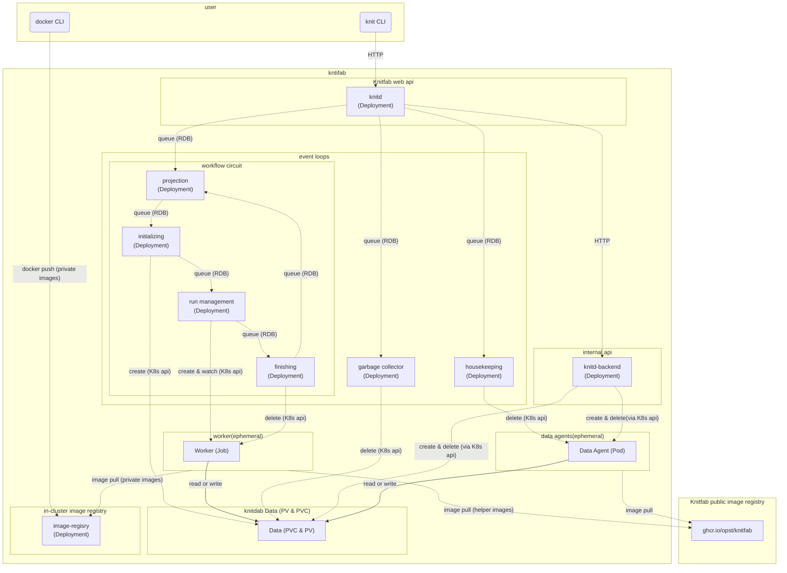

# Knitfab 管理ガイド: 2.詳細編 <!-- omit in toc -->

もくじ
- [1. ユーザに開示すべきクラスタの情報](#1-ユーザに開示すべきクラスタの情報)
  - [1.1. クラスタ内イメージレジストリの接続情報](#11-クラスタ内イメージレジストリの接続情報)
  - [1.2. "プラン"の `resources` に指定できるリソースと上限](#12-プランの-resources-に指定できるリソースと上限)
- [2. 各要素の Kubernetes 的な表現について](#2-各要素の-kubernetes-的な表現について)
  - [2.1. "データ"の実体](#21-データの実体)
  - [2.2. "プラン"の実体](#22-プランの実体)
  - [2.3. "ラン"の実体](#23-ランの実体)
- [3. Knitfab の Kubernetes 的構成](#3-knitfab-の-kubernetes-的構成)
  - [3.1. deployment, service](#31-deployment-service)
  - [3.2. daemonset](#32-daemonset)
  - [3.3. その他のリソース](#33-その他のリソース)
- [4. 日常的な監視](#4-日常的な監視)
- [5. トラブルシュート](#5-トラブルシュート)
  - [5.1. "ラン"が starting になったが、いつまでたっても running にならない or すぐに失敗する](#51-ランが-starting-になったがいつまでたっても-running-にならない-or-すぐに失敗する)
  - [5.2. システム側 Pod が頻繁に停止する](#52-システム側-pod-が頻繁に停止する)
  - [5.3. なにか調子の悪い Pod がいる、再起動したい](#53-なにか調子の悪い-pod-がいる再起動したい)
  - [5.4. ノードを追加したい](#54-ノードを追加したい)
- [6. バックアップとレストア](#6-バックアップとレストア)
  - [6.1. バックアップ](#61-バックアップ)
  - [6.2. レストア](#62-レストア)
- [7. Knitfab を拡張する](#7-knitfab-を拡張する)
  - [7.1. ウェブフック](#71-ウェブフック)
  - [7.2. ライフサイクル・フック](#72-ライフサイクルフック)
  - [7.3. 拡張 Web API を登録する](#73-拡張-web-api-を登録する)
  - [7.4. カスタムなデータインポート機構を追加する](#74-カスタムなデータインポート機構を追加する)

# 1. ユーザに開示すべきクラスタの情報

Knitfab の機能には、インストールされている Kubernetes クラスタの設定に依存するも
のがあります。それらの機能をユーザがうまく活用するためには、ユーザに対して K8sク
ラスタの設定に関する情報が開示されていなくてはなりません。 Knitfab を構築した管
理者として、ユーザに適切な情報開示をしましょう。このセクションでは、そのような
ユーザに開示すべき情報について説明します。

## 1.1. クラスタ内イメージレジストリの接続情報

[ハンドアウト](admin-guide-installation.ja.md#334-ユーザにハンドアウトknitfab設定情報を配布する)
内の `docker/certs.d` ディレクトリ内を見ればわかりますが、利用すべきクラスタ内イ
メージレジストリのホスト・ポートについては、ユーザに対して明示的に伝えるべきで
しょう。

## 1.2. "プラン"の `resources` に指定できるリソースと上限

Knitfab の"プラン"定義には、その"プラン"に基づく"ラン"が利用する計算機資源を宣言
する機能 `resources` があります。この値として、クラスタに存在しないような規模の
cpu や memory が指定されても、そのような"プラン"の"ラン"は実行できないだけとなり
ます。したがって、設定可能な値の上限について、管理者はユーザに極力開示すべきで
しょう。

また、Kubernetes では、GPU を搭載したノードがある場合に、GPU が schedulable
resource として公開されます。具体的に指定できるリソースの名称 (例:
`nvidia.com/gpu`, `amd.com/gpu`) はノードの構成次第となります。こうした、拡張的
なリソース名称が使えるならば、その旨もユーザに開示すべきです。

### 1.2.1. "プラン"の `on_node` で利用できるラベル: ノードの label と taint

Knitfab の"プラン"定義には Kubernetes のノードに設定された label と taint を利用
した機能 [`on_node`](#6213-プランの-on_node-はどのように-label-と-taint-を利用しているのか)

があります。

管理者は、ユーザに向けて、`on_node` 機能で利用できるラベルとその意味するところに
ついて開示してください。

> [!Note]
>
> **Knitfab が推奨する taint と label の設定**
>
> もし node に taint をセットするなら、同じキーバリュー組で label もセットします。
>

#### 1.2.1.1. K8s node の label とは

Kubernetes におけるノードの [label](https://Kubernetes.io/docs/concepts/overview/working-with-objects/labels/) とは、ノードのメタデータです。ラベルはキーバリュー型の構造をとります。

Kubernetes には、Pod に対して「ある label のあるノードで必ず（あるいは優先的に）実行する」という制約をかけることができます。これを [node Affinity](https://Kubernetes.io/docs/concepts/scheduling-eviction/assign-pod-node/#node-affinity)) 機能といいます。

#### 1.2.1.2. K8s node の taint とは

Kubernetes におけるノードの [taint](https://Kubernetes.io/docs/concepts/scheduling-eviction/taint-and-toleration/) とは「ノードに pod を配置 **しない** ようにする制約」です。

これに対して、「taint を無視してよい」という属性 (**toleration**といいます) を Pod
に与えることができます。こうすると、該当する toleration のある Pod だけが taint
のあるノード上に配置されるようになります。

taint は、label のようなキーバリュー組とあわせて taint の強さ (NoSchedule,
PreferNoSchedule) が設定できます。

たとえば「 GPU のあるノードには、特に GPU を必要としないタスクが配置されないよう
にしたい」なら、node に taint を設定する必要があります。詳しくは、上記の
Kubernetes 公式ドキュメント等を参照ください。

#### 1.2.1.3. "プラン"の on_node はどのように label と taint を利用しているのか

[user-guide](../02.user-guide/user-guide.ja.md) に詳しく書きましたが、Knitfab で
は、"プラン"定義に `on_node` という属性をもたせることができます。これは、その"プ
ラン"に基づいた"ラン"をどういうノード上なら実行してよいかを示すもの
で、Kubernetes 的には toleration と node Affinity の値として利用されます。

具体的には、次のように `on_node` を使って "プラン" を定義します。

```yaml
on_node:
  may:
    - "key=value"
  prefer:
    - "vram=large"
  must:
    - "accelarator=gpu"
```

`may`、`prefer`、`must` は、いずれも Kubernetes の node label と同じ形式をした値
の配列をセットします。 `may` はノードへの配置許可、`prefer` はノードへの優先配
置、`must` はノードへの強制配置を意味します。

具体的には、これらはそれぞれ、Worker の属性として次のように翻訳されます。

- `may`:
    - `toleration`: `NoSchedule` のラベル
- `prefer`:
    - `toleration`: `NoSchedule` および `PreferNoSchedule` のラベル
    - node Affinity: `preferredDuringSchedulingIgnoredDuringExecution` のラベル
- `must`:
    - `toleration`: `NoSchedule` および `PreferNoSchedule` のラベル
    - node Affinity: `requiredDuringSchedulingIgnoredDuringExecution` のラベル

[推奨事項](#621-プランの-on_node-で利用できるラベル-ノードの-label-と-taint)とし
て「taint をセットしたなら、そのラベルを node にも直接セットする」を掲げたの
は、`on_node` 機能が同じラベルを toleration と node Affinity に使い回すからで
す。

# 2. 各要素の Kubernetes 的な表現について

## 2.1. "データ"の実体

"データ"は、Kubernetes 的には PersistentVolumeClaim (PVC) およびバインドされてい
る PersistentVolume (PV) です。

Knitfab は、RDB に"データ"である PVC の名前を記録しています。"データ"に割り当て
られている"タグ"は RDB に書き込まれています。

## 2.2. "プラン"の実体

"プラン"の実体は、RDB に記録されたレコードです。
ただし、このレコードにはコンテナイメージの名前が含まれています。

## 2.3. "ラン"の実体

"ラン"の実体には、2つの側面があります。

ひとつは RDB 上に記録されたリネージ情報です。つまり、入力と、出力と、"プラン"の
組み合わせを記録しています。

もうひとつは、Kubernetes 上で実施されている計算です。これは Worker と呼ばれる
Job を起動することで実現します。 Worker は"ラン"ごとに最大 1 個存在します。必要
になったら起動され、不要になったら破棄されます。


# 3. Knitfab の Kubernetes 的構成

Knitfab の、特に Kubernetes 的な構成要素について解説します。

Knitfab はいくつかの deployment, daemonset, service から構成されています。

## 3.1. deployment, service

Knitfab を構成する **静的なコンポーネント** は次のものたちです。

| daemonset | 解説 | service | NodePort |
|:---------:|:----:|:--------:|:------:|
| knitd | Knitfab API サーバーです | knitd | ✔ (30803) |
| knitd-backend | Knitfab 内部 API サーバーです | knitd-backend | |
| database-postgres | RDB です | database | |
| image-registry-registry | クラスタ内イメージレジストリです | image-registry | ✔ (30503) |
| csi-nfs-controller | NFS を PV として使えるようにします (csi-driver-nfs 由来) | | |
| projection-leader | "ラン" を生成します | | |
| initialize-leader | "ラン" を起動する準備をします | | |
| run-management-leader | "ラン" を起動し死活監視します | | |
| finishing-leader | 停止した "ラン" を破棄します | | |
| garbage-collection-leader | 不要になった PVC を破棄します | | |
| housekeeping-leader | その他放置されたリソースを破棄します | | |

NodePort 列に ✔ が入っている service は、クラスタ外からアクセスされることが想定
されています。カッコ内にデフォルトのポート番号を示しておきました。

ユーザは、knitd service に対して Knitfab の API アクセスを (CLI 経由で) します。
また、カスタムイメージを image-registry service に対して push します。

コンポーネント間のメッセージは次の図のように流れます。



通信は点線、コンテナ内のファイル読み書きは実線で示しました。

また、RDB や Kubernetes API へのデータフローは煩雑になるので省きました。コンポー
ネント間の通信手段であるかのように表現しています。

ユーザは `knit` CLI を使って knitd にリクエストを送ります。 knitd はそれに応じて
RDB のレコードを操作します。

"knitfab" とラベル付けられた着色ボックスの範囲内が、お使いの Kubernetes クラスタ
内に構築されている Knitfab の範囲です。

Web API を提供するコンテナ knitd が CLI からリクエストを受け取ります。一部リクエ
ストは内部 API である knitd_backend にプロキシされて、Kubernetes API を呼び出し
ています。

イベントループ (event loops) の各コンポーネントは、定期的に RDB を監視して、各々
果たすべきタスクを探しています。特に、workflow circuit とラベル付けられているイ
ベントループの集まりは、

- "プラン" や "データ" から "ラン" を生成し (projection)、
- 出力 "データ" の実体となる PVC を確保して (initializing)、
- "ラン" を Worker として起動して終了まで監視し (run management)、
- 終了した Worker を破棄しつつ "ラン" を完了させます (finishing)

...という一連の流れで、ワークフローを駆動させています。この Worker とは、Job を
実体とした Knitfab の **動的なコンポーネント** のひとつです。 Worker の主体は
ユーザ定義コンテナですが、それ以外にも Knitfab の公開レジストリ
(`ghcr.io/opst/Knitfab`) から提供されるイメージも利用しています。

housekeeping イベントループは、停止しているが破棄されていない Data Agent を探し
て、これを破棄します。

garbage collector イベントループは、knitd によって「削除して良い」とマークされた
PVC と PV を定期的に削除します。

図中に登場する Data Agent は、Knitfab が有するもうひとつの
**動的なコンポーネント** です。

この実体は Pod です。ユーザが "データ" をアップロードしたりダウンロードしたりし
ようとすると、そのタスクが knitd から knitd_backend に対して下請けに出されま
す。knitd_backend は要求に応じた PVC をマウントした Data Agent を起動して、具体
的な読み書きをさらに下請けに出します。読み書きが終わって不要になったData Agent
は、原則 knitd_backend によって破棄されます。Data Agent のイメージは、Knitfab の
公開レジストリ (`ghcr.io/opst/Knitfab`) から提供されます。

ユーザは自作したプライベートなコンテナイメージをクラスタ内イメージレジストリ
(image-registry) に `docker push` します。

Worker が起動するに当たり、ユーザ定義のイメージは image-registry から pull され
ることになるでしょう。その他、Workerを構成するコンテナは、Knitfab の公開レジスト
リから提供されます。

> [!Warning]
>
> 動的なコンポーネントは、既に述べた通り `ghcr.io/opst/knitfab` からイメージを
> pull することで起動します。
>
> したがって、インターネットアクセスがない場合や、ghcr.io に何らかの障害が起きて
> いる場合には動的コンポーネントの起動に失敗する可能性があります。

## 3.2. daemonset

- vex: そのノード上の pod がマウントしている PVC のキャパシティが足りなくなった
  ら、自動的に拡張します。

ただし、NFS では PVC のキャパシティはあまり意味を持たないので、この daemonset も
現時点ではそれほど有意義なものではありません。

## 3.3. その他のリソース

さらに、Knitfab をインストールすると、次のリソースも作成されます。

- StorageClass: NFS を利用した PersistnetVolume を作成できるようにするためです。
- PersistentVolume, PersistnetVolumeClaim: RDB とクラスタ内イメージレジストリの記憶領域として使用します。
- Role, RoleBinding, ServiceAccount: K8s API にアクセスするためです。
- ConfigMap, Secret: knitd, knitd-backend の設定ファイル、RDB の認証情報、TLS 証明書類です。
- PriorityClass: ワーカ（後述）用の PriorityClass です。

# 4. 日常的な監視

通常のシステム監視と同様の監視をすることになります。具体的には

- ノードの計算機資源 (メモリ使用量・ CPU 使用量・ロードアベレージ)
- 通信量
- NFS のストレージ容量

が監視対象となります。

ノードの計算機資源が不足している場合は、その理由が重要です。

Worker が大量に起動していることが理由であれば、それがただちに異常であるとは言い
切れません。順次それらのWorkerの処理が進行するのを待っていれば計算資源不足が解消
していく場合があるからです。

あるいは、K8s ノードを追加すればスループット (時間あたり "ラン" の終了数) を改善
できる可能性があります。

NFS のストレージ容量には注意してください。これが不足すると、ユーザの実験が生成し
た"データ"を記録できなくなります。できるだけ余裕がある状態を維持しましょう。

# 5. トラブルシュート

Knitfab がうまく動いていない場合に調べるべき観点について説明します。

## 5.1. "ラン"が starting になったが、いつまでたっても running にならない or すぐに失敗する
少なくとも、以下２つの可能性があります。

### 5.1.1. 可能性1. Worker の Pod が正常に起動しないのかもしれない。

まず当該 "ラン" の Run ID を確認します。そのうえで、

```
kubectl -n ${NAMESPACE} get pod
```

を実行して、実行されている Pod の状況を調べます。

上記 Run ID に関連する Worker の Pod は

```
worker-run-${RUN_ID}-${RANDOM_SUFFIX}
```

という Name をしています。例えば、Run ID が `3cb1b091-01ad-41b1-acac-3f042f9df97c` なら、

```
worker-run-3cb1b091-01ad-41b1-acac-3f042f9df97c-wkgrq
```

のような Pod Name です。

この Pod を確認したら、 `kubectl describe pod ${POD_NAME}` や
`kubectl get pod -o yaml pod ${POD_NAME}` を使って原因を探ります。

たとえば、上記コマンドの出力に：

- `ImagePullBackoff`, `ImagePullError` などが発生している場合:
    - "プラン" に指定されているイメージが実在しないのかもしれません。
    - クラスタ内イメージレジストリがダウンしているのかもしれません。
    - ghcr.io(GitHubコンテナレジストリ) が障害を起こしているときに、新しいノード
      上で worker を起動しようとした場合にはこうなる可能性があります。
- `Pending`状態である場合:
    - "プラン" に指定されている cpu や memory が大きすぎるかもしれません。
    - 存在しない label が `on_node` に指定されているかもしれません。
    - 単に多量の "ラン" が存在していて、起動を待たされているだけかもしれません。
- `Error`が発生している場合:
    - "ラン"の `exit` 属性の内容を確認します。例えば：
        - `OOMError`があれば: "プラン" の `resources` に割り当てるべきメモリの不足が原因です。

### 5.1.2. 可能性2. イベントループのコンテナが存在しない、エラーを起こしている

メンテナンス等のために Deployment をスケールインしていると、イベントループの連鎖
が止まってしまいます。これを防ぐには、各イベントループにつき少なくとも 1 つの
Pod が存在するように設定します。

- Error のままになっているイベントループ Pod がないか確認します。
- `kubectl logs` で動作が止まっているイベントループ Pod がないか確認します。

こうしたコンテナがあるようなら、 `kubectl delete` で Pod を削除します。
Deployment が自動的に必要数まで Pod を起動するのを待って、様子を見ます。

## 5.2. システム側 Pod が頻繁に停止する

ログや `kubectl describe` を利用して、停止する理由を探る必要があります。

異常停止を繰り返している Pod が knitd, knitd-backend とイベントループに限られて
いる場合、database-postgres が正常な状態にない可能性があります。

- 異常停止を起こした Pod のログを確認して、データベースに対するアクセスエラーを
  起こしていないか確認します。
- database-postgres のログを確認して、異常を起こしていないか確認します。
- Config Map, Secret など、静的コンポーネントが前提としている他のリソースが消滅
  していないか確認します。
    - `kubectl describe` をすると、不足がないかどうかわかります。

また、ノードのメモリは十分でしょうか？

シングルノードの Knitfab を構成する場合、4GiB 程度のメモリ容量が必要です。 （私
たちの検証では、これを下回る仮想マシン上に Knitfab のデプロイを試みたところ、静
的なコンポーネントが不規則に停止・再起動を繰り返しました。）

## 5.3. なにか調子の悪い Pod がいる、再起動したい

Knitfabにおいては、いつでも `kubectl pod delete` して構いません。 Knitfabは、突
然Podが終了しても整合性を損なわないように設計されているからです。

ただし、Worker や Data Agent を強制終了すると、ユーザの機械学習タスクやデータの
アップロード・ダウンロードは失敗します。

また、スケールイン・スケールアウトについては、Kubernetes の Deployment としてス
ケーリング設定することで対応できます。

## 5.4. ノードを追加したい

ノード追加は、kubenetes の通常の手順に従って追加します。

ただし、v1.0 の時点においては、TLS 証明書は新規追加されたノードには対応していません。
したがって、ユーザからのリクエストは、以前からあるノードに対して送らねばなりません。
そうでなければ、証明書エラーになります。

# 6. バックアップとレストア

本章では、Knitfab の"データ"とリネージをバックアップし、新規にインストールされた
Knitfab にレストアする方法について述べます。

バックアップとレストアのためのスクリプトは、Knitfab リポジトリの `admin-tool`
ディレクトリにあります。また、これをtar.gz アーカイブしたものが各[リリー
ス](https://github.com/opst/knitfab/releases)のAssetsに含まれています。

Knitfab のバックアップ手順の概略は以下のとおりです。

1. システムの停止をアナウンスする
2. システムを停止する
3. バックアップをとる
  - イメージレジストリのバックアップ
  - "データ" のバックアップ
  - データベースのバックアップ
4. システムを復旧して、利用可能になったことをアナウンスする

Knitfab のレストアは、新規にインストールした Knitfab に対して適用することを想定
しています。また、その際の Knitfab のバージョンは、バックアップを取ったバージョ
ンと同一であることを想定しています。

Knitfab のレストア手順の概略は、次のとおりです。

1. イメージレジストリをレストアする
2. "データ" をレストアする
3. データベースをレストアする

レストア手順を実行することで、イメージレジストリと RDB の内容は抹消され、バック
アップ時点の内容に復元されます。

## 6.1. バックアップ

### 6.1.1. システムの停止をアナウンスする

また、ユーザに対して、バックアップのためにシステムが利用できなくなることを事前に
告知します。この際、システム停止時点で実行中であった"ラン"は失敗する可能性がある
ことを含め、ユーザに注意を促します。

### 6.1.2. システムを停止する

シェルスクリプト `admin-tools/system-freeze.sh` を実行することでシステムを停止し
ます。このスクリプトは特定のカレントディレクトリで実行する必要があります。その
ディレクトリとは、対象のKnitfabシステムにおいて `knit init` を実施したディレクト
リまたはその配下のディレクトリです。

なお、この際 root 権限は必要ありません。

```sh
$ cd dir/inited/by/knitfab
$ KUBECONFIG=${KUBECONFIG:-~/.kube/config} NAMESPACE=${YOUR_KNITFAB_NAMESPACE} \
    admin-tools/system-freeze.sh
```

このスクリプトは次のツールを必要とします。

- `knit`
- `helm`
- `kubectl`
- `jq`

また、このスクリプトは次の環境変数を参照します。

- `NAMESPACE` **(required)**: 凍結対象の Knitfab がインストールされている
  Kubernetes Namespace
- `KUBECONFIG` (optional): デフォルト以外の kubeconfig ファイルを指定する必要が
  ある場合には、明示してください。

シェルスクリプト `admin-tools/system-freeze.sh` を実行すると、

- Knitfab を構成する deployment を 0 に scale-in する。
- 実行中の "ラン" を強制的に失敗させ、停止を待つ。
- 凍結解除用のスクリプトを生成する。

という 3 つのタスクが実行される。実際には、"ラン" のライフサイクルに関わらない
deployment を scale in してから "ラン" を停止させて、残りの deployment を scale
in する、という順序で処理が進みます。

この操作を始めると、Knitfab は新しい "ラン" を生成しなくなります。また、この操作
が完了すると、Knitfab API は停止します。もし進行中の `knit data push` や `knit
data pull` があっても、中断します。

`admin-tools/system-freeze.sh` は、カレントディレクトリにシステム復旧用のスクリ
プト `./system-unfreeze.sh` を生成する。このシステム復旧用スクリプトは、後でまた
利用する。

### 6.1.3. バックアップ: イメージレジストリ

次のようにシェルスクリプト `admin-tools/backup/images.sh` を実行する。

```sh
KUBECONFIG=${KUBECONFIG:-~/.kube/config} NAMESPACE=${YOUR_KNITFAB_NAMESPACE} \
    admin-tools/backup/images.sh backup/images
```

このスクリプトは、次のコマンドを必要とします。

- `helm`
- `kubectl`
- `jq`

このスクリプトは、次の環境変数を参照します。

- `NAMESPACE` **(required)**: 凍結対象の Knitfab がインストールされている
  Kubernetes Namespace
- `KUBECONFIG` (optional): デフォルト以外の kubeconfig ファイルを指定する必要が
  ある場合には、明示してください。

このスクリプトはバックアップ処理用に Pod を起動するので、そのイメージを pull す
るためにインターネットアクセスを必要とします。

このスクリプトは、引数に指定したディレクトリ `backup/images` (実施環境で適切な
ディレクトリを指定してください)に、Knitfab のイメージレジストリのストレージを
tar.gz アーカイブしたものを書き出します。書き出し先ディレクトリが存在しなけれ
ば、スクリプトが自動作成します。

バックアップ中に、PV(K8s Persistent Volume) の内容を読み出すため "datadumper" と
いう Pod を生成します。このPodは正常に処理が終了すれば、自動的に削除されます。も
しバックアップを中断した場合には、このPod が削除されないことがあるの
で、`kubectl` コマンドを利用して手動で削除してください。

### 6.1.4. バックアップ: "データ"

Knitfab の "データ" の内容をバックアップします。

このバックアップには、 リネージやタグは **含まれません**。リネージやタグをバック
アップするには、データベースのバックアップが必要です。

次のようにシェルスクリプト `admin-tools/backup/data.sh` を実行します。

```sh
KUBECONFIG=${KUBECONFIG:-~/.kube/config} NAMESPACE=${YOUR_KNITFAB_NAMESPACE} \
    admin-tools/backup/data.sh backup/data
```

このスクリプトは、次のコマンドを必要とします。

- `helm`
- `kubectl`
- `jq`

このスクリプトは、次の環境変数を参照します。

- `NAMESPACE` **(required)**: 凍結対象の Knitfab がインストールされている
  Kubernetes Namespace
- `KUBECONFIG` (optional): デフォルト以外の kubeconfig ファイルを指定する必要が
  ある場合には、明示してください。

このスクリプトはバックアップ処理用に Pod を起動するので、そのイメージを pull す
るためにインターネットアクセスを必要とします。

このスクリプトを実行すると、引数に指定したディレクトリ `backup/data` (実施環境で
適切なディレクトリを指定してください) に、"データ" の内容を保持している各 K8s
PVCのリソース定義と、当該 PVC にバインドされている PV の内容の tar.gz アーカイブ
を書き出します。

この処理中に、PV の内容を読み出すため "datadumper" という Pod を生成します。この
Podは正常に処理が終了すれば、自動的に削除されます。もしバックアップを中断した場
合には、この Podが削除されないことがあるので、`kubectl` コマンドを利用して手動で
削除してください。

### 6.1.5. バックアップ: データベース

Knitfab のデータベースの内容をバックアップします。

このバックアップには、 **"データ" の内容は含まれません**。
レストアのためには "データ" のバックアップも必要です。

次のようにシェルスクリプト `admin-tools/backup/db.sh` を実行します。

```sh
KUBECONFIG=${KUBECONFIG:-~/.kube/config} NAMESPACE=${YOUR_KNITFAB_NAMESPACE} \
    admin-tools/backup/db.sh backup/db
```

このスクリプトは、次のコマンドを必要とします。

- `helm`
- `kubectl`
- `jq`

このスクリプトは、次の環境変数を参照します。

- `NAMESPACE` **(必須)**: 凍結対象の Knitfab がインストールされている Kubernetes
  Namespace
- `KUBECONFIG` (任意): デフォルト以外の kubeconfig ファイルを指定する必要がある
  場合には、明示してください

このスクリプトはバックアップ処理用に Pod を起動するので、そのイメージを pull す
るためにインターネットアクセスを必要とします。

このスクリプトを実行すると、引数に指定したディレクトリ `backup/db` (適宜管理しや
すい名前を指定してください)
に、[`pg_dump`](https://www.postgresql.org/docs/15/app-pgdump.html) を tar 形式
で出力したものを、gzip 圧縮したものを書き出します。もし書き出し先ディレクトリが
存在しなければ、スクリプトが自動的に作成します。

この処理中に、PV の内容を読み出すため "pgdumper" という Pod を生成します。この
Podは正常に処理が終了すれば、自動的に削除されます。バックアップを中断した場合に
は、この Pod が削除されないことがあるので、`kubectl` コマンドを利用して手動で削
除してください。

### 6.1.6. システムを復旧して、復旧をアナウンスする

`admin-tools/system-freeze.sh` が生成したシステム復旧用のスクリプト
`./system-unfreeze.sh` を実行します。

これによって、各 deployment のレプリカ数を停止前の数に復元し、Web API や Run の
ライフサイクルが再開します。

各 deployment が十分な数に復旧したのち、ユーザにシステム復旧をアナウンスしてくだ
さい。

## 6.2. レストア

過去に取得したバックアップで Knitfab を再構築する手順について述べます。

レストア先の Knitfab は、バックアップ取得時と同じバージョンである必要がありま
す。また、レストア先の Knitfab は、新規にインストールされた直後のものである必要
があります。それ以外の条件でレストアを行った場合、レストアが失敗したり、システム
の整合性が失われる可能性があります。

### 6.2.1. レストア:イメージレジストリ

次のようにシェルスクリプト `admin-tools/restore/images.sh` を実行します。

```sh
KUBECONFIG=${KUBECONFIG:-~/.kube/config} NAMESPACE=${YOUR_KNITFAB_NAMESPACE} \
    admin-tools/restore/images.sh backup/images
```

ここで、`backup/images` は、イメージのバックアップを記録したディレクトリです。

このスクリプトは、次のコマンドを必要とします。

- `helm`
- `kubectl`
- `jq`

このスクリプトは、次の環境変数を参照します。

- `NAMESPACE` **(required)**: 凍結対象の Knitfab がインストールされている
  Kubernetes Namespace
- `KUBECONFIG` (optional): デフォルト以外の kubeconfig ファイルを指定する必要が
  ある場合には、明示してください。

このスクリプトはレストア処理用に Pod を起動するので、そのイメージを pull するた
めにインターネットアクセスを必要とします。

`admin-tools/restore/images.sh` を実行すると、次のように表示されます。

```
*** Restore Images ***
  - SOURCE: backup/images
  - NAMESPACE: knitfab
  - STORAGE CLASS:  (not changed)
  - CLEAN: yes   # (If yes, delete the existing PVC for images before restoring.)

Do you want to restore? [y/N]:
```

このメッセージは、レストア処理の内容を示しつつ、最終確認を求めるものです。問題な
ければ、`y` を入力して enter します。

この後、次の処理を順に実行します。

1. イメージレジストリのレプリカ数を 0 にする
2. イメージレジストリ用の PVC を抹消して、バックアップで上書きする
3. イメージレジストリのレプリカ数を元に戻す

途中で中断・再試行した場合には、最後の手順で正常にレプリカ数が復元されない可能性
があります。その場合には、`kubectl` コマンドを利用して、直接レプリカ数を調整して
ください。

レストア中に、PV に書き込みを行うため、"dataloader" という名前の Pod を起動しま
す。正常にレストアが進めば、このPodは自動的に削除されます。もしレストアを中断し
た場合に "dataloader" Pod が削除されずに残った場合は、`kubectl ` コマンドを利用
して手動で削除してください。

### 6.2.2. レストア:データ

次のようにシェルスクリプト `admin-tools/restore/data.sh` を実行します。

```sh
KUBECONFIG=${KUBECONFIG:-~/.kube/config} NAMESPACE=${YOUR_KNITFAB_NAMESPACE} \
    admin-tools/restore/images.sh backup/data
```

ここで、`backup/data` は、"データ"のバックアップを記録したディレクトリです。

このスクリプトは、次のコマンドを必要とします。

- `helm`
- `kubectl`
- `jq`

このスクリプトは、次の環境変数を参照します。

- `NAMESPACE` **(required)**: 凍結対象の Knitfab がインストールされている
  Kubernetes Namespace
- `KUBECONFIG` (optional): デフォルト以外の kubeconfig ファイルを指定する必要が
  ある場合には、明示してください。

このスクリプトはレストア処理用に Pod を起動するので、そのイメージを pull するた
めにインターネットアクセスが必要です。

`admin-tools/restore/data.sh` を実行すると、次のように表示されます。

```
*** Restore Knitfab Data ***
  - SOURCE: backup/data/*  # Each directory containing pvc.json and data.tar.gz
  - NAMESPACE: knitfab
  - STORAGE CLASS:  (not changed)
  - CLEAN: no   # If yes, delete the existing PVC before restoring.

Do you want to restore? [y/N]:
```

このメッセージは、レストア処理の内容を示しつつ、最終確認を求めるものです。問題な
ければ `y` を入力して enter してください。

この後、バックアップに基づいて、各 PVC を再構築します。

レストア中に、PV に書き込みを行うため、"dataloader" という名前の Pod を起動しま
す。正常にレストアが進めば、このPodは自動的に削除されます。レストアを中断した場
合には"dataloader" Pod が削除されずに残った場合は、`kubectl` コマンドを利用して
手動で削除してください。

### 6.2.3. レストア:データベース

次のようにシェルスクリプト `admin-tools/restore/db.sh` を実行します。

```sh
KUBECONFIG=${KUBECONFIG:-~/.kube/config} NAMESPACE=${YOUR_KNITFAB_NAMESPACE} \
    admin-tools/restore/db.sh backup/db
```

ここで、`backup/db` は、データベースのバックアップを記録したディレクトリです。

このスクリプトは、次のコマンドを必要とします。

- `helm`
- `kubectl`
- `jq`

このスクリプトは、次の環境変数を参照します。

- `NAMESPACE` **(required)**: 凍結対象の Knitfab がインストールされている
  Kubernetes Namespace
- `KUBECONFIG` (optional): デフォルト以外の kubeconfig ファイルを指定する必要が
  ある場合には、明示してください。

このスクリプトはレストア処理用に Pod を起動するので、そのイメージを pull するた
めにインターネットアクセスを必要とします。

`admin-tools/restore/db.sh` を実行すると、次のように表示されます。

```
*** Restore database ***
  - SOURCE: backup/db
  - NAMESPACE: knitfab
  - DATABASE SERVICE NAME: database

Do you want to restore? [y/N]:
```

このメッセージは、レストア処理の内容を示しつつ、最終確認を求めるものです。問題な
ければ `y` を入力して enter してください。

この後、バックアップに基づいて、データベースを復元する。

レストア中に [pg_resotre](https://www.postgresql.org/docs/15/app-pgrestore.html)
を実行するため、 "pgloader" という名前の Pod を起動します。正常にレストアが進め
ば、この Pod は自動的に削除される。もしレストアを中断した場合には "pgloader" Pod
が残ることがあるので、その際は `kubectl ` コマンドを利用して手動で削除してくださ
い。

# 7. Knitfab を拡張する

この章では、発展的な利用法として、Knitfab をカスタマイズする方法について説明します。

## 7.1. ウェブフック

Knitfab には、Knitfab 内部で発生したイベントを外部に HTTP リクエストの形で通知す
る機能（WebHook）があります。

WebHook をサポートするイベントは次のものです。

- ライフサイクル・フック: Run が状態遷移する前後で、HTTP リクエストを送ります。

WebHook はいずれも、次の手順で設定します。

1. Knitfab インストーラが生成したインストール設定ディレクトリ
   （`knitfab-install-settings`）内の `values/hooks.yaml` を編集します。
2. Knitfab を更新します: `./installer.sh --install` を再実行します。

## 7.2. ライフサイクル・フック

ライフサイクル・フックは、Run が状態変化する直前・直後に呼び出される WebHook で
す。フックとして登録された URL に Run の情報を POST リクエストとして送信します。
状態変化前のフックを **Before フック**、状態変化後のフックを **After フック** と
呼びます。いずれも、複数の URL を宛先として登録できます。

Knitfab は、Run の状態を遷移させるにあたり、次の順序で処理を行います。

1. Before フックに順次リクエストを送る
    - すべての Before フックが 200 番台のレスポンスを返したなら、次に進む
2. Run の状態を変化させる
    - 状態変化に成功したら、次に進む
3. After フックに順次リクエストを送る
    - レスポンスは無視する

Before フックには、Run の状態変化の都度、通常は 1 回リクエストを送信します。この
フックには、*少なくとも 1 回* のリクエストを送信しますが、以下に述べる条件に該当
する場合には同じ Runの同じ状態について、複数回リクエストを送信することがありま
す。

- 当該フック、または他の Before フックが 200 番台以外のHTTPレスポンスを返した場
  合
- Run の状態遷移に失敗した場合

これらの場合、Knitfab は Run の状態遷移をやり直すので、複数回リクエストを送信す
ることになるのです。

After フックにも Run の状態変化の都度、通常は 1 回リクエストを送信します。この
フックには、最大 1 回のリクエストを送信し、次の場合にはリクエストを送信しないこ
とがあります。

- Run の状態変化に成功したあと、After フックが呼び出される前に Knitfab のプロセ
  スが予期せず停止した場合

### 7.2.1. ライフサイクル・フックを設定する

ライフサイクル・フックの設定は、 `values/hooks.yaml` 内のエントリ `hooks.lifecycle-hooks` に記述します。

`hooks.lifecycle-hooks` Knitfabインストーラが生成したファイルで、次のような内容です。

```yaml
  # # lifecycle-hooks: lifecycle webhooks for Knitfab.
  # #
  # # Each URLs reveices POST requests with a Run as JSON, before or after status change of the Run.
  # #
  # # The Run JSON is formatted as same as output of `knit run show`.
  lifecycle-hooks:

    # # before: Webhook URLs to be called before the Knitfab changes the status of a Run.
    # #
    # # The webhook receives POST requests with JSON for each Runs whose status is going to be changed.
    # #
    # # When these hook responses non-200 status, the status changing causes an error and will be retried later.
    before: []

    # # before: Webhook URLs to be called after the Knitfab has changed the status of a Run.
    # #
    # # The webhook receives POST requests with JSON for each Runs whose status has been changed.
    # #
    # # Responses from these hooks are ignored.
    after: []
```

上記の`"before"` が Before フックがリクエストを送る URL のリストであ
り、`"after"` が After フックがリクエストを送る URL のリストです。初期状態では、
いずれも空です。

フックを追加・変更するには、たとえば次のように書き換えて、Knitfab をインストール
したディレクトリで `installer.sh --install` を実行します。

```yaml
  # # lifecycle-hooks: lifecycle webhooks for Knitfab.
  # #
  # # Each URLs reveices POST requests with a Run as JSON, before or after status change of the Run.
  # #
  # # The Run JSON is formatted as same as output of `knit run show`.
  lifecycle-hooks:

    # # before: Webhook URLs to be called before the Knitfab changes the status of a Run.
    # #
    # # The webhook receives POST requests with JSON for each Runs whose status is going to be changed.
    # #
    # # When these hook responses non-200 status, the status changing causes an error and will be retried later.
    before:
      - https://example.com/before

    # # before: Webhook URLs to be called after the Knitfab has changed the status of a Run.
    # #
    # # The webhook receives POST requests with JSON for each Runs whose status has been changed.
    # #
    # # Responses from these hooks are ignored.
    after:
      - https://example.com/after
```

Before フックだけ、あるいは After フックだけ設定しても構いません。また、ひとつの
フックに複数の URL を設定することができます。

その後、フックを呼び出す Pod が停止・再起動して、フックが有効になります。

### 7.2.2. ライフサイクル・フックのリクエスト仕様

ライフサイクル・フックは、Before・After のいずれについても Runの情報 を JSON と
して`POST` します。 Before フックには状態遷移を起こす直前の Run情報を送信しま
す。Afterフックは状態遷移を起こした直後の Run情報を送信します。

この JSON の形式は、 `knit run show` して得られる形式と同じで、以下に示す形式です。

```json
{
    "runId": "74372a32-165d-432b-83e8-5821ab6bf21e",
    "status": "running",
    "updatedAt": "2024-05-17T04:19:33.325+00:00",
    "plan": {
        "planId": "3328be16-5b74-400a-a918-7b2a41bc0bf8",
        "image": "localhost:30503/knitfab-first-train:v1.0"
    },
    "inputs": [
        {
            "path": "/in/dataset",
            "tags": [
                "mode:training",
                "project:first-knitfab",
                "type:dataset"
            ],
            "knitId": "a07490b8-0fdf-4c75-bce1-fba8ccf81336"
        }
    ],
    "outputs": [
        {
            "path": "/out/model",
            "tags": [
                "description:2 layer CNN + 2 layer Affine",
                "project:first-knitfab",
                "type:model"
            ],
            "knitId": "7ada9346-c037-4d4a-8569-48d706edbac0"
        }
    ],
    "log": {
        "Tags": [
            "project:first-knitfab",
            "type:log"
        ],
        "knitId": "958b791c-cd56-4170-9d17-b4031ff528e6"
    }
}
```
上記の各エントリの説明：
- `runId`: この Run の識別子
- `status`: Run の状態。Before フックでは遷移前の、After フックでは遷移後の状態がセットされます。
- `updatedAt`: 最終更新時刻
- `plan`: この Run が基づいている Plan
     - `planId`: この Plan の識別子
     - `image`: この Plan に指定されているコンテナイメージ。これと `name` は排他的です。
     - `name`: イメージを利用しない Plan に与えられる名前。これと `image` は排他的です。
- `inputs[*]`, `outputs[*]`: この Run に入力ないし出力された Data について：
    - `path`: Data がマウントされたファイルパス
    - `tags[*]`: この入力（出力）に指定されている Tag（Data の Tag ではない）
    - `knitId`: マウントされた Data の識別子。
- `log`: 標準出力や標準エラーを記録する出力
    - `tags[*]`: このログ出力に指定されている Tag （Data の Tag ではない）
    - `knitId`: ログを保持している Data の Knit Id


## 7.3. 拡張 Web API を登録する

Knitfab の WebAPI に追加の Web API (Extra API) を登録できます。

Knitfab WebAPI サーバ (`knitd`) は、設定された Extra API のパスに届いたリクエス
トを、他の URL に転送して、その結果をリクエスト元に送り返します。

この機能は、たとえば Knitfab のデータベースを読み取る必要のあるカスタムな機能
を、Knitfab の本体に手を加えずに追加するうえで便利です。

> [!Note]
>
> Knitfab のデータベースの接続情報は、 Kubernetes の Secret
> `database-credential` に格納されています。
>
> データベースに書き込みを行う機能を追加することもできますが、その場合には、デー
> タベース内の情報の一貫性を破壊しないように注意する必要があります。

Extra API を登録するためには、次の手順を実施してください。

1. インストール設定ディレクトリ内のファイル `values/extraApi.yaml` を編集する
2. `./installer.sh --install` を再実行する

このファイルは、 `./installer.sh --prepare` した直後は次の内容となっています。

```yaml
# # # values/extra-api.yaml # # #

extraApi:
  # # endpoints ([{path:..., proxy_to: ...}]): extra API endpoints .
  endpoints: []
  #  - # path, proxy_to: Knitfab proxies requests to the path (and subpath) to proxy_to.
  #    path: /path/to/your/api
  #    proxy_to: "http://your-api-server/api"
  #    # The example above works as follows:
  #    # https://KNITFAB_HOST/path/to/your/api               -> http://your-api-server/api
  #    # https://KNITFAB_HOST/path/to/your/api/sub           -> http://your-api-server/api/sub
  #    # https://KNITFAB_HOST/path/to/your/api/sub/resource  -> http://your-api-server/api/sub/resource
  #    # https://KNITFAB_HOST/path/to/your/api/sub?query     -> http://your-api-server/api/sub?query
  #    # https://KNITFAB_HOST/path/to/your                   -> (404)
  #    #
  #    # For path, "/api" is reserved for Knitfab builtin API.
  #
  # # more extra apis can be added.
  # # - path: ...
  # #   proxy_to: ...

```

`extraApi.endpoints` の各要素は、 `path` と `proxy_to` という 2 つのキーを持ちます。

`path` には Knitfab API として公開したい URL のパス部分を指定します。

`proxy_to` には、`path` に届いたリクエストを実際に処理する URL を指定します。

`path` のサブパスに届いたリクエストは、 `proxy_to` を起点として対応するサブパス
に送られます(上例参照)。

設定変更を反映するには、 `./installer.sh --install` を再実行してください。

## 7.4. カスタムなデータインポート機構を追加する

Knitfab のバックエンド WebAPI は、Data のカスタムなインポートをサポートしています。

Knitfab を構成する Kubernetes の Service のうち、`knitd_backend` がバックエンドAPIのエンドポイントとなっています。
Knitfab をインストールした Namespace 内であれば、 `knitd_backend` がそのまま Service を指すホスト名として解決できます。

> [!Note]
>
> この Service 名 `knitd_backend` はデフォルトのものです。
>
> インストール時に helm に渡した values において `knitd_backend.service` を上書きしていた場合には、
> その値がバックエンドAPIの Service 名となります。適宜読み替えてください。

Data インポートは次の流れで進みます。

1. バックエンド WebAPI の `POST /api/backend/data/import/begin` にリクエストすることで、Data のインポート開始を Knitfab に通知します。
  - リクエストボディとして送信すべきものはありません。空のリクエストを送ってください。
  - レスポンスのボディには JSON Web Token (JWT) が返されます。
2. レスポンスボディの JWT から `sub` を読みとります。
  - この値が、Knitfab がこのインポート用に確保した PersistentVolumeClaim(PVC) の名前です。
  - Knitfab は JWT 検証用の証明書を公開 *しません*。JWT のクレームを検証なしで読み取ってください。
3. `sub` に指定された PVC と、PersistentVolume (PV) を作成し、バインドします。
4.  バックエンド WebAPI の `POST /api/backend/data/import/end` にリクエストして、インポートの終了を通知します。
  - このとき、JWT をリクエストボディに設定してください。
  - リクエスト時のヘッダには `Content-Type: application/jwt` を含めてください。
  - Knitfab がインポートを受理すると、成功レスポンス(200) を返します。

このうち、手順 3. では任意の方法で PVC と PV を作成してよいので、必要に応じた任意のインポート手法を実現できます。

カスタムなインポート手順は、Web サーバとして構成され、Knitfab と同じ Namespace にデプロイされて、
Knitfab にカスタム API として登録されることを想定しています。
また、カスタムなインポート手順をユーザに提供するためには、CLI のカスタムサブコマンドとして
クライアントを開発するとよいでしょう。
