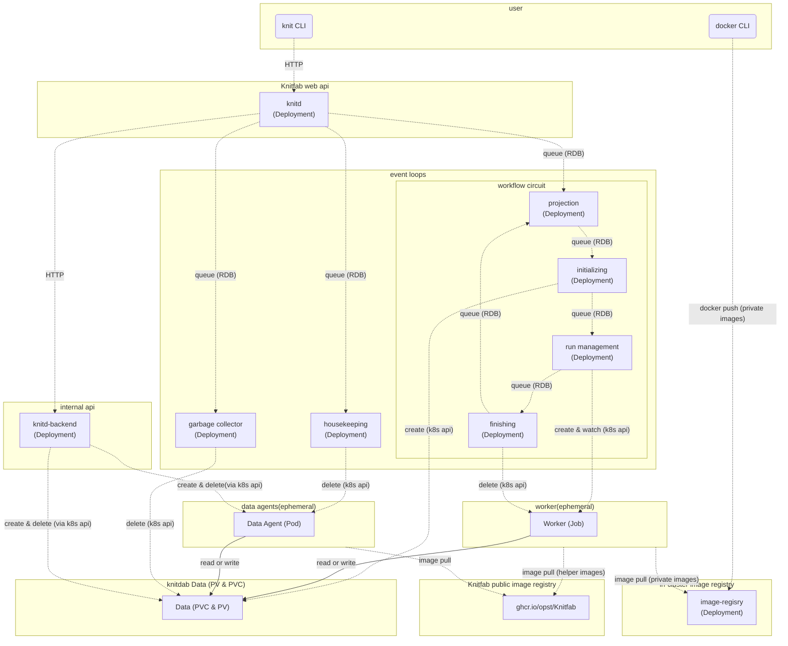

Knitfab Administration Guide
===========================

This document is for individuals who are responsible for operating and managing Knitfab.

Topics covered include:

- How to install Knitfab
- Operational considerations for Knitfab
- Kubernetes resources that make up Knitfab

These topics may go beyond the scope of interest for users who do not manage or operate Knitfab.

Preparation for Installing Knitfab
----------------------------------

Before starting the installation process of Knitfab, you need to prepare an environment that meets the following requirements.

- Kubernetes Cluster consisting of Nodes equipped with x86_64 CPUs: Knitfab runs Kubernetes.
- NFS: To persist RDB, cluster-internal image registry, and Knitfab data, NFS is used.

In particular, NFS will serve as the destination for users to accumulate data. It is recommended to allocate sufficient storage capacity.

### Kubernetes

Please refer to the following official documentation for instructions on how to set up Kubernetes.

- https://kubernetes.io/docs/setup/production-environment/tools/kubeadm/create-cluster-kubeadm/
- https://kubernetes.io/docs/setup/production-environment/container-runtimes/
- https://kubernetes.io/docs/tasks/administer-cluster/kubeadm/configure-cgroup-driver/

Note that the Knitfab development team has tested the operation on a Kubernetes cluster built with the following conditions:

- Kubernetes 1.29.2
- Container runtime: containerd
- Cgroup: systemd

#### Install CNI

To enable the network functionality of Kubernetes, you need to install some Container Network Interface (CNI).

The Knitfab development team has tested the operation with [calico](https://docs.tigera.io/calico/latest/about).

#### Enable GPU

To enable the use of GPUs from containers on Kubernetes, you need to configure the nodes accordingly.

Please refer to the official documentation for instructions on how to set this up.

- https://kubernetes.io/ja/docs/tasks/manage-gpus/scheduling-gpus/

#### Single Node Cluster

If you are operating a Kubernetes cluster with only a single node (control plane node), you need to remove the taint specified on that node.
Otherwise, the components of Knitfab will not be able to start on any node.

For more details, please refer to https://kubernetes.io/docs/setup/production-environment/tools/kubeadm/create-cluster-kubeadm/#control-plane-node-isolation.

### NFS Server

Knitfab adopts the storage driver [csi-driver-nfs](https://github.com/kubernetes-csi/csi-driver-nfs) as the default [storage class](https://kubernetes.io/docs/concepts/storage/storage-classes/). This is done to ensure access to Knitfab data regardless of the node on which the container is launched.

Knitfab assumes NFSv4.

Therefore, please set up NFS in a location on the network accessible from each node of the Kubernetes cluster.
It should be sufficient to use an NAS with NFS capabilities, but it is also possible to set up nfsd on an existing machine.

> For example, on Ubuntu,
>
> - Install the `nfs-kernel-server` package (`apt install nfs-kernel-server`), and
> - Configure the settings file in `/etc/exports`
>
> to set up an NFS server.

Installing Knitfab
-----------------------

### Prerequisites

To install Knitfab, the following tools are required:

- [helm](https://helm.sh/)
- bash
- wget

In addition, internet access and a kubeconfig file with access to the target Kubernetes cluster are also required.

If you are planning to configure a single-node cluster, at least 4GB of memory is required.
Note that this requirement is only the minimum for Knitfab to start. Depending on the machine learning tasks being executed, more memory may be required.

#### (Optional) Prepare TLS Certificates

Knitfab API and the cluster-internal image registry communicate over HTTPS.
The installer script generates certificates for this purpose, but you can also specify specific certificates to use.

- If you have a CA certificate and its key, you can use them.
- Additionally, if you have a server certificate and its key, you can use them.

For example, if you have a requirement such as "I want to use a specific domain name for the nodes in the Kubernetes cluster," you will need a server certificate and a CA certificate signed by it (along with their keys).

If no certificates are provided, the installer will generate self-signed certificates and a server certificate signed by them.

### Installation steps

1. Obtain the installer.
2. Generate the installation settings file and adjust the parameters.
3. Execute the installation.
4. Distribute the handout to users and have them start using it.

#### Step 1: Obtain the installer

The installer is located at https://github.com/opst/Knitfab/installer/installer.sh.

Download it to a suitable directory.

```
mkdir -p ~/Knitfab/install
cd ~/Knitfab/install
wget -O installer.sh https://raw.githubusercontent.com/opst/Knitfab/main/installer/installer.sh
chmod +x ./installer.sh
```

#### Step 2: Generate the installation settings file and adjust the parameters

The following Command generates the installation settings for Knitfab in the `./knitfab_install_settings` directory:

```
./installer.sh --prepare --kubeconfig ${YOUR_KUBECONFIG}
```

> [!Note]
>
> If you want to use specific TLS certificates, execute the following command instead.
>
> ```
> TLSCACERT=path/to/ca.crt TLSCAKEY=path/to/ca.key TLSCERT=path/to/server.crt TLSKEY=path/to/server.key ./installler.sh --prepare
> ```
>
> If there is no specification for the server certificate, omit the environment variables `TLSCERT` and `TLSKEY` and do the following:
>
> ```
> TLSCACERT=path/to/ca.crt TLSCAKEY=path/to/ca.key ./installler.sh --prepare
> ```
>

> [!Caution]
>
> **If you specify TLS certificates, those certificates and keys will be copied as part of the installation settings.**
>
> - `Knitfab-install-settings/certs/*` (as file copies)
> - `Knitfab-install-settings/values/knit-certs.yaml` (as base64-encoded text)
>

##### Configure to use NFS

**The default configuration generated by this command is set to "not persist Knitfab-managed information."**

To persist data using the prepared NFS, update the configuration.

The file to be updated is `Knitfab-install-settings/values/knit-storage-nfs.yaml`.
Update the following entries:

- `nfs.external`: Set the value to `true`.
- `nfs.server`: Comment in and specify the hostname (or IP) of the NFS server.

Additionally, update the following entries if necessary:

- `nfs.mountOptions`: Update if there are specific mount options for NFS.
- `nfs.share`: Specify the subdirectory you want to use for Knitfab.
    - The subdirectory needs to be created beforehand.

The configuration should look as follow:

```yaml
nfs:
  # # external: If true (External mode), use NFS server you own.
  # #  Otherwise(In-cluster mode), Knitfab employs in-cluster NFS server.
  external: true

  # # mountOptions: (optional) Mount options for the nfs server.
  # #  By default, "nfsvers=4.1,rsize=8192,wsize=8192,hard,nolock".
  mountOptions: "nfsvers=4.1,rsize=8192,wsize=8192,hard,nolock"

  # # # FOR EXTERNAL MODE # # #

  # # server: Hostname of the nfs server.
  # #  If external is true, this value is required.
  server: "nfs.example.com"  # update this to your NFS server host.

  # # share: (optional) Export root of the nfs server. default is "/".
  share: "/"

  # # # FOR IN-CLUSTER MODE # # #

  # # hostPath: (optional) Effective only when external is false.
  # # If set, the in-cluster NFS server will read/write files at this directory ON NODE.
  # #
  # # This is useful when you want to keep the data even after the NFS server is restarted.
  # hostPath: "/var/lib/Knitfab"

  # # node: (optional) kubernetes node name where the in-cluster NFS server pod should be scheduled.
  # node: "nfs-server"
```

##### Other installation parameters

For other files as well, you can modify the parameters as needed.

The following are particularly impactful for usage:

- `Knitfab-install-settings/values/knit-app.yaml`'s `knitd.port`
- `Knitfab-install-settings/values/knit-image-registry.yaml`'s `port`

The former is the listening port for the Knitfab API, and the latter is the listening port for the in-cluster image registry.

Also, if you have changed the TLD (Top-Level Domain) of the Kubernetes cluster during its setup from the default value (`cluster.local`), set the custom TLD in the following item.

- `clusterTLD` in `Knitfab-install-settings/values/knit-app.yaml` (Comment in and modify)


#### Step 3: Install

```
./installer.sh --install --kubeconfig path/to/kubeconfig -n NAMESPACE -s ./knitfab-install-settings
```

By executing this command, the installer script will sequentially install Knitfab components onto the Kubernetes cluster. It may take some time to complete.

#### Step 4: Distribute handouts to users

The connection information to the installed Knitfab is generated in the `Knitfab-install-settings/handout` folder.

Distribute this folder to users who want to use Knitfab.

The usage instructions for this handout are described in the user guide.

##### Modify the handout

If you want to access Knitfab with a specific domain name (e.g., when a specified server certificate is configured), you need to modify the connection settings before distributing the handout to users.

The connection settings to the Knitfab API, called **knitprofil file**, can be found in `Knitfab-install-settings/handout/knitprofile`. This file is a YAML file with the following structure:

```yaml
apiRoot: https://IP-ADDRESS:PORT/api
cert:
    ca: ...Certification....
```

The value of the `apiRoot` key indicates the endpoint of the Knitfab Web API.
By default, it should be set to the IP address of a appropriate node in the cluster.

If you want to access Knitfab with a specific domain name instead of an IP address, you need to modify this item.

For example, if you want to access Knitfab as `example.com:30803`, you can rewrite the host part of the `apiRoot` as follows:

```yaml
apiRoot: https://example.com:30803/api
cert:
    ca: ...Certification....
```

Also, you need to address the certificate for the **in-cluster repository**.

You will find a directory named `Knitfab-install-settings/handout/docker/certs.d/10.10.0.3:30503`.
This directory is also named after the IP address of a appropriate Kubernetes node concatenated with the port number using `:` as a separator.
Rename the part with this IP to the desired domain name for access.

### Uninstall Knitfab

When you execute the installation, an uninstaller will be generated as `Knitfab-install-settings/uninstall.sh`.

```
Knitfab-install-settings/uninstall.sh
```

Executing this command will uninstall the Knitfab application within the cluster.

Furthermore,

```
Knitfab-install-settings/uninstall.sh --hard
```

Executing this command will destroy all Knitfab-related resources, including the database and the in-cluster image registry.


### Helm configuration for Knitfab

Knitfab is composed of several helm charts. This section explains the helm-based construction of Knitfab.

Administrators may need to uninstall, reinstall, or update parts of Knitfab. This section provides guidance on what to do in such cases, providing clarity on the necessary steps.

> [!Note]
>
> This section assumes that the reader has knowledge of helm.

Knitfab is composed of the following helm charts:

- Knitfab/knit-storage-nfs: Introduces the NFS driver and defines the StorageClass.
- Knitfab/knit-certs: Introduces certificates.
- Knitfab/knit-db-postgres: Defines the RDB.
- Knitfab/knit-image-registry: Defines the cluster's internal registry.
- Knitfab/knit-app: Defines other components of Knitfab not covered above.

The helm chart repository "Knitfab" is (by default) located at https://raw.githubusercontent.com/opst/Knitfab/main/charts/release.

By following the appropriate steps to install these charts, Knitfab can be installed.
In fact, the installer does exactly that.

In general, Knitfab is installed using the following steps:

```sh
NAMESPACE=${NAMESPACE}  # where Knitfab to be installed
CHART_VERSION=${CHART_VERSION:=v1.0.0}  # version of Knitfab to be installed
VALUES=./knit-install-settings/values

helm install -n ${NAMESPACE} --version ${CHART_VERSION} \
    -f ${VALUES}/knit-storage-nfs.yaml \
    knit-storage-nfs Knitfab/knit-storage-nfs

helm install -n ${NAMESPACE} --version ${CHART_VERSION} \
    -f ${VALUES}/knit-certs.yaml \
    knit-certs Knitfab/knit-certs

helm install -n ${NAMESPACE} --version ${CHART_VERSION} \
    --set-json "storage=$(helm get values knit-storage-nfs -n ${NAMESPACE} -o json --all)" \
    -f ${VALUES}/knit-db-postgres.yaml \
    knit-db-postgres Knitfab/knit-db-postgres

helm install -n ${NAMESPACE} --version ${CHART_VERSION} \
    --set-json "storage=$(helm get values knit-storage-nfs -n ${NAMESPACE} -o json --all)" \
    --set-json "certs=$(helm get values knit-certs -n ${NAMESPACE} -o json --all)" \
    -f ${VALUES}/knit-image-registry.yaml \
    knit-image-registry Knitfab/knit-image-registry

helm install -n ${NAMESPACE} --version ${CHART_VERSION} \
    --set-json "storage=$(helm get values knit-storage-nfs -n ${NAMESPACE} -o json --all)" \
    --set-json "database=$(helm get values knit-db-postgres -n ${NAMESPACE} -o json --all)" \
    --set-json "imageRegistry=$(helm get values knit-image-registry -n ${NAMESPACE} -o json --all)" \
    --set-json "certs=$(helm get values knit-certs -n ${NAMESPACE} -o json --all)" \
    -f ${VALUES}/knit-app.yaml \
    knit-app Knitfab/knit-app
```

> In addition to the above operations, the installer provides additional options to make these behaviors more stable and generates uninstallers and handouts.

The pattern `--set-json "...=$(helm get values ...)"` that appears frequently in the middle is used to read installation parameters ([Helm Values](https://helm.sh/docs/chart_template_guide/values_files/)) from installed charts and ensure consistency between charts.

In addition, `./Knitfab-install-settings/values/CHART_NAME.yaml` is incorporated as the Values for that chart.
Therefore, if you need to reinstall or update only a specific chart, you should follow this approach.

> [!Caution]
>
> Uninstalling the following charts will result in the loss of lineage and data in Knitfab. Please be cautious when uninstalling charts.
>
> - Knitfab/knit-storage-nfs
> - Knitfab/knit-db-postgres
> - Knitfab/knit-image-registry
>
> knit-db-postgres and knit-image-registry also define PVCs, so uninstalling these charts will result in the loss of the previous database content and `docker push`ed images.
> As a result, the relationship between PVCs and Knitfab data, as well as the images referenced by Plans, will be lost, and the premise of Knitfab's lineage management will not be met.
>
> Additionally, knit-storage-nfs provides the functionality to store all other PVs on NFS. If this is lost, all Pods will no longer have access to PVs.


Cluster Information to Disclose to Users
--------------------------

Some features of Knitfab depend on the configuration of the installed Kubernetes cluster.
In order for users to effectively utilize these features, they must be provided with information about the cluster's configuration.

As the administrator who has set up Knitfab, it is important to disclose the appropriate information to users.

### Connection information for the cluster's Internal image registry

While it can be inferred by examining the `docker/certs.d` directory within the handout, it is advisable to explicitly guide users on the host and port of the cluster's internal image registry.

### Resources that can be specified in the `resources` field of a Plan and their limits

Knitfab has a feature called `resources` in its Plan definition, which declares the computational resources used by the Run based on that Plan.

Even if CPU or memory values are specified in a Plan that are not available in the cluster, the Run based on such a Plan cannot be executed.

It is advisable for administrators to disclose the range of possible values to users as much as possible.

In addition, in Kubernetes, if there are nodes with GPUs, the GPUs are exposed as schedulable resources.
The specific resource names that can be specified (e.g., `nvidia.com/gpu`, `amd.com/gpu`) depend on the node configuration.
If such extended resource names are available, it should also be disclosed to the users.

### Labels available for `on_node` in a Plan: labels and taints of node

Knitfab has a feature called `on_node` in Plan definitions that utilizes labels and taints set on Kubernetes nodes.

Administrators should disclose to users the labels that can be used with the `on_node` feature and their respective meanings.

> [!Note]
>
> **Recommended taints and labels Configuration by Knitfab**
>
> If you set a taint on a node, set a label with the same key-value pair.
>

#### Labels of node

[label](https://kubernetes.io/docs/concepts/overview/working-with-objects/labels/) of a node in Kubernetes refers to metadata for a node. Labels have a key-value structure.
In Kubernetes, it is possible to impose constraints on Pods to "always or preferentially run on nodes with a certain label" ([node Affinity](https://kubernetes.io/docs/concepts/scheduling-eviction/assign-pod-node/#node-affinity)).

#### Taints of node

[taint](https://kubernetes.io/docs/concepts/scheduling-eviction/taint-and-toleration/) of a node in Kubernetes is a constraint that prevents pods from being scheduled on a node.
In contrast, a toleration is an attribute that allows pods to ignore taint. By assigning tolerations to pods, only pods with toleration can be scheduled on nodes with taint.

Taints can be set along with key-value pairs, similar to labels, to specify the strength of the taint (NoSchedule, PreferNoSchedule).

For example, if you want to ensure that tasks that do not specifically require GPUs are not scheduled on nodes with GPUs, you need to set a taint on the node.

#### Usage of labels and taints for the `on_node` attribute in Plans

As described in the user guide, Knitfab allows the use of the `on_node` attribute in plan definitions.
This attribute specifies where the Runs based on the Plan can be executed on which nodes, and it is used as toleration and node affinity values in Kubernetes.

The `on_node` in plan definitions is written as follows:

```yaml
on_node:
  may:
    - "key=value"
  prefer:
    - "vram=large"
  must:
    - "accelarator=gpu"
```

`may`, `prefer`, and `must` are all arrays of values that follow the same format as Kubernetes node labels.
`may` represents permission for node placement, `prefer` represents preferred node placement, and `must` represents mandatory node placement.

Specifically, these are translated as the following worker attributes:

- `may`:
    - `toleration`: Labels with `NoSchedule`
- `prefer`:
    - `toleration`: Labels with `NoSchedule` and `PreferNoSchedule`
    - `nodeAffinity`: Labels with `preferredDuringSchedulingIgnoredDuringExecution`
- `must`:
    - `toleration`: Labels with `NoSchedule` and `PreferNoSchedule`
    - `nodeAffinity`: Labels with `requiredDuringSchedulingIgnoredDuringExecution`

The recommendation to "set the same label on the node if you set a taint" is because the `on_node` feature reuses the same label for tolerations and node affinity.

Important Note
---------------------

> [!Caution]
>
> **Don't expose Knitfab to the public network.**
>
> The current version of Knitfab and the cluster's image registry have no authentication or authorization mechanisms.
>
> If exposed to the public internet, the following risks exist:
>
> - Malicious containers can be executed.
> - Malicious container images can be distributed.
>
> The former not only results in the theft of computing resources but also exposes the possibility of exploiting unknown vulnerabilities in Kubernetes, leading to further threats.
> The latter can also serve as a stepping stone for other threats.
>
> **We strongly advise against exposing Knitfab to the public internet.**
>


Representation of Each Element in Kubernetes
--------------------------------------------

### Data Entity

In Kubernetes, Data is represented by a PersistentVolumeClaim (PVC) and the associated bound PersistentVolume (PV).

Knitfab records the name of the PVC, which represents the Data, in the RDB. The Tags set to the Data are written in the RDB.

### Plan Entity

The entity of a Plan is a record stored in the RDB. However, this record includes the name of the container image.

### Run Entity

The Run entity has two aspects.

One is the lineage information recorded in the RDB. It records the input, output, and combination of Plans.

The other aspect is the computation performed on Kubernetes. This is achieved by launching a Job called a Worker.
There is a maximum of one Worker per Run. It is launched when needed and destroyed when no longer needed.


Configuration of Knitfab in Kubernetes
------------------

This section explains the Kubernetes-specific components of Knitfab.

Knitfab consists of several deployments, daemonsets, and services.

### Deployments and services

The following **static components** make up Knitfab:

| Daemonset | Description | Service | NodePort |
|:---------:|:-----------:|:-------:|:-------:|
| knitd | Knitfab API server | knitd | ✔ (30803) |
| knitd-backend | Internal API server for Knitfab | knitd-backend | |
| database-postgres | Relational database | database | |
| image-registry-registry | Cluster internal image registry | image-registry | ✔ (30503) |
| csi-nfs-controller | Enables NFS as a Persistent Volume (derived from csi-driver-nfs) | | |
| projection-leader | Generates Runs | | |
| initialize-leader | Prepares to launch Runs | | |
| run-management-leader | Launches and monitors Runs | | |
| finishing-leader | Disposes of stopped Runs | | |
| garbage-collecion-leader | Disposes of unnecessary PVCs | | |
| housekeeping-leader | Disposes of other abandoned resources | | |

Services with a ✔ in the NodePort column are intended to be accessed from outside the cluster. The default port numbers are indicated in parentheses.
Users interact with the knitd service to access the Knitfab API (via CLI). They also push custom images to the image-registry service.

The flow of messages between components is illustrated in the following diagram.



Communication is represented by dotted lines, while file read/write within containers is represented by solid lines.
The data folw to RDB and the Kubernetes API has been omitted for simplicity. It is depicted as if it were a means of communication between components.

Users send requests to knitd using the `knit` CLI. knitd then manipulates records in the RDB accordingly.

Each component of the event loops periodically monitors the RDB to find the tasks it needs to perform. In particular, the collection of event loops labeled as the "workflow circuit" drives the workflow using the following sequence:

- Generating a Run from a Plan or Data (projection),
- Allocating a PVC as the physical entity of the output Data (initializing),
- Starting and monitoring the Run as a Worker until completion (run management),
- Disposing of the finished worker while completing the Run (finishing)

This Worker is one of the **dynamic components** of Knitfab, with the Job as its entity.
The main component of the Worker is the user-defined container, but it also utilizes images provided by Knitfab's public registry (`ghcr.io/opst/Knitfab`).

The housekeeping event loop searches for Data Agents that are stopped but not yet disposed of, and discards them.

The garbage collector event loop periodically deletes PVCs and PVs that have been marked for deletion by knitd.

The Data Agent mentioned in the diagram is another **dynamic component** of Knitfab. This entity is a Pod.
When users upload or download Data, the task is subcontracted from knitd to knitd_backend. The knitd_backend launches a Data Agent that mounts a PVC as per the request, and further subcontracts the specific read and write operations. The Data Agent, once no longer needed after the read and write operations, is typically disposed of by knitd_backend. The image of the Data Agent is provided by Knitfab's public registry (`ghcr.io/opst/Knitfab`).

Users push their privately created container images to the cluster's internal image registry using `docker push`. When a Worker is launched, the user-defined image will be pulled from the image registry. Other containers that make up the Worker are provided by Knitfab's public registry.

> [!Warning]
>
> As mentioned earlier, dynamic components are launched by pulling images from `ghcr.io/opst/Knitfab`.
>
> Therefore, if there is no internet access or if there is a problem with ghcr.io, there is a possibility of failure in launching the dynamic components.

### daemonset

- vex: Automatically scales up if the capacity of the PVCs mounted by pods on that node becomes insufficient.

However, NFS does not place much significance on the capacity of PVCs, so this daemonset is not currently very meaningful.

### Other resources

Additionally, when installing Knitfab, the following resources are created:

- StorageClass: To enable the creation of PersistentVolumes using NFS.
- PersistentVolume, PersistentVolumeClaim: Used as storage for the RDB and cluster internal image registry.
- Role, RoleBinding, ServiceAccount: Used to access the Kubernetes API.
- ConfigMap, Secret: Configuration files for knitd, knitd-backend, authentication information for the RDB, and TLS certificates.
- PriorityClass: PriorityClass for the Workers (explained later).

Routine Monitoring
-----------------

You should perform routine monitoring similar to regular system monitoring. Specifically, monitor:

- Node computing resources (memory usage, CPU usage, load average)
- Network traffic
- NFS storage capacity

If there is a shortage of node computing resources, the cause is important. If a large number of Workers are being launched, it may be normal in a sense. Simply wait for the experiments to proceed sequentially. Alternatively, if possible, adding nodes may improve throughput (the number of completed Runs per unit of time).

Pay attention to the NFS storage capacity. If it becomes insufficient, it will prevent the recording of Data generated by user experiments. It is important to maintain sufficient capacity.

Troubleshooting
----------------

When a user reports that Knitfab is not functioning properly, it is important to investigate the following points:

### The Run is stuck in the "starting" state and never transitions to "running" or fails immediately.

#### Possible cause 1: The Worker Pod may not be starting successfully.

Ask the user for the Run ID of the specific Run. Then Execute

```
kubectl -n ${NAMESPACE} get pod
```

to investigate the status of the running Pods.

The Pod of the problematic Worker has the following Name:

```
worker-run-${RUN_ID}-${RANDOM_SUFFIX}
```

For example, if the Run ID is `3cb1b091-01ad-41b1-acac-3f042f9df97c`, it will look like this.

```
worker-run-3cb1b091-01ad-41b1-acac-3f042f9df97c-wkgrq
```

To find such Pods, use `kubectl describe pod ${POD_NAME}` or `kubectl get pod -o yaml pod ${POD_NAME}` to investigate the cause.

For example,

- `ImagePullBackoff`, `ImagePullError`, etc.:
    - The specified image in the Plan may not exist.
    - Is the cluster internal image registry down?
    - This can happen when trying to launch a worker on a new node while ghcr.io is experiencing issues.
- `Pending`:
    - Is the specified cpu or memory in the Plan too large?
    - Is there a non-existent label specified in `on_node`?
    - It could simply be waiting due to a large number of existing Runs.
- `Error`:
    - Check the `exit` attribute of the Run.
        - `OOMError`: The memory allocated in the Plan is too small.

#### Possible cause 2: The event loop container is missing or causing errors

If you are scaling in the Deployment for maintenance purposes, it can stop the chain of event loops.
Make sure that there is at least one Pod for each event loop.

- Check if there are any event loop Pods that are still in the Error state.
- Use `kubectl logs` to check for event loop Pods that are not functioning.

If you find such containers, delete the Pods using `kubectl delete`.
Wait for the Deployment to automatically start the necessary number of Pods and observe the situation.

### Frequent system-side pod failures

You need to investigate the reason for the frequent failures by checking logs and using `kubectl describe`.

If the repeatedly failing Pods are limited to knitd, knitd-backend, and event loops, there may be an issue with database-postgres.

- Read the logs of the failing Pods to check for any access errors to the database.
- Read the logs of database-postgres to check for any abnormalities.
- Check if other resources that static components depend on, such as Config Maps and Secrets, have disappeared.
    - Running `kubectl describe` should indicate if anything is missing.

Also, is the memory of the node sufficient?

When configuring Knitfab on a single node, it requires approximately 4GiB of memory capacity.
When attempting to deploy Knitfab on a virtual machine with less memory, the static components started to fail and restart irregularly.

### There is a problematic pod. So, want to restart it

You can always use `kubectl delete pod` to restart it.

Knitfab's Pods are designed to maintain consistency even if they are abruptly terminated.

However, if you abruptly terminate a Worker or Data Agent, it will cause failures in user's machine learning tasks and data uploads/downloads.

Also, for scaling in/out, you can simply scale the Kubernetes Deployment.

### Want to add a node

You can follow the Kubernetes procedure to add a node.
You will be able to increase the number of nodes where Workers and Data Agents can be deployed.

However, as of v1.0.0, TLS certificates are not supported for newly added nodes.
User requests should be sent to the existing nodes. Otherwise, it will result in a certificate error.
