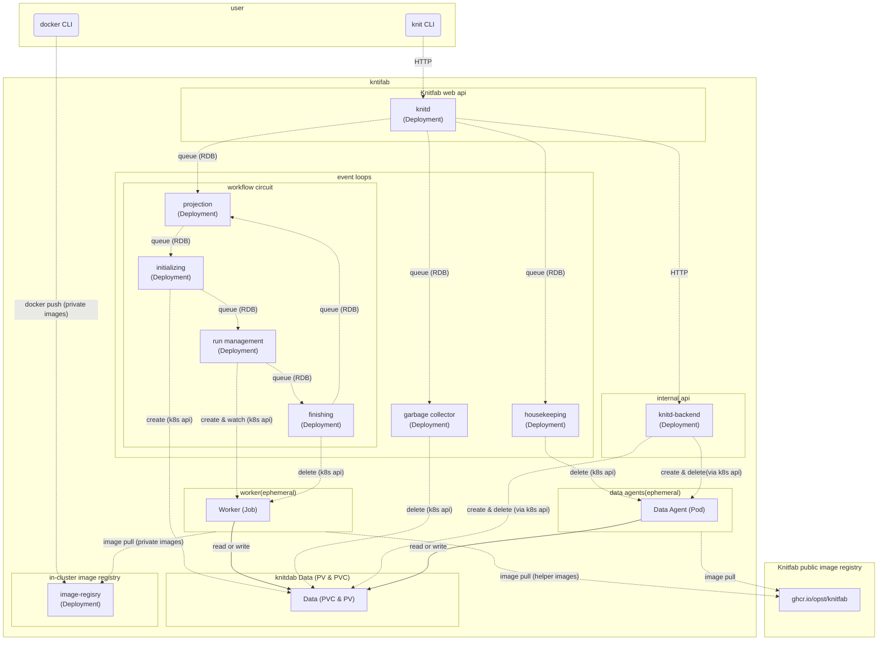

Knitfab 管理ガイド
=================

# 1. はじめに
-----------------------

この文書は Knitfab を運用・管理する人に向けたものです。

- Knitfab をインストールする方法
- Knitfab の運用上の注意点
- Knitfab を構成する kubernetes リソースについて

などの話題を取り扱います。

## 1.1. 他言語版/Translations

- English: [./admin-guide.en.md](./admin-guide.en.md)


# 2. Knitfab インストールの事前準備
--------------------

Knitfab をインストールするには、以下の環境が必要です。

- kubernetes クラスタ: 
  - Knitfab は kubernetes クラスタ上で稼働します。
  - マルチノードクラスタまたはシングルノードクラスタでも構いません。
  - この kubernetes は、x86_64 系CPUで動作するマシン上で動作している必要があります。
  - クラスタからインターネットにアクセスが可能なこと。
- NFS: 
  - Knitfabが用いる RDB やクラスタ内イメージレジストリ、データなどを永続化するために、NFS を利用します。

特に NFS は、Knitfabがデータ履歴等を蓄積していく場所となりますので、十分な容量があるものが良いでしょう。

## 2.1. kubernetesのインストール

kubernetes の構築手法については、下記の公式リファレンスを参考にしてください。

- https://kubernetes.io/docs/setup/production-environment/tools/kubeadm/create-cluster-kubeadm/
- https://kubernetes.io/docs/setup/production-environment/container-runtimes/
- https://kubernetes.io/docs/tasks/administer-cluster/kubeadm/configure-cgroup-driver/

なお、Knitfab 開発チームでは、次の条件で構築した kubernetes クラスタについて動作を確認しています。

- kubernetes 1.29.2以降
- コンテナランタイム: containerd
- cgroup: systemd

## 2.2. CNI をインストールする

kubenetes 上のネットワーク機能を有効化するために、何らかの CNI (container network interface) をインストールする必要があります。

Knitfab 開発チームは [calico](https://docs.tigera.io/calico/latest/about) で動作を確認しています。

## 2.3. GPU を有効化する

kubernetes 上のコンテナから GPU を使えるようにするには、node をそのように設定しておく必要があります。

これも下記の公式リファレンスを参考にしながら設定を行ってください。

- https://kubernetes.io/ja/docs/tasks/manage-gpus/scheduling-gpus/

## 2.4. シングルノードクラスタでの設定

kubernetes クラスタを単一ノード (control plane ノード) のみのクラスタで運用し始める場合は、そのノードに指定されている taint を除去する必要があります。
これを行わないと Knitfab のコンポーネントが起動できるノードが存在しない、という状態になります。

詳細は https://kubernetes.io/docs/setup/production-environment/tools/kubeadm/create-cluster-kubeadm/#control-plane-node-isolation を参照ください。

## 2.5. NFS サーバの用意

Knitfab では、デフォルトの [ストレージクラス](https://kubernetes.io/docs/concepts/storage/storage-classes/) として、ストレージドライバ [csi-driver-nfs](https://github.com/kubernetes-csi/csi-driver-nfs) によるものを採用しています。これはコンテナがどの kubernetes ノードで起動したとしても Knitfab がデータにアクセスできるようにするためです。

NFSにはいくつかバージョンがありますが、Knitfab では NFS version 4 を前提としています。

そこで、kubernetes クラスタの各ノードからアクセス可能なネットワーク上の位置に、NFSサーバ を用意してください。
例えば、NFS 機能を有する NAS(Network Attached Storage)機器や、NFSサーバー機能を有する計算機（Linuxサーバなど）等です。

> たとえば Ubuntu OS マシンをNFSサーバーとするなら:
>
> - `nfs-kernel-server` パッケージをインストールして (`apt install nfs-kernel-server`) 、
> - `/etc/exports` に設定ファイルを配置することで
>
> NFS サーバにできます。

## 2.6. その他ツール類
以下のツールをインストールしてください。

- [helm](https://helm.sh/)
- bash
- wget
- jq

インストール方法は、お使いのOSのドキュメントや関連資料を参照ください。


# 3. Knitfab をインストールする
-----------------------

## 3.1. インストールされるもの

インストール手順を実施することにより、次のものが Kubernetes クラスタにインストールされます。

|  | 対応する Helm Chart |
|:------|:------------|
| Knitfab アプリケーション本体 | knit-app, knit-schema-upgrader |
| データベース | knit-db-postgres |
| クラスタ内イメージレジストリ | knit-image-registry |
| TLS 証明書類 | knit-certs |
| ストレージクラス | knit-storage-nfs |

また、 Helm Chart "knit-storage-nfs" は [CSI "csi-driver-nfs"](https://github.com/kubernetes-csi/csi-driver-nfs/) に依存しているので、この Chart も Knitfab とおなじ Namespace にインストールされます。

## 3.2. 必要なもの
- インストール先の kubernetes クラスタに対してアクセスできる設定の kubeconfig ファイル
- (単一ノードクラスタを構成の場合)そのノードのマシンに 4GB のメモリが必要。
  なお、このメモリ量は最低限 Knitfab が起動できる程度の容量です。Knitfab上で実行する機械学習タスクによっては、より多くのメモリが必要となります。

### 3.2.1. (任意実施) TLS 証明書を用意する

Knitfab Web API やクラスタ内イメージレジストリは、原則として https で通信を行います。
デフォルトではインストールスクリプトはそのための証明書を生成しますが、必要に応じて別の証明書を指定して使うこともできます。

- CA 証明書とその鍵があれば、それを使う
- 加えて、サーバ証明書とその鍵があれば、それを使う

たとえば「 kubernetes クラスタのノードに対して特定のドメイン名が使いたい」などといった要求があるなら、事前にサーバ証明書とそれに署名した CA 証明書 (およびそれらの鍵) が必要です。

証明書類が指定されない場合は、インストーラは自己署名証明書と、それで署名したサーバ証明書を生成します。サーバ証明書は、Knitfab をインストールした際の Kubernetes クラスタのノードの IP アドレスを SAN に持つように生成します。

## 3.3. インストール手順
以下の順序で実施します。

1. インストーラを手に入れます。
2. インストール設定ファイルを生成し、パラメータを調整します。
3. インストールを実行します。
4. ユーザにハンドアウトを配布し、利用開始してもらう。

### 3.3.1. インストーラを手に入れる

インストーラは https://github.com/opst/knitfab/installer/installer.sh です。

これを適当なディレクトリ ( 本書では、例として`~/knitfab` としますが、別の場所でも構いません) にダウンロードします。

```
mkdir -p ~/knitfab/install
cd ~/knitfab/install
wget -O installer.sh https://raw.githubusercontent.com/opst/knitfab/main/installer/installer.sh
chmod +x ./installer.sh
```

### 3.3.2. インストール設定ファイルを生成し、パラメータを調整する
以下を実行すると、 `./knitfab-install-settings` ディレクトリに Knitfab のインストール設定が生成されます。
`${YOUR_KUBECONFIG}` の部分は、事前に用意した kubeconfig ファイルへのパスを指定してください。

```
./installer.sh --prepare --kubeconfig ${YOUR_KUBECONFIG}
```


> [!Note]
>
> もし特定の TLS 証明書類を利用したいなら、代わりに次のコマンドを実行してください。
>
> ```
> TLSCACERT=path/to/ca.crt TLSCAKEY=path/to/ca.key TLSCERT=path/to/server.crt TLSKEY=path/to/server.key ./installler.sh --prepare --kubeconfig ${KUBECONFIG}
> ```
>
> サーバ証明書について指定がないなら、環境変数 `TLSCERT`, `TLSKEY` を省略して、次のようにします。
>
> ```
> TLSCACERT=path/to/ca.crt TLSCAKEY=path/to/ca.key ./installler.sh --prepare
> ```
>
> CA 証明書が指定されなかった場合には、インストーラは 自己署名証明書を自動的に生成します。
> サーバ証明書が指定されなかった場合には、インストーラは CA 証明書から自動的に生成します。

> [!Note]
>
> **上級向け**
>
> 上記の手順は、 Knitfab Web API を https として公開するように設定するものです。
>
> 一方で、Knitfab 自身が https 化されていると不都合な場合もあります。たとえば、Knitfab Web API の前にロードバランサーを設置して、TLS終端化はそちらで行いたい、という場合です。
>
> そうした場合には、次のように、フラグ `--no-tls` を付加して「手順2」を実行してください。
>
> ```
> ./installer.sh --prepare --no-tls --kubeconfig ${YOUR_KUBECONFIG}
> ```
>
> これによって、 `./installer.sh --prepare` が TLS 証明書ならびに関連する設定を生成しないようになり、続くインストール時にも Knitfab Web API は https 化されません。
>
> なお、この際にはクラスタ内イメージレジストリも https 化されないので、各ユーザはインセキュアレジストリ(insecure registry)として dockerd に登録する必要があります。その詳細は、次のリンク先を参照ください。
>
> - https://docs.docker.com/reference/cli/dockerd/#insecure-registries
> - https://docs.docker.com/reference/cli/dockerd/#daemon-configuration-file
>

> [!Caution]
>
> **TLS証明書を指定した場合、それら証明書や秘密鍵がインストール設定の一部として以下の場所に複製されます。**
>
> - `knitfab-install-settings/certs/*` (キーペア; ファイルのコピーとして)
> - `knitfab-install-settings/values/knit-certs.yaml` (キーペア; base64エンコードされたテキストとして)
> - `knitfab-install-settings/knitprofile` (証明書のみ; base64エンコードされたテキストとして)
>
> また、インストーラが証明書を自動生成した場合も上記の場所に配置されます。
>
> 特に、キーペアには **秘密鍵** が含まれるので、取り扱いには注意してください。

#### 3.3.2.1. NFS を設定する

**インストーラで生成されるデフォルト設定は、「 Knitfab が管理している情報を永続化しない」ようになっています。**

つまりデフォルトでは NFS を使用しない設定です。
そこで、Knitfab用に用意した NFS を利用してデータを永続化するように、設定を変更します。

変更すべきファイルは `knitfab-install-settings/values/knit-storage-nfs.yaml` です。
このファイル内の次のエントリを変更してください。

- `nfs.external`: 値を `true` にする。
- `nfs.server`: をコメント解除して、 NFS サーバのホスト名 (ないし IPアドレス) を指定する。

さらに、必要に応じて次のエントリも変更してください。

- `nfs.mountOptions`: NFS に対するマウントオプションについて特に指定があれば記述します。
- `nfs.share`: Knitfab に利用させたいサブディレクトリがあれば指定します。
    - 注：そのサブディレクトリは、事前に作成しておく必要があります。

以上をまとめると、`knit-storage-nfs.yaml` は、次のようになるでしょう。

```yaml
nfs:
  # # external: If true (External mode), use NFS server you own.
  # #  Otherwise(In-cluster mode), knitfab employs in-cluster NFS server.
  external: true

  # # mountOptions: (optional) Mount options for the nfs server.
  # #  By default, "nfsvers=4.1,rsize=8192,wsize=8192,hard,nolock".
  mountOptions: "nfsvers=4.1,rsize=8192,wsize=8192,hard,nolock"

  # # # FOR EXTERNAL MODE # # #

  # # server: Hostname of the nfs server.
  # #  If external is true, this value is required.
  server: "nfs.example.com"  # update this to your NFS server host.

  # # share: (optional) Export root of the nfs server. default is "/".
  share: "/"

  # # # FOR IN-CLUSTER MODE # # #

  # # hostPath: (optional) Effective only when external is false.
  # # If set, the in-cluster NFS server will read/write files at this directory ON NODE.
  # #
  # # This is useful when you want to keep the data even after the NFS server is restarted.
  # hostPath: "/var/lib/knitfab"

  # # node: (optional) kubernetes node name where the in-cluster NFS server pod should be scheduled.
  # node: "nfs-server"
```

#### 3.3.2.2. その他のインストール時の設定

ここまで述べた以外のファイルについても、必要に応じてパラメータを変更できます。

特に利用上影響があるのは次のものです。
##### (1) ポート番号

- `knitfab-install-settings/values/knit-app.yaml` の `knitd.port`
- `knitfab-install-settings/values/knit-image-registry.yaml` の `port`

前者は Knitfab API の LISTEN ポート、後者はクラスタ内イメージレジストリの LISTEN ポートです。

##### (2) クラスタのTLD
また、 kubernetes クラスタ構築時に、クラスタの TLD(Top Level Domain)をデフォルト値 ( `cluster.local` ) から変更していた場合には、次の項目にその TLD を設定する必要があります。

- `knitfab-install-settings/values/knit-app.yaml` の `clusterTLD` (コメント解除して書き換えます)

##### (3) Knitfab 拡張機能関連
Knitfab の動作を拡張するための設定ファイルも含まれています。

- `knitfab-install-settings/values/hooks.yaml` を編集することで WebHook を設定できます。
- `knitfab-install-settings/values/extra-api.yaml` を編集することで拡張 Web API を設定できます。

詳細は、「Knitfab を拡張する」の章を参照ください。

### 3.3.3. インストールする

以下のコマンドを実行することで、インストールスクリプトが順次 Knitfab のコンポーネントを kubernetes クラスタにインストールします。
`${NAMESPACE}`には、Knitfabアプリケーションのインストール先とする kubernetes 名前空間名を指定してください。（ここで新規に指定します。）
これには、しばらく時間がかかります。

```
./installer.sh --install --kubeconfig path/to/kubeconfig -n ${NAMESPACE} -s ./knitfab-install-settings
```

<!-- TODO: インストールの成否はどうやって確認するか記載 -->

### 3.3.4. ユーザにハンドアウト(Knitfab設定情報)を配布する

インストールされた Knitfab への接続情報が `knitfab-install-settings/handouts` フォルダに生成されます。

このフォルダの内容を、Knitfab を使用するユーザに配布してください。これを**ハンドアウト**と呼びます。

このハンドアウトの使い方については、 user-guide に説明があります。

#### (任意実施)3.3.4.1. ハンドアウトを修正する

Knitfab に対して特定のドメイン名でアクセスしたい場合には (例: 指定したサーバ証明書がそうなっている場合) 、ユーザにハンドアウトを配布する前に、接続設定を書き換える必要があります。

**knitprofile ファイル** と呼ばれる、Knitfab API への接続設定が `knitfab-install-settings/handouts/knitprofile` にあります。このファイルは次のような構成をした yaml ファイルです。

```yaml
apiRoot: https://IP-ADDRESS:PORT/api
cert:
    ca: ...Certification....
```

キー `apiRoot` の値が、Knitfab Web API のエンドポイントを示します。
デフォルトでは、クラスタの適当なノードの IP がセットされています。
特定のドメイン名でアクセスしたいなら、ここにそれを記入してください。

たとえば Knitfab に対して `example.com:30803` としてアクセスしたいなら、

```yaml
apiRoot: https://example.com:30803/api
cert:
    ca: ...Certification....
```

のように、 `apiRoot` のホスト部分を書き換えます。

また、**クラスタ内イメージレジストリ** の証明書についても対処が必要です。

`knitfab-install-settings/handouts/docker/certs.d/IP-ADDRESS:PORT` のような名前のディレクトリがあります。
このディレクトリ名は kubernertes ノードの IPアドレスとポート名を `:` でつないだものです。
この IPアドレスの部分を、使用したいドメイン名に変更してください。

# 4. Knitfab をアンインストールする

インストールを実行すると `knitfab-install-settings/uninstall.sh` としてアンインストーラが生成されます。

これを以下のように実行すると、kubernetes クラスタ内の Knitfab のアプリケーションがアンインストールされます。

```
knitfab-install-settings/uninstall.sh
```

さらに、以下を実行すると、データベースやクラスタ内イメージレジストリを含むすべての Knitfab 関連リソースが破棄されます。

```
knitfab-install-settings/uninstall.sh --hard
```


# 5. Knitfab の helm 的構成について

Knitfab はいくつかの helm chart で構成されています。
このセクションでは、Knitfab の helm 的な構築方法について解説します。

管理者は Knitfab の一部をアンインストール・再インストールしたり、アップデートしたりしなくてはならない場合があるかもしれません。helm構成を理解しておけば、そうした場合に何をすればよいか見通しが立つようになるでしょう。

> [!Note]
>
> このセクションは、読者に helm の知識があることを前提としています。

Knitfab は次の helm chart から構成されています。

- knitfab/knit-storage-nfs: NFS ドライバを導入し StorageClass を定義する。
- knitfab/knit-certs: 証明書類を導入する。
- knitfab/knit-db-postgres: RDB を定義する。
- knitfab/knit-image-registry: クラスタ内レジストリを定義する。
- knitfab/knit-app: 上記以外の Knitfab のコンポーネントを定義する。

helm chart リポジトリ "Knitfab" は (デフォルトでは)  https://raw.githubusercontent.com/opst/knitfab/main/charts/release です。

これらの chart を適切な手順でインストールすれば、Knitfab をインストールできます。
実際、Knitfabの インストーラはまさにそれを実行しています。

要点だけに絞ると、インストーラは以下ような手順を実施しています。

```sh
NAMESPACE=${NAMESPACE}  # where Knitfab to be installed
CHART_VERSION=${CHART_VERSION:=v1.0.0}  # version of Knitfab to be installed
VALUES=./knit-install-settings/values

helm install -n ${NAMESPACE} --version ${CHART_VERSION} \
    -f ${VALUES}/knit-storage-nfs.yaml \
    knit-storage-nfs knitfab/knit-storage-nfs

helm install -n ${NAMESPACE} --version ${CHART_VERSION} \
    -f ${VALUES}/knit-certs.yaml \
    knit-certs knitfab/knit-certs

helm install -n ${NAMESPACE} --version ${CHART_VERSION} \
    --set-json "storage=$(helm get values knit-storage-nfs -n ${NAMESPACE} -o json --all)" \
    -f ${VALUES}/knit-db-postgres.yaml \
    knit-db-postgres Knitfab/knit-db-postgres

helm install -n ${NAMESPACE} --version ${CHART_VERSION} \
    --set-json "storage=$(helm get values knit-storage-nfs -n ${NAMESPACE} -o json --all)" \
    --set-json "certs=$(helm get values knit-certs -n ${NAMESPACE} -o json --all)" \
    -f ${VALUES}/knit-image-registry.yaml \
    knit-image-registry Knitfab/knit-image-registry

helm install -n ${NAMESPACE} --version ${CHART_VERSION} \
    --set-json "storage=$(helm get values knit-storage-nfs -n ${NAMESPACE} -o json --all)" \
    --set-json "database=$(helm get values knit-db-postgres -n ${NAMESPACE} -o json --all)" \
    --set-json "imageRegistry=$(helm get values knit-image-registry -n ${NAMESPACE} -o json --all)" \
    --set-json "certs=$(helm get values knit-certs -n ${NAMESPACE} -o json --all)" \
    -f ${VALUES}/knit-app.yaml \
    knit-app Knitfab/knit-app
```

> 実際のインストーラは以上の操作に加えて、これらの挙動をもっと安定させるために追加のオプションを与えたり、アンインストーラやハンドアウトを生成したりしています。

上記の途中にたびたび現れている `--set-json "...=$(helm get values ...)"` というパターンは、インストール済の chart からインストールパラメータ ([helm の Values](https://helm.sh/docs/chart_template_guide/values_files/)) を読み出して、chart 間で矛盾がないようにする手法です。

それに加えて `./knitfab-install-settings/values/CHART_NAME.yaml` をその chart 用の Values として取り込んでいます。
したがって、特定の chart のみを再インストールしたり、アップデートしたりする必要に迫られた場合は、この手法を踏襲するのが良いでしょう。

> [!Caution]
>
> 次の chart をアンインストールすると、Knitfab 内の**リネージやデータを喪失してしまいます**。chart をアンインストールする際には注意ください。
>
> - knitfab/knit-storage-nfs
> - knitfab/knit-db-postgres
> - knitfab/knit-image-registry
>
> knit-db-postgres や knit-image-registry は、それぞれ PVC も定義しているので、これらの chart をアンインストールすると、それまでのデータベースの内容や、`docker push` されたイメージが**失われます**。
> 結果として、PVC と Knitfab 的なデータとの関係や、プランが参照するイメージが失われるので、Knitfab のリネージ管理の前提が満たされないことになります。
>
> また、knit-storage-nfs は他の全ての PV を NFS 上に記録する機能を提供しています。これが失われると、全 Pod が PV にアクセスできなくなります。


# 6. ユーザに開示すべきクラスタの情報

Knitfab の機能には、インストールされている kubernetes クラスタの設定に依存するものがあります。
それらの機能をユーザがうまく活用するためには、ユーザに対してクラスタの設定に関する情報が開示されていなくてはなりません。
Knitfab を構築した管理者として、ユーザに適切な情報開示をしましょう。
以下では、そのようなユーザに開示すべき情報について説明します。

## 6.1. クラスタ内イメージレジストリの接続情報

ハンドアウト内の `docker/certs.d` ディレクトリ内を見ればわかりますが、利用すべきクラスタ内イメージレジストリのホスト・ポートについては、ユーザに対して明示的に伝えるべきでしょう。

## 6.2. "プラン"の `resources` に指定できるリソースと上限

Knitfab の"プラン"定義には、その"プラン"に基づく"ラン"が利用する計算機資源を宣言する機能 `resources` があります。
この値として、クラスタに存在しないような規模の cpu や memory が指定されても、そのような"プラン"の"ラン"は実行できないだけとなります。
したがって、設定可能な値の上限について、管理者はユーザに極力開示すべきでしょう。

また、kubernetes では、GPU を搭載したノードがある場合に、GPU が schedulable resource として公開される。
具体的に指定できるリソースの名称 (例: `nvidia.com/gpu`, `amd.com/gpu`) はノードの構成次第となります。
こうした、拡張的なリソース名称が使えるならば、その旨もユーザに開示すべきです。

### 6.2.1. "プラン"の `on_node` で利用できるラベル: ノードの label と taint

Knitfab の"プラン"定義には kubernetes のノードに設定された label と taint を利用した機能 `on_node` がある。

管理者は、ユーザに向けて、`on_node` 機能で利用できるラベルとその意味するところについて開示すべきである。

> [!Note]
>
> **Knitfab が推奨する taint と label の設定**
>
> もし node に taint をセットするなら、同じキーバリュー組で label もセットする。
>

#### 6.2.1.1. node の label とは

kubenetes におけるノードの [label](https://kubernetes.io/docs/concepts/overview/working-with-objects/labels/) とは、ノードのメタデータである。ラベルはキーバリュー型の構造をとる。
kubernetes には、Pod に対して「ある label のあるノードで必ず、あるいは優先的に実行する」という制約をかけることができる ([node Affinity](https://kubernetes.io/docs/concepts/scheduling-eviction/assign-pod-node/#node-affinity)) 。

#### 6.2.1.2. node の taint とは

kubenetes におけるノードの [taint](https://kubernetes.io/docs/concepts/scheduling-eviction/taint-and-toleration/) とは「ノードに pod を配置 **しない** ようにする制約」である。
これに対して、taint を無視してよい、という属性 (toleration) を Pod に与えることができる。こうすると、適当な toleration のある Pod だけが taint のあるノード上に配置されうるのである。

taint は、label のようなキーバリュー組とあわせて taint の強さ (NoSchedule, PreferNoSchedule) が設定できる。

たとえば「 GPU のあるノードには、特に GPU を必要としないタスクが配置されないようにしたい」なら、node に taint を設定する必要がある。

#### 6.2.1.3. "プラン"の on_node はどのように label と taint を利用しているのか

user-guide に詳しく書いたが、Knitfab では、"プラン"定義に `on_node` という属性をもたせることができる。
これは、その"プラン"に基づいた"ラン"がどういうノード上で実行されてよいか、を示すもので、kubernetes 的には toleration と node Affinity の値として利用される。

"プラン"定義の `on_node` は次のように記述される。

```yaml
on_node:
  may:
    - "key=value"
  prefer:
    - "vram=large"
  must:
    - "accelarator=gpu"
```

`may`, `prefer`, `must` は、いずれも kuberenets の node label と同じ形式をした値の配列をセットする。
`may` はノードへの配置許可、 `prefer` はノードへの優先配置、 `must` はノードへの強制配置を意味する。

具体的には、これらはそれぞれ、Worker の属性として、次のように翻訳される。

- `may`:
    - `toleration`: `NoSchedule` のラベル
- `prefer`:
    - `toleration`: `NoSchedule` および `PreferNoSchedule` のラベル
    - node Affinity: `preferredDuringSchedulingIgnoredDuringExecution` のラベル
- `must`
    - `toleration`: `NoSchedule` および `PreferNoSchedule` のラベル
    - node Affinity: `requiredDuringSchedulingIgnoredDuringExecution` のラベル

推奨事項として「 taint をセットしたなら、そのラベルを node にも直接セットする」を掲げたのは、`on_node` 機能が同じラベルを toleration と node Affinity に使い回すから、である。

## 6.3. 重要な注意点
---------------------

> [!Caution]
>
> **Knitfab をパブリックなネットワークに公開してはならない。**
>
> 現時点のKnitfab やクラスタ内イメージレジストリは、認証や認可の仕組みが一切ない。
>
> パブリックなインターネットに公開すると、次のリスクがある。
>
> - 悪意あるコンテナを実行させられる
> - 悪意あるコンテナイメージを配信させられる
>
> 前者は、計算機資源を奪われるだけでなく、kubernetes の未知の脆弱性をつかれてさらなる脅威にさらされる可能性がある。
> 後者も、他の脅威の踏み台になりかねない。
>
> **重ねて警告する。Knitfab をパブリックなインターネットに公開してはならない。**
>


## 6.4. 各要素の kubernetes 的な表現について
--------------------------------

### 6.4.1. "データ"の実体

"データ"は、kubernetes 的には PersistntVolumeClaim (PVC) およびバインドされている PersistentVolume (PV) である。

Knitfab は、RDB に"データ"である PVC の名前を記録している。"データ"に割り当てられている"タグ"は RDB に書き込まれている。

### 6.4.2. "プラン"の実体

"プラン"の実体は、RDB に記録されたレコードである。
ただし、このレコードにはコンテナイメージの名前が含まれている。

### 6.4.3. "ラン"の実体

"ラン"の実体には、2つの側面がある。

ひとつは RDB 上に記録されたリネージ情報である。つまり、入力と、出力と、"プラン"の組み合わせを記録している。

もうひとつは、kubenetes 上で実施されている計算である。これは Worker と呼ばれる Job を起動することで実現する。
Worker は"ラン"ごとに最大 1 存在する。必要になったら起動され、不要になったら破棄される。


## 6.5. Knitfab の kubernetes 的構成
------------------

Knitfab の、特に kubernetes 的な構成要素について解説する。

Knitfab はいくつかの deployment, daemonset, service から構成されている。

### 6.5.1. deployment, service

Knitfab を構成する **静的なコンポーネント** は次のものたちである。

| daemonset | 解説 | service | NodePort |
|:---------:|:----:|:--------:|:------:|
| knitd | Knitfab API サーバ | knitd | ✔ (30803) |
| knitd-backend | Knitfab 内部 APIサーバ | knitd-backend | |
| database-postgres | RDB | database | |
| image-registry-registry | クラスタ内イメージレジストリ | image-registry | ✔ (30503) |
| csi-nfs-controller |  NFS を PV として使えるようにする (csi-driver-nfs 由来)  | | |
| projection-leader |  "ラン" を生成する | | |
| initialize-leader |  "ラン" を起動する準備をする | | |
| run-management-leader |  "ラン" を起動し死活監視する | | |
| finishing-leader | 停止した "ラン" の破棄 | | |
| garbage-collecion-leader | 不要になった PVC の破棄 | | |
| housekeeping-leader | その他放置されたリソースの破棄 | | |

NodePort 列に ✔ が入っている service は、クラスタ外からアクセスされることが想定されている。カッコ付きでデフォルトのポート番号を示しておいた。
ユーザは、knitd service に対して Knitfab の API アクセスを (CLI 経由で) する。また、カスタムイメージを image-regisrty service に対して push する。

コンポーネント間のメッセージは次図のように流れる。



通信は点線、コンテナ内のファイル読み書きは実線で示した。
また、RDB や kubernetes api へのデータフローは煩雑になるので省いた。コンポーネント間の通信手段であるかのように表現してある。

ユーザは `knit` CLI を使って knitd にリクエストを送る。 knitd はそれに応じて RDB のレコードを操作する。

"knitfab" とラベル付けられた囲みの範囲内が、お使いの kubernetes クラスタ内に構築されている Knitfab の範囲である。

Web API を提供するコンテナ knitd が CLI からリクエストを受け取る。一部リクエストは 内部 API である knitd_backend にプロキシされて、 kubernetes API を呼び出している。

イベントループ (event loops) の各コンポーネントは、定期的に RDB を監視して、各々果たすべきタスクを探している。特に、workflow circuit とラベル付けられているイベントループの集まりは、

- "プラン" や "データ" から "ラン" を生成し (projection) 、
- 出力 "データ" の実体となる PVC を確保して (initializing) 、
- "ラン" を Worker として起動して終了まで監視し (run management) 、
- 終了した worker を破棄しつつ "ラン" を完了させる (finishing)

...という一連の流れでもって、ワークフローを駆動させている。
この Worker とは、Job を実体とした Knitfab の **動的なコンポーネント** のひとつである。
Worker の主体はユーザ定義コンテナであるが、それ以外にも Knitfab の公開レジストリ (`ghcr.io/opst/Knitfab`) から提供されるイメージも利用している。

housekeeping イベントループは、停止しているが破棄されていない Data Agent を探して、これを破棄する。

garbage collector イベントループは、knitd によって「削除して良い」とマークされた PVC と PV を定期的に削除する。

図中に登場する Data Agent は、Knitfab が有するもうひとつの **動的なコンポーネント** である。この実体は Pod である。
ユーザが "データ" をアップロードしたりダウンロードしたりしようとすると、そのタスクが knitd から knitd_backend に対して下請けにだされる。knitd_backend は要求に応じた PVC をマウントした Data Agent 起動して、具体的な読み書きをさらに下請けに出す。読み書きが終わって不要になった Data Agent は、原則 knitd_backend によって破棄される。Data Agent のイメージは、Knitfab の公開レジストリ (`ghcr.io/opst/Knitfab`) から提供される。

ユーザは自作したプライベートなコンテナイメージをクラスタ内イメージレジストリ (image-regisrty) に `docker push` する。
Worker が起動するに当たり、ユーザ定義のイメージは image-registry から pull されることになるだろう。
その他、Worker を構成するコンテナは、 Knitfab の公開レジストリから提供される。

> [!Warning]
>
> 動的なコンポーネントは、既に述べた通り `ghcr.io/opst/knitfab` からイメージを pull することで起動する。
>
> したがって、インターネットアクセスがない場合や、 ghcr.io に何らかの障害が起きている場合には動的コンポーネントの起動に失敗する可能性がある。

### 6.5.2. daemonset

- vex: そのノード上の pod がマウントしている PVC のキャパシティが足りなくなったら、自動的に拡張する。

ただし、NFS は PVC のキャパシティはあまり意味を持たないので、この daemonset も現時点ではそれほど有意義なものではない。

### 6.5.3. その他のリソース

さらに、Knitfab をインストールすると、次のリソースも作成される。

- StorageClass: NFS を利用した PersistnetVolume を作成できるようにするため。
- PersistentVolume, PersistnetVolumeClaim: RDB とクラスタ内イメージレジストリの記憶領域として。
- Role, RoleBinding, ServiceAccount: k8s API にアクセスするため。
- ConfigMap, Secret: knitd, knitd-backend の設定ファイル, RDB の認証情報, TLS 証明書類
- PriorityClass: ワーカ(後述)用の PriorityClass

## 6.6. 日常的な監視
-----------

通常のシステム監視と同様の監視をすることになる。具体的には

- ノードの計算機資源 (メモリ使用量・ CPU 使用量・ロードアベレージ)
- 通信量
- NFS のストレージ容量

ノードの計算機資源が不足している場合は、その理由が重要である。
Worker が大量に起動しているのであれば、ある意味では正常である。単に順次実験が進行するのを待てばよい。あるいは、ノードを追加できればスループット (時間あたり "ラン" の終了数) を改善できる可能性がある。

NFS のストレージ容量には注意して欲しい。これが不足すると、ユーザの実験が生成した"データ"を記録できなくなる。余裕がある状態を維持したい。

# 7. トラブルシュート
----------------

Knitfab がうまく動いていない、とユーザから相談を受けた場合に、少なくとも調べるべき観点について説明する。

## 7.1. "ラン"が starting になったが、いつまでたっても running にならない or すぐに失敗する

### 7.1.1. 可能性1. Worker の Pod が正常に起動しないのかもしれない。

ユーザに、当該 "ラン" の Run ID を尋ねよう。そのうえで、

```
kubectl -n ${NAMESPACE} get pod
```

を実行して、実行されている Pod の状況を調べる。

問題の Worker の Pod は

```
worker-run-${RUN_ID}-${RANDOM_SUFFIX}
```

という Name をしているだろう。Run ID が `3cb1b091-01ad-41b1-acac-3f042f9df97c` なら、

```
worker-run-3cb1b091-01ad-41b1-acac-3f042f9df97c-wkgrq
```

のようになる。

そうした Pod を探し、 `kubectl describe pod ${POD_NAME}` や `kubectl get pod -o yaml pod ${POD_NAME}` を使って原因を探る。

たとえば、

- `ImagePullBackoff`, `ImagePullError` など:
    - "プラン" に指定されているイメージが実在しないのかもしれない。
    - クラスタ内イメージレジストリがダウンしていないだろうか？
    - ghcr.io が障害を起こしているときに、新しいノード上で worker を起動しようとした場合にはこうなる可能性がある。
- `Pending`:
    - "プラン" に指定されている cpu や memory が大きすぎないだろうか？
    - 存在しない label が `on_node` に指定されていないだろうか？
    - 単に多量の "ラン" が存在していて、待たされているだけかもしれない。
- `Error`:
    - "ラン"の `exit` 属性の内容を確認する。
        - `OOMError`: "プラン" の `resources` に割り当てているメモリが小さすぎる。

### 7.1.2. 可能性2. イベントループのコンテナが存在しない、エラーを起こしている

メンテナンス等のために Deployment をスケールインしていると、イベントループの連鎖が止まってしまう。
各イベントループにつき少なくとも 1 つの Pod が存在するように設定する。

- Error のままになっているイベントループ Pod がないか確認する。
- `kubectl logs` で動作が止まっているイベントループ Pod がないか確認する。

こうしたコンテナがあるようなら、 `kubectl delete` で Pod を削除する。
Deployment が自動的に必要数まで Pod を起動するのを待って、様子を見る。

## 7.2. システム側 Pod が頻繁に停止する

ログや `kubectl desctibe` を利用して、停止する理由を探る必要がある。

異常停止を繰り返している Pod が knitd, knitd-backend とイベントループに限られているなら、database-postgres が正常な状態にない可能性がある。

- 異常停止を起こした Pod のログを読んで、データベースに対するアクセスエラーを起こしていないか確認する
- database-postgres のログを読んで、異常を起こしていないか確認する
- Config Map, Secret など、静的コンポーネントが前提としている他のリソースが消滅していないか確認する
    - `kubectl describe` をすると、不足がないかどうかわかるだろう。

また、ノードのメモリは十分だろうか？

シングルノードの Knitfab を構成する場合、 4GiB 程度のメモリ容量が必要であった。
これを下回る仮想マシン上に Knitfab のデプロイを試みたところ、静的なコンポーネントが不規則に停止・再起動を繰り返した。

## 7.3. なにか調子の悪い Pod がいる、再起動したい

いつでも `kubectl pod delete` して構わない。

Knitfab の Pod は、突然に終了されても整合性を損なわないように設計されている。

ただし、Worker や Data Agent を突然終了すると、ユーザの機械学習タスクやデータのアップロード・ダウンロードは失敗するだろう。

また、スケールイン・スケールアウトについても、 kubernetes の Deployment としてスケーリングすればよい。

## 7.4. ノードを追加したい

kubenetes の手順に従って追加して良い。
Worker や Data Agent を配置できるノードを増やすことができるだろう。

ただし、v1.0 の時点においては、TLS 証明書は新規追加されたノードには対応していない。
ユーザからのリクエストは、以前からあるノードに対して送られるべきだ。さもなければ、証明書エラーになるだろう。

# 8. バックアップとレストア
-------------------

本章では、Knitfab の"データ"とリネージをバックアップし、新規にインストールされた Knitfab にレストアする方法について述べる。
バックアップとレストアのためのスクリプトは、このリポジトリの `admin-tool` ディレクトリにある。また、これを tar.gz アーカイブしたものがリリースにある。

Knitfab のバックアップは次の手順から構成される。

1. システムの停止をアナウンスする
2. システムを停止する
3. バックアップをとる
  - イメージレジストリのバックアップ
  - "データ" のバックアップ
  - データベースのバックアップ
4. システムを復旧して、利用可能になったことをアナウンスする

Knitfab のレストアは、新規にインストールした Knitfab に対して適用することを想定している。
また、その際の Knitfab のバージョンは、バックアップを取ったバージョンと同一であることを想定している。

Knitfab のレストアは、次の手順から構成される。

1. イメージレジストリをレストアする
2. "データ" をレストアする
3. データベースをレストアする

レストア手順を実行することで、イメージレジストリと RDB の内容は抹消され、バックアップ時の内容に復元される。

## 8.1. バックアップ

### 8.1.1. システムの停止をアナウンスする

ユーザに対して、バックアップのためにシステムが利用できなくなることを事前に告知する。
この際、当該期間に実行中であった"ラン"は失敗する可能性があることを含め、ユーザに注意を促す。

### 8.1.2. システムを停止する

シェルスクリプト `admin-tools/system-freeze.sh` を実行することでシステムを停止する。
停止したい Knitfab に対して `knit init` したディレクトリで実行せよ。

```sh
knit init KNITPROFILE

KUBECONFIG=${KUBECONFIG:-~/.kube/config} NAMESPACE=${YOUR_KNITFAB_NAMESPACE} \
    admin-tools/system-freeze.sh
```

このスクリプトは次のツールを要求する。

- `knit`
- `helm`
- `kubectl`
- `jq`

このスクリプトは次の環境変数を参照する。

- `NAMESPACE` **(required)**: 凍結対象の Knitfab がインストールされている Kubernetes Namespace
- `KUBECONFIG` (optional): デフォルト以外の kubeconfig ファイルを指定する必要がある場合には、明示せよ

シェルスクリプト `admin-tools/system-freeze.sh` を実行すると、

- Knitfab を構成する deployment を 0 に scale-in する。
- 実行中の "ラン" を強制的に失敗させ、停止を待つ。
- 凍結解除用のスクリプトを生成する。

という 3 つのタスクが実行される。実際には、"ラン" のライフサイクルに関わらない deployment を scale in してから "ラン" を停止させて、残りの deployment を scale in する、という順序で進む。

この操作を始めると、Knitfab は新しい "ラン" を生成しなくなる。また、この操作が完了すると、Knitfab API は停止する。もし進行中の `knit data push` や `knit data pull` があっても、中断させられる。

`admin-tools/system-freeze.sh` は、カレントディレクトリにシステム復旧用のスクリプト `./system-unfreeze.sh` を生成する。このシステム復旧用スクリプトは、後でまた利用する。

### 8.1.3. バックアップ: イメージレジストリ

次のようにシェルスクリプト `admin-tools/backup/images.sh` を実行する。

```sh
KUBECONFIG=${KUBECONFIG:-~/.kube/config} NAMESPACE=${YOUR_KNITFAB_NAMESPACE} \
    admin-tools/backup/images.sh backup/images
```

このスクリプトは、次のコマンドを必要とする。

- `helm`
- `kubectl`
- `jq`

このスクリプトは、次の環境変数を参照する。

- `NAMESPACE` **(required)**: 凍結対象の Knitfab がインストールされている Kubernetes Namespace
- `KUBECONFIG` (optional): デフォルト以外の kubeconfig ファイルを指定する必要がある場合には、明示せよ

このスクリプトはバックアップ処理用に Pod を起動するので、そのイメージを pull するためにインターネットアクセスを必要とする。

このスクリプトは、引数に指定したディレクトリ `backup/images` (適宜管理しやすい名前を指定せよ)に、Knitfab のイメージレジストリのストレージを tar.gz アーカイブしたものを書き出す。書き出し先ディレクトリが存在しなければ、作成される。

バックアップ中に、PV の内容を読み出すため "datadumper" という Pod を生成する。正常に処理が終了すれば、自動的に削除される。バックアップを中断した場合には、この Pod が削除されないことがあるので、`kubectl` コマンドを利用して削除せよ。

### 8.1.4. バックアップ: "データ"

Knitfab の "データ" の内容をバックアップする。

このバックアップには、 リネージやタグは **含まれない**。リネージやタグをバックアップするには、データベースのバックアップが必要である。

次のようにシェルスクリプト `admin-tools/backup/data.sh` を実行する。

```sh
KUBECONFIG=${KUBECONFIG:-~/.kube/config} NAMESPACE=${YOUR_KNITFAB_NAMESPACE} \
    admin-tools/backup/data.sh backup/data
```

このスクリプトは、次のコマンドを必要とする。

- `helm`
- `kubectl`
- `jq`

このスクリプトは、次の環境変数を参照する。

- `NAMESPACE` **(required)**: 凍結対象の Knitfab がインストールされている Kubernetes Namespace
- `KUBECONFIG` (optional): デフォルト以外の kubeconfig ファイルを指定する必要がある場合には、明示せよ

このスクリプトはバックアップ処理用に Pod を起動するので、そのイメージを pull するためにインターネットアクセスを必要とする。

このスクリプトを実行すると、引数に指定したディレクトリ `backup/data` (適宜管理しやすい名前を指定せよ) に、"データ" の内容を保持している各 PVC のリソース定義と、当該 PVC にバインドされている PV の内容の tar.gz アーカイブを書き出す。

この処理中に、PV の内容を読み出すため "datadumper" という Pod を生成する。正常に処理が終了すれば、自動的に削除される。バックアップを中断した場合には、この Pod が削除されないことがあるので、`kubectl` コマンドを利用して削除せよ。

### 8.1.5. バックアップ: データベース

Knitfab のデータベースの内容をバックアップする。

このバックアップには、 **"データ" の内容は含まれない**。
レストアのためには "データ" のバックアップも必要である。

次のようにシェルスクリプト `admin-tools/backup/db.sh` を実行する。

```sh
KUBECONFIG=${KUBECONFIG:-~/.kube/config} NAMESPACE=${YOUR_KNITFAB_NAMESPACE} \
    admin-tools/backup/db.sh backup/db
```

このスクリプトは、次のコマンドを必要とする。

- `helm`
- `kubectl`
- `jq`

このスクリプトは、次の環境変数を参照する。

- `NAMESPACE` **(required)**: 凍結対象の Knitfab がインストールされている Kubernetes Namespace
- `KUBECONFIG` (optional): デフォルト以外の kubeconfig ファイルを指定する必要がある場合には、明示せよ

このスクリプトはバックアップ処理用に Pod を起動するので、そのイメージを pull するためにインターネットアクセスを必要とする。

このスクリプトを実行すると、引数に指定したディレクトリ `backup/db` (適宜管理しやすい名前を指定せよ)は配下に [`pg_dump`](https://www.postgresql.org/docs/15/app-pgdump.html) を tar 形式で出力したものを、gzip 圧縮したものを書き出す。もし書き出し先ディレクトリが存在しなければ、自動的に作成する。

この処理中に、PV の内容を読み出すため "pgdumper" という Pod を生成する。正常に処理が終了すれば、自動的に削除される。バックアップを中断した場合には、この Pod が削除されないことがあるので、`kubectl` コマンドを利用して削除せよ。


### 8.1.6. システムを復旧して、復旧をアナウンスする

`admin-tools/system-freeze.sh` が生成したシステム復旧用のスクリプト `./system-unfreeze.sh` を実行する。

これによって、各 deployment のレプリカ数を停止前の数に復元して、Web API や Run のライフサイクルが再開する。

各 deployment が十分な数に復旧したのち、ユーザにシステム復旧をアナウンスせよ。

## 8.2. レストア

過去に取得したバックアップで Knitfab を再構築する手順について述べる。

レストア先の Knitfab は、バックアップ取得時と同じバージョンである必要がある。また、レストア先の Knitfab は、新規にインストールされたばかりのものである必要がある。
それ以外の条件でレストアを行った場合、レストアが失敗したり、システムの整合性が失われる可能性がある。

### 8.2.1. レストア:イメージレジストリ

次のようにシェルスクリプト `admin-tools/restore/images.sh` を実行する。

```sh
KUBECONFIG=${KUBECONFIG:-~/.kube/config} NAMESPACE=${YOUR_KNITFAB_NAMESPACE} \
    admin-tools/restore/images.sh backup/images
```

ここで、`backup/images` は、イメージのバックアップを記録したディレクトリである、

このスクリプトは、次のコマンドを必要とする。

- `helm`
- `kubectl`
- `jq`

このスクリプトは、次の環境変数を参照する。

- `NAMESPACE` **(required)**: 凍結対象の Knitfab がインストールされている Kubernetes Namespace
- `KUBECONFIG` (optional): デフォルト以外の kubeconfig ファイルを指定する必要がある場合には、明示せよ

このスクリプトはレストア処理用に Pod を起動するので、そのイメージを pull するためにインターネットアクセスを必要とする。

`admin-tools/restore/images.sh` を実行すると、次のように表示される。

```
*** Restore Images ***
  - SOURCE: backup/images
  - NAMESPACE: knitfab
  - STORAGE CLASS:  (not changed)
  - CLEAN: yes   # (If yes, delete the existing PVC for images before restoring.)

Do you want to restore? [y/N]:
```

このメッセージは、レストア処理の内容を示しつつ、最終確認を求めるものである。もし良いようなら、 `y` を入力して enter する。

この後、次の処理が順に実行される。

1. イメージレジストリのレプリカ数を 0 にする
2. イメージレジストリ用の PVC を抹消して、バックアップで上書きする
3. イメージレジストリのレプリカ数を元に戻す

途中で中断・再試行した場合には、最後の手順で正常にレプリカ数が復元されない可能性がある。
その場合には、`kubectl` コマンドを利用して、直接レプリカ数を調整されたい。

レストア中に、PV に書き込みを行うため、"dataloader" という名前の Pod を起動する。正常にレストアが進めば自動的に削除される。レストアを中断した場合には "dataloader" が削除されずに残る可能性があるが、`kubectl ` コマンドを利用して直接削除せよ。

### 8.2.2. レストア:データ

次のようにシェルスクリプト `admin-tools/restore/data.sh` を実行する。

```sh
KUBECONFIG=${KUBECONFIG:-~/.kube/config} NAMESPACE=${YOUR_KNITFAB_NAMESPACE} \
    admin-tools/restore/images.sh backup/data
```

ここで、`backup/data` は、"データ"のバックアップを記録したディレクトリである、

このスクリプトは、次のコマンドを必要とする。

- `helm`
- `kubectl`
- `jq`

このスクリプトは、次の環境変数を参照する。

- `NAMESPACE` **(required)**: 凍結対象の Knitfab がインストールされている Kubernetes Namespace
- `KUBECONFIG` (optional): デフォルト以外の kubeconfig ファイルを指定する必要がある場合には、明示せよ

このスクリプトはレストア処理用に Pod を起動するので、そのイメージを pull するためにインターネットアクセスを必要とする。

`admin-tools/restore/data.sh` を実行すると、次のように表示される。

```
*** Restore Knitfab Data ***
  - SOURCE: backup/data/*  # Each directory containing pvc.json and data.tar.gz
  - NAMESPACE: knitfab
  - STORAGE CLASS:  (not changed)
  - CLEAN: no   # If yes, delete the existing PVC before restoring.

Do you want to restore? [y/N]:
```

このメッセージは、レストア処理の内容を示しつつ、最終確認を求めるものである。もし良いようなら、 `y` を入力して enter する。

この後、バックアップに基づいて、各 PVC を再構築する。

レストア中に、PV に書き込みを行うため、"dataloader" という名前の Pod を起動する。正常にレストアが進めば自動的に削除される。レストアを中断した場合には "dataloader" が削除されずに残る可能性があるが、`kubectl ` コマンドを利用して直接削除せよ。

### 8.2.3. レストア:データベース

次のようにシェルスクリプト `admin-tools/restore/db.sh` を実行する。

```sh
KUBECONFIG=${KUBECONFIG:-~/.kube/config} NAMESPACE=${YOUR_KNITFAB_NAMESPACE} \
    admin-tools/restore/db.sh backup/db
```

ここで、`backup/db` は、データベースのバックアップを記録したディレクトリである、

このスクリプトは、次のコマンドを必要とする。

- `helm`
- `kubectl`
- `jq`

このスクリプトは、次の環境変数を参照する。

- `NAMESPACE` **(required)**: 凍結対象の Knitfab がインストールされている Kubernetes Namespace
- `KUBECONFIG` (optional): デフォルト以外の kubeconfig ファイルを指定する必要がある場合には、明示せよ

このスクリプトはレストア処理用に Pod を起動するので、そのイメージを pull するためにインターネットアクセスを必要とする。

`admin-tools/restore/db.sh` を実行すると、次のように表示される。

```
*** Restore database ***
  - SOURCE: backup/db
  - NAMESPACE: knitfab
  - DATABASE SERVICE NAME: database

Do you want to restore? [y/N]:
```

このメッセージは、レストア処理の内容を示しつつ、最終確認を求めるものである。もし良いようなら、 `y` を入力して enter する。

この後、バックアップに基づいて、データベースを復元する。

レストア中に [pg_resotre](https://www.postgresql.org/docs/15/app-pgrestore.html) を実行するため、 "pgloader" という名前の Pod を起動する。正常にレストアが進めば、この Pod は自動的に削除される。レストアを中断した場合には "pgloader" が削除されずに残る可能性があるが、`kubectl ` コマンドを利用して直接削除せよ。

# 9. Knitfab を拡張する
--------------------

この章では、発展的な利用法として、Knitfab をカスタマイズする方法について説明する。

## 9.1. ウェブフック

Knitfab には、Knitfab 内部で発生したイベントを外部に HTTP リクエストの形で通知する機能（WebHook）がある。

WebHook をサポートするイベントは次のものである。

- ライフサイクル・フック: Run が状態遷移する前後で、HTTP リクエストを送る

WebHook はいずれも、次の手順で設定する。

1. Knitfab インストーラが生成したインストール設定ディレクトリ（`knitfab-install-settings`）内の `values/hooks.yaml` を編集する
2. Knitfab を更新する: `./installer.sh --install` を再実行する

## 9.2. ライフサイクル・フック

ライフサイクル・フックは、Run が状態変化する前後に呼び出される WebHook である。フックとして登録された URL は Run の情報を POST リクエストとして受け取る。
状態変化前のフックを Before フック、状態変化後のフックを After フックと呼ぶ。いずれも、複数の URL を宛先として登録できる。

Knitfab は、Run の状態を遷移させるにあたり、次の順序で処理を行う。

1. Before フックに順次リクエストを送る
    - すべての Before フックが 200 番台のレスポンスを返したなら、次に進む
2. Run の状態を変化させる
    - 状態変化に成功したら、次に進む
3. After フックに順次リクエストを送る
    - レスポンスは無視する

Before フックは、Run の状態変化の都度、通常は 1 回リクエストを受け取る。このフックは、*少なくとも 1 回* のリクエストを受け取るが、次の場合には同じ Run の同じ状態について、複数回リクエストを受け取ることがある。

- この、または他のBefore フックが 200 番台以外のレスポンスを返した場合
- Run の状態遷移に失敗した場合

これらの場合、Knitfab は Run の状態遷移をやり直すので、複数回リクエストを受け取ることがあるのである。

After フックも Run の状態変化の都度、通常は 1 回リクエストを受け取る。このフックは、最大 1 回のリクエストを受け取るが、次の場合にはリクエストを受け取れない事がある。

- Run の状態変化に成功したあと、After フックが呼び出される前に Knitfab のプロセスが予期せず停止した場合

### 9.2.1. ライフサイクル・フックを設定する

ライフサイクル・フックの設定は、 `values/hooks.yaml` 内のエントリ `hooks.lifecycle-hooks` に記述する。

インストーラは `hooks.lifecycle-hooks` を、次の内容で生成される。

```yaml
  # # lifecycle-hooks: lifecycle webhooks for Knitfab.
  # #
  # # Each URLs reveices POST requests with a Run as JSON, before or after status change of the Run.
  # #
  # # The Run JSON is formatted as same as output of `knit run show`.
  lifecycle-hooks:

    # # before: Webhook URLs to be called before the Knitfab changes the status of a Run.
    # #
    # # The webhook receives POST requests with JSON for each Runs whose status is going to be changed.
    # #
    # # When these hook responses non-200 status, the status changing causes an error and will be retried later.
    before: []

    # # before: Webhook URLs to be called after the Knitfab has changed the status of a Run.
    # #
    # # The webhook receives POST requests with JSON for each Runs whose status has been changed.
    # #
    # # Responses from these hooks are ignored.
    after: []
```

`"before"` が Before フックがリクエストを送る URL のリストであり、`"after"` が After フックがリクエストを送る URL のリストである。
初期状態では、いずれも空である。

ここにフックを更新するには、たとえば次のように書き換えて、Knitfab をインストールしたディレクトリで `installer.sh --install` を実行する。

```yaml
  # # lifecycle-hooks: lifecycle webhooks for Knitfab.
  # #
  # # Each URLs reveices POST requests with a Run as JSON, before or after status change of the Run.
  # #
  # # The Run JSON is formatted as same as output of `knit run show`.
  lifecycle-hooks:

    # # before: Webhook URLs to be called before the Knitfab changes the status of a Run.
    # #
    # # The webhook receives POST requests with JSON for each Runs whose status is going to be changed.
    # #
    # # When these hook responses non-200 status, the status changing causes an error and will be retried later.
    before:
      - https://example.com/before

    # # before: Webhook URLs to be called after the Knitfab has changed the status of a Run.
    # #
    # # The webhook receives POST requests with JSON for each Runs whose status has been changed.
    # #
    # # Responses from these hooks are ignored.
    after:
      - https://example.com/after
```

Before フックだけ、あるいは After フックだけ設定しても構わない。また、ひとつのフックに複数の URL を設定しても構わない。

その後、フックを呼び出す Pod が停止・再起動して、フックが有効になる。

### 9.2.2. Lifecycle Hook のリクエスト仕様

ライフサイクル・フックは、Before・After のいずれについても Run を JSON として `POST` する。
Before フックは状態遷移をおこす直前の Run を受け取る。After フックは状態遷移を起こした直後の Run を受け取る。

この JSON の形式は、 `knit run show` して得られる形式と同じく、次の形式を取る。

```json
{
    "runId": "74372a32-165d-432b-83e8-5821ab6bf21e",
    "status": "running",
    "updatedAt": "2024-05-17T04:19:33.325+00:00",
    "plan": {
        "planId": "3328be16-5b74-400a-a918-7b2a41bc0bf8",
        "image": "localhost:30503/knitfab-first-train:v1.0"
    },
    "inputs": [
        {
            "path": "/in/dataset",
            "tags": [
                "mode:training",
                "project:first-knitfab",
                "type:dataset"
            ],
            "knitId": "a07490b8-0fdf-4c75-bce1-fba8ccf81336"
        }
    ],
    "outputs": [
        {
            "path": "/out/model",
            "tags": [
                "description:2 layer CNN + 2 layer Affine",
                "project:first-knitfab",
                "type:model"
            ],
            "knitId": "7ada9346-c037-4d4a-8569-48d706edbac0"
        }
    ],
    "log": {
        "Tags": [
            "project:first-knitfab",
            "type:log"
        ],
        "knitId": "958b791c-cd56-4170-9d17-b4031ff528e6"
    }
}
```

- `runId`: この Run の識別子
- `status`: Run の状態。Before フックでは遷移前の、After フックでは遷移後の状態がセットされる。
- `updatedAt`: 最終更新時刻
- `plan`: この Run が基づいている Plan
     - `planId`: この Plan の識別子
     - `image`: この Plan に指定されているコンテナイメージ。これと `name` は排他的である。
     - `name`: イメージを利用しない Plan に与えられる名前。これと `image` は排他的である。
- `inputs[*]`, `outputs[*]`: この Run に入力ないし出力された Data について
    - `path`: Data がマウントされたファイルパス
    - `tags[*]`: この入力（出力）に指定されている Tag（Data の Tag ではない）
    - `knitId`: マウントされた Data の識別子。
- `log`: 標準出力や標準エラーを記録する出力
    - `tags[*]`: このログ出力に指定されている Tag （Data の Tag ではない）
    - `knitId`: ログを保持している Data の Knit Id


## 9.3. 拡張 Web API を登録する

Knitfab の WebAPI に追加の Web API (Extra API) を登録できる。

Knitfab WebAPI サーバ (`knitd`) は。設定された Extra API のパスに届いたリクエストを、他の URL に転送して、その結果をリクエスト元に送り返す。

この機能は、たとえば Knitfab のデータベースを読み取る必要のあるカスタムな機能を、Knitfab の本体に手を加えずに追加するうえで便利である。

> [!Note]
>
> Knitfab のデータベースの接続情報は、 kubernetes の Secret `database-credential` に格納されている。
>
> データベースに書き込みを行う機能を追加することもできるが、その場合には、データベース内の情報の一貫性を破壊しないように注意する必要がある。

Extra API を登録するためには、次の手順に従う。

1. インストール設定ディレクトリ内のファイル `values/extraApi.yaml` を編集する
2. `./installer.sh --install` を再実行する

このファイルは、 `./installer.sh --prepare` した直後は次の内容となっている。

```yaml
# # # values/extra-api.yaml # # #

extraApi:
  # # endpoints ([{path:..., proxy_to: ...}]): extra API endpoints .
  endpoints: []
  #  - # path, proxy_to: Knitfab proxies requests to the path (and subpath) to proxy_to.
  #    path: /path/to/your/api
  #    proxy_to: "http://your-api-server/api"
  #    # The example above works as follows:
  #    # https://KNITFAB_HOST/path/to/your/api               -> http://your-api-server/api
  #    # https://KNITFAB_HOST/path/to/your/api/sub           -> http://your-api-server/api/sub
  #    # https://KNITFAB_HOST/path/to/your/api/sub/resource  -> http://your-api-server/api/sub/resource
  #    # https://KNITFAB_HOST/path/to/your/api/sub?query     -> http://your-api-server/api/sub?query
  #    # https://KNITFAB_HOST/path/to/your                   -> (404)
  #    #
  #    # For path, "/api" is reserved for Knitfab builtin API.
  #
  # # more extra apis can be added.
  # # - path: ...
  # #   proxy_to: ...

```

`extraApi.endpoints` の各要素は、 `path` と `proxy_to` という 2 つのキーをもつ。
`path` には Knitfab API として公開したい URL のパス部分を指定する。`proxy_to` には、`path` に届いたリクエストを実際に処理する URL を指定する。`path` のサブパスに届いたリクエストは、 `proxy_to` を起点として対応するサブパスに送られる(上例参照)。

設定変更を適用するには、 `./installer.sh --install` を再実行すればよい。
