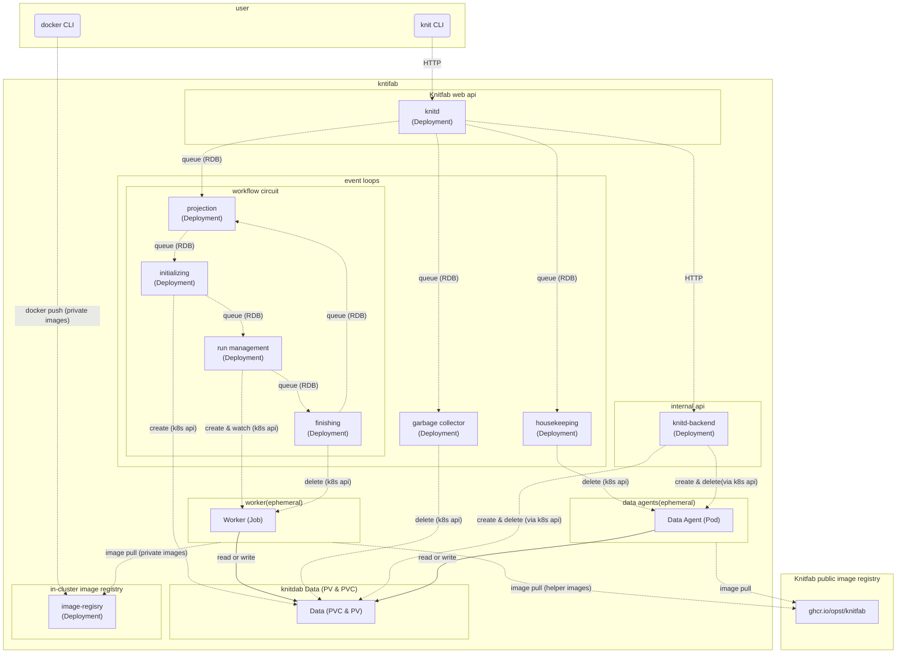

Knitfab 管理ガイド
=================

この文書は Knitfab を運用・管理する人に向けて書かれた。

- Knitfab をインストールする方法
- Knitfab の運用上の注意点
- Knitfab を構成する kubernetes リソースについて

などの話題を取り扱う。

Knitfab を管理・運用しないユーザにとっては関心の範囲を超えるであろう話題を扱っている。

Knitfab をインストールの事前準備
-----------------------

Knitfab のインストール作業を開始する前に、環境の用意をする必要がある。

- kubernetes クラスタ: Knitfab は kubenetes 上で稼働する。
- NFS: RDB やクラスタ内イメージレジストリ、Knitfab のデータなどを永続化するために、NFS を利用する。

とくに NFS は、ユーザがデータをどんどん蓄積してゆく先になる。容量は大きめに確保しておいたほうが良いだろう。

### kubernetes

kubernetes の構築手法については、公式リファレンスを参考にしてほしい。

- https://kubernetes.io/docs/setup/production-environment/tools/kubeadm/create-cluster-kubeadm/
- https://kubernetes.io/docs/setup/production-environment/container-runtimes/
- https://kubernetes.io/docs/tasks/administer-cluster/kubeadm/configure-cgroup-driver/

なお、Knitfab 開発チームでは、次の条件で構築した kubernetes クラスタについて動作を確認している。

- kubernetes 1.29.2
- コンテナランタイム: containerd
- cgroup: systemd

#### CNI をインストールする

kubenetes のネットワーク機能を有効化するために、何らかの CNI (container network interface) をインストールする必要がある。

Knitfab 開発チームは [calico](https://docs.tigera.io/calico/latest/about) で動作を確認している。

#### GPU を有効化する

kubernetes 上のコンテナから GPU を使えるようにするには、node をそのように設定しておく必要がある。

これも公式リファレンスを参考にしながら構築を進めて欲しい。

- https://kubernetes.io/ja/docs/tasks/manage-gpus/scheduling-gpus/

#### シングルノードクラスタ

kubernetes クラスタを単一ノード (control plane ノード) のみのクラスタで運用し始める場合は、そのノードに指定されている taint を除去する必要がある。
そうでないと、Knitfab のコンポーネントが起動できるノードが存在しない、という状態になる。

詳細は https://kubernetes.io/docs/setup/production-environment/tools/kubeadm/create-cluster-kubeadm/#control-plane-node-isolation を参照されたい。

### NFS サーバ

Knitfab では、デフォルトの [ストレージクラス](https://kubernetes.io/docs/concepts/storage/storage-classes/) として、ストレージドライバ [csi-driver-nfs](https://github.com/kubernetes-csi/csi-driver-nfs) によるものを採用している。コンテナの起動するノードによらず Knitfab のデータにアクセスできるようにするためである。

Knitfab は NFSv4 を前提としている。

そこで、kubernetes クラスタの各ノードからアクセス可能なネットワーク上の位置に、NFS を構築してほしい。
NFS 機能を有する NAS でよいはずだが、既存の計算機に nfsd を立てても構わない。

> たとえば Ubuntu なら、
>
> - `nfs-kernel-server` パッケージをインストールして (`apt install nfs-kernel-server`) 、
> - `/etc/exports` に設定ファイルを配置することで
>
> NFS サーバにできる。

Knitfab をインストールする
-----------------------

### 事前に用意するもの

Knitfab をインストールするためには、次のツールが必要である。

- [helm](https://helm.sh/)
- bash
- wget

また、インターネットアクセス、およびインストール先の kubernetes クラスタに対してアクセス権のある kubeconfig ファイルも必要である。

もし単一ノードクラスタを構成するつもりなら、少なくとも 4GB のメモリが必要である。
なお、この要件は最低限 Knitfab が起動する程度を述べているにすぎない。実行される機械学習タスクに応じ、より多くのメモリが必要となるだろう。

####  (選択) TLS 証明書を用意する

Knitfab API やクラスタ内イメージレジストリは https で通信を行う。
インストールスクリプトはそのための証明書を生成するが、代わりに特定の証明書を指定して使うこともできる。

- CA 証明書とその鍵があれば、それを使う
- 加えて、サーバ証明書とその鍵があれば、それを使う

たとえば「 kubernetes クラスタのノードに対して特定のドメイン名が使いたい」などといった要求があるなら、事前にサーバ証明書とそれに署名した CA 証明書 (およびそれらの鍵) が必要である。

証明書類が与えられない場合、インストーラは自己署名証明書と、それで署名したサーバ証明書を生成する。

### 手順

1. インストーラを手に入れる。
2. インストール設定ファイルを生成し、パラメータを調整する。
3. インストールを実行する。
4. ユーザにハンドアウトを配布し、利用開始してもらう。

#### 手順1: インストーラを手に入れる

インストーラは https://github.com/opst/knitfab/installer/installer.sh である。

これを適当なディレクトリ ( 次例では、仮に `~/knitfab` とした) にダウンロードする。

```
mkdir -p ~/knitfab/install
cd ~/knitfab/install
wget -O installer.sh https://raw.githubusercontent.com/opst/knitfab/main/installer/installer.sh
chmod +x ./installer.sh
```

#### 手順2: インストール設定ファイルを生成し、パラメータを調整する

```
./installer.sh --prepare
```

を実行すると、 `./knitfab_install_settings` ディレクトリに Knitfab のインストール設定が生成される。

> [!Note]
>
> もし特定の TLS 証明書類を利用したいなら、代わりに次のコマンドを実行する。
>
> ```
> TLSCACERT=path/to/ca.crt TLSCAKEY=path/to/ca.key TLSCERT=path/to/server.crt TLSKEY=path/to/server.key ./installler.sh --prepare
> ```
>
> サーバ証明書について指定がないなら、環境変数 `TLSCERT`, `TLSKEY` を省略して、次のようにする。
>
> ```
> TLSCACERT=path/to/ca.crt TLSCAKEY=path/to/ca.key ./installler.sh --prepare
> ```
>
>
> CA 証明書が指定されなかった場合には、インストーラは 自己署名証明書を自動的に生成する。
> サーバ証明書が指定されなかった場合には、インストーラは CA 証明書から自動的に生成する。

> [!Caution]
>
> **TLS証明書を指定した場合、それら証明書と鍵がインストール設定の一部として複製される。**
>
> - `knitfab-install-settings/certs/*` (ファイルのコピーとして)
> - `knitfab-install-settings/values/knit-certs.yaml` (base64エンコードされたテキストとして)
>

##### NFS を使うように設定する

**このコマンドで生成されるデフォルト設定は、「 Knitfab が管理している情報を永続化しない」ように記述されている。**

そこで、用意した NFS を利用してデータを永続化するように、設定を更新する。

変更すべきファイルは `knitfab-install-settings/values/knit-storage-nfs.yaml` である。
次のエントリを変更せよ。

- `nfs.external`: 値を `true` にする。
- `nfs.server`: コメントインして、 NFS サーバのホスト名 (ないし IP) を指定する。

さらに、必要に応じて次のエントリも変更せよ。

- `nfs.mountOptions`: NFS に対するマウントオプションについて特に指定があれば更新せよ。
- `nfs.share`: Knitfab に利用させたいサブディレクトリがあれば指定せよ。
    - そのサブディレクトリは、事前に作成しておく必要がある。

次のようになるだろう。

```yaml
nfs:
  # # external: If true (External mode), use NFS server you own.
  # #  Otherwise(In-cluster mode), knitfab employs in-cluster NFS server.
  external: true

  # # mountOptions: (optional) Mount options for the nfs server.
  # #  By default, "nfsvers=4.1,rsize=8192,wsize=8192,hard,nolock".
  mountOptions: "nfsvers=4.1,rsize=8192,wsize=8192,hard,nolock"

  # # # FOR EXTERNAL MODE # # #

  # # server: Hostname of the nfs server.
  # #  If external is true, this value is required.
  server: "nfs.example.com"  # update this to your NFS server host.

  # # share: (optional) Export root of the nfs server. default is "/".
  share: "/"

  # # # FOR IN-CLUSTER MODE # # #

  # # hostPath: (optional) Effective only when external is false.
  # # If set, the in-cluster NFS server will read/write files at this directory ON NODE.
  # #
  # # This is useful when you want to keep the data even after the NFS server is restarted.
  # hostPath: "/var/lib/knitfab"

  # # node: (optional) kubernetes node name where the in-cluster NFS server pod should be scheduled.
  # node: "nfs-server"
```

##### その他のインストール時パラメータについて

それら以外のファイルについても、必要に応じてパラメータを変更できる。

特に利用上影響があるのは次のものである。

- `knitfab-install-settings/values/knit-app.yaml` の `knitd.port`
- `knitfab-install-settings/values/knit-image-registry.yaml` の `port`

前者は Knitfab API のリッスンポート、後者はクラスタ内イメージレジストリのリッスンポートである。

また、 kubernetes クラスタ構築時に、クラスタの TLD をデフォルト値 ( `cluster.local` ) から変更していた場合には、次の項目にそのカスタムな TLD を設定せよ。

- `knitfab-install-settings/values/knit-app.yaml` の `clusterTLD` (コメントインして書き換える)


#### 手順3: インストールする

```
./installer.sh --kubeconfig path/to/kubeconfig -n NAMESPACE -s ./Knitfab-install-settings
```

このコマンドを実行することで、インストールスクリプトが順次 Knitfab のコンポーネントを kubernetes クラスタにインストールする。しばらく時間がかかるだろう。

#### 手順4: ユーザにハンドアウトを配布する

インストールされた Knitfab への接続情報が `knitfab-install-settings/handout` に生成されている。

このフォルダを、Knitfab を使おうとしているユーザに配布せよ。

このハンドアウトの使い方については、 user-guide に記述されている。

##### ハンドアウトを訂正する

Knitfab に対して特定のドメイン名でアクセスさせたい場合には (例: 指定したサーバ証明書がそうなっている) 、ユーザにハンドアウトを配布する前に、接続設定を書き換える必要がある。

**knitprofile ファイル** と呼ばれる、Knitfab API への接続設定が `knitfab-install-settings/handout/knitprofile` にある。このファイルは次の構成をした yaml ファイルである。

```yaml
apiRoot: https://IP-ADDRESS:PORT/api
cert:
    ca: ...Certification....
```

キー `apiRoot` の値が、Knitfab Web API のエンドポイントを示している。
デフォルトでは、クラスタの適当なノードの IP がセットされているはずである。

IP アドレスの代わりに特定のドメイン名でアクセスさせたいなら、この項目を変更せよ。

たとえば Knitfab に対して `example.com:30803` としてアクセスさせたいなら、

```yaml
apiRoot: https://example.com:30803/api
cert:
    ca: ...Certification....
```

のように、 `apiRoot` のホスト部分を書き換えればよい。

また、**クラスタ内リポジトリ** の証明書についても対処が必要である。

`knitfab-install-settings/handout/docker/certs.d/IP-ADDRESS:PORT` のような名前のディレクトリが見つかるだろう。
このディレクトリは、やはり適当な kubernertes ノードの IP とポート名を `:` でつないだものである。
この IP の部分を、アクセスさせたいドメイン名にリネームせよ。

### Knitfab をアンインストールする

インストールを実行すると `knitfab-install-settings/uninstall.sh` としてアンインストーラが生成される。

```
knitfab-install-settings/uninstall.sh
```

を実行すると、クラスタ内の Knitfab のアプリケーションがアンインストールされる。

さらに、

```
knitfab-install-settings/uninstall.sh --hard
```

を実行すると、データベースやクラスタ内イメージレジストリを含むすべての Knitfab 関連リソースが破棄される。


### Knitfab の helm 的構成について

Knitfab はいくつかの helm chart をインストールすることで構成されている。
このセクションでは、Knitfab の helm 的な構築方法について解説する。

管理者は Knitfab の一部をアンインストール・再インストールしたり、アップデートしたりしなくてはならない場合があるかもしれない。そうした場合にも、何をすればよいか見通しが立つようになるだろう。

> [!Note]
>
> このセクションは、読者に helm の知識があることを前提としている。

Knitfab は次の helm chart から構成されている。

- knitfab/knit-storage-nfs: NFS ドライバを導入し StorageClass を定義する。
- knitfab/knit-certs: 証明書類を導入する。
- knitfab/knit-db-postgres: RDB を定義する。
- knitfab/knit-image-registry: クラスタ内レジストリを定義する。
- knitfab/knit-app: 上記以外の Knitfab のコンポーネントを定義する。

helm chart リポジトリ "Knitfab" は (デフォルトでは)  https://raw.githubusercontent.com/opst/knitfab/main/charts/release である。

これらの chart を適切な手順でインストールできれば、Knitfab をインストールできる。
実際、インストーラはまさにそういうことをしているのである。

大雑把に言えば、次の手順で Knitfab はインストールされている。

```sh
NAMESPACE=${NAMESPACE}  # where Knitfab to be installed
CHART_VERSION=${CHART_VERSION:=v1.0.0}  # version of Knitfab to be installed
VALUES=./knit-install-settings/values

helm install -n ${NAMESPACE} --version ${CHART_VERSION} \
    -f ${VALUES}/knit-storage-nfs.yaml \
    knit-storage-nfs knitfab/knit-storage-nfs

helm install -n ${NAMESPACE} --version ${CHART_VERSION} \
    -f ${VALUES}/knit-certs.yaml \
    knit-certs knitfab/knit-certs

helm install -n ${NAMESPACE} --version ${CHART_VERSION} \
    --set-json "storage=$(helm get values knit-storage-nfs -n ${NAMESPACE} -o json --all)" \
    -f ${VALUES}/knit-db-postgres.yaml \
    knit-db-postgres Knitfab/knit-db-postgres

helm install -n ${NAMESPACE} --version ${CHART_VERSION} \
    --set-json "storage=$(helm get values knit-storage-nfs -n ${NAMESPACE} -o json --all)" \
    --set-json "certs=$(helm get values knit-certs -n ${NAMESPACE} -o json --all)" \
    -f ${VALUES}/knit-image-registry.yaml \
    knit-image-registry Knitfab/knit-image-registry

helm install -n ${NAMESPACE} --version ${CHART_VERSION} \
    --set-json "storage=$(helm get values knit-storage-nfs -n ${NAMESPACE} -o json --all)" \
    --set-json "database=$(helm get values knit-db-postgres -n ${NAMESPACE} -o json --all)" \
    --set-json "imageRegistry=$(helm get values knit-image-registry -n ${NAMESPACE} -o json --all)" \
    --set-json "certs=$(helm get values knit-certs -n ${NAMESPACE} -o json --all)" \
    -f ${VALUES}/knit-app.yaml \
    knit-app Knitfab/knit-app
```

> インストーラは以上の操作に加えて、これらの挙動をもっと安定させるために追加のオプションを与えたり、アンインストーラやハンドアウトを生成したりしている。

途中に度々現れている `--set-json "...=$(helm get values ...)"` というパターンは、インストール済の chart からインストールパラメータ ([helm の Values](https://helm.sh/docs/chart_template_guide/values_files/)) を読み出して、chart 間で矛盾がないようにしている。

それに加えて `./knitfab-install-settings/values/CHART_NAME.yaml` をその chart 用の Values として取り込んでいる。
したがって、特定の chart のみを再インストールしたり、アップデートしたりする必要に迫られた場合は、この手法を踏襲することになる。

> [!Caution]
>
> 次の chart をアンインストールすると、Knitfab 内のリネージやデータを喪失する。chart をアンインストールする際には注意されたい。
>
> - knitfab/knit-storage-nfs
> - knitfab/knit-db-postgres
> - knitfab/knit-image-registry
>
> knit-db-postgres や knit-image-registry は、それぞれ PVC も定義しているので、これらの chart をアンインストールすると、それまでのデータベースの内容や、`docker push` されたイメージが失われる。
> 結果として、PVC と Knitfab 的なデータとの関係や、プランが参照するイメージが失われるので、Knitfab のリネージ管理の前提が満たされないことになる。
>
> また、knit-storage-nfs は他の全ての PV を NFS 上に記録する機能を提供している。これが失われると、全 Pod が PV にアクセスできなくなる。


ユーザに開示すべきクラスタの情報
--------------------------

Knitfab の機能には、インストールされている kubernetes クラスタの設定に依存するものがある。
そうした機能をユーザがうまく活用するためには、ユーザに対してクラスタの設定に関する情報が開示されていなくてはならない。

Knitfab を構築した管理者として、ユーザに適切な情報開示をすべきだ。

### クラスタ内イメージレジストリの接続情報

ハンドアウト内の `docker/certs.d` ディレクトリ内を見ればわかることではあるが、利用すべきクラスタ内イメージレジストリのホスト・ポートについては、ユーザに対して明示的に案内すべきだろう。

### "プラン"の `resources` に指定できるリソースと上限

Knitfab の"プラン"定義には、その"プラン"に基づく"ラン"が利用する計算機資源を宣言する機能 `resources` がある。

この値として、クラスタに存在しないような規模の cpu や memory が指定されても、そのような"プラン"の"ラン"は実行できないだけである。

設定可能な値のバリエーションについて、管理者はユーザに極力開示したほうがいいだろう。

また、kubernetes では、GPU を搭載したノードがある場合に、GPU が schedulable resource として公開される。
具体的に指定できるリソースの名称 (例: `nvidia.com/gpu`, `amd.com/gpu`) はノードの構成次第である。
こうした、拡張的なリソース名称が使えるならば、その旨もユーザに開示すべきだ。

### "プラン"の `on_node` で利用できるラベル: ノードの label と taint

Knitfab の"プラン"定義には kubernetes のノードに設定された label と taint を利用した機能 `on_node` がある。

管理者は、ユーザに向けて、`on_node` 機能で利用できるラベルとその意味するところについて開示すべきである。

> [!Note]
>
> **Knitfab が推奨する taint と label の設定**
>
> もし node に taint をセットするなら、同じキーバリュー組で label もセットする。
>

#### node の label とは

kubenetes におけるノードの [label](https://kubernetes.io/docs/concepts/overview/working-with-objects/labels/) とは、ノードのメタデータである。ラベルはキーバリュー型の構造をとる。
kubernetes には、Pod に対して「ある label のあるノードで必ず、あるいは優先的に実行する」という制約をかけることができる ([node Affinity](https://kubernetes.io/docs/concepts/scheduling-eviction/assign-pod-node/#node-affinity)) 。

#### node の taint とは

kubenetes におけるノードの [taint](https://kubernetes.io/docs/concepts/scheduling-eviction/taint-and-toleration/) とは「ノードに pod を配置 **しない** ようにする制約」である。
これに対して、taint を無視してよい、という属性 (toleration) を Pod に与えることができる。こうすると、適当な toleration のある Pod だけが taint のあるノード上に配置されうるのである。

taint は、label のようなキーバリュー組とあわせて taint の強さ (NoSchedule, PreferNoSchedule) が設定できる。

たとえば「 GPU のあるノードには、特に GPU を必要としないタスクが配置されないようにしたい」なら、node に taint を設定する必要がある。

#### "プラン"の on_node はどのように label と taint を利用しているのか

user-guide に詳しく書いたが、Knitfab では、"プラン"定義に `on_node` という属性をもたせることができる。
これは、その"プラン"に基づいた"ラン"がどういうノード上で実行されてよいか、を示すもので、kubernetes 的には toleration と node Affinity の値として利用される。

"プラン"定義の `on_node` は次のように記述される。

```yaml
on_node:
  may:
    - "key=value"
  prefer:
    - "vram=large"
  must:
    - "accelarator=gpu"
```

`may`, `prefer`, `must` は、いずれも kuberenets の node label と同じ形式をした値の配列をセットする。
`may` はノードへの配置許可、 `prefer` はノードへの優先配置、 `must` はノードへの強制配置を意味する。

具体的には、これらはそれぞれ、Worker の属性として、次のように翻訳される。

- `may`:
    - `toleration`: `NoSchedule` のラベル
- `prefer`:
    - `toleration`: `NoSchedule` および `PreferNoSchedule` のラベル
    - node Affinity: `preferredDuringSchedulingIgnoredDuringExecution` のラベル
- `must`
    - `toleration`: `NoSchedule` および `PreferNoSchedule` のラベル
    - node Affinity: `requiredDuringSchedulingIgnoredDuringExecution` のラベル

推奨事項として「 taint をセットしたなら、そのラベルを node にも直接セットする」を掲げたのは、`on_node` 機能が同じラベルを toleration と node Affinity に使い回すから、である。

重要な注意点
---------------------

> [!Caution]
>
> **Knitfab をパブリックなネットワークに公開してはならない。**
>
> 現時点のKnitfab やクラスタ内イメージレジストリは、認証や認可の仕組みが一切ない。
>
> パブリックなインターネットに公開すると、次のリスクがある。
>
> - 悪意あるコンテナを実行させられる
> - 悪意あるコンテナイメージを配信させられる
>
> 前者は、計算機資源を奪われるだけでなく、kubernetes の未知の脆弱性をつかれてさらなる脅威にさらされる可能性がある。
> 後者も、他の脅威の踏み台になりかねない。
>
> **重ねて警告する。Knitfab をパブリックなインターネットに公開してはならない。**
>


各要素の kubernetes 的な表現について
--------------------------------

### "データ"の実体

"データ"は、kubernetes 的には PersistntVolumeClaim (PVC) およびバインドされている PersistentVolume (PV) である。

Knitfab は、RDB に"データ"である PVC の名前を記録している。"データ"に割り当てられている"タグ"は RDB に書き込まれている。

### "プラン"の実体

"プラン"の実体は、RDB に記録されたレコードである。
ただし、このレコードにはコンテナイメージの名前が含まれている。

### "ラン"の実体

"ラン"の実体には、2つの側面がある。

ひとつは RDB 上に記録されたリネージ情報である。つまり、入力と、出力と、"プラン"の組み合わせを記録している。

もうひとつは、kubenetes 上で実施されている計算である。これは Worker と呼ばれる Job を起動することで実現する。
Worker は"ラン"ごとに最大 1 存在する。必要になったら起動され、不要になったら破棄される。


Knitfab の kubernetes 的構成
------------------

Knitfab の、特に kubernetes 的な構成要素について解説する。

Knitfab はいくつかの deployment, daemonset, service から構成されている。

### deployment, service

Knitfab を構成する **静的なコンポーネント** は次のものたちである。

| daemonset | 解説 | service | NodePort |
|:---------:|:----:|:--------:|:------:|
| knitd | Knitfab API サーバ | knitd | ✔ (30803) |
| knitd-backend | Knitfab 内部 APIサーバ | knitd-backend | |
| database-postgres | RDB | database | |
| image-registry-registry | クラスタ内イメージレジストリ | image-registry | ✔ (30503) |
| csi-nfs-controller |  NFS を PV として使えるようにする (csi-driver-nfs 由来)  | | |
| projection-leader |  "ラン" を生成する | | |
| initialize-leader |  "ラン" を起動する準備をする | | |
| run-management-leader |  "ラン" を起動し死活監視する | | |
| finishing-leader | 停止した "ラン" の破棄 | | |
| garbage-collecion-leader | 不要になった PVC の破棄 | | |
| housekeeping-leader | その他放置されたリソースの破棄 | | |

NodePort 列に ✔ が入っている service は、クラスタ外からアクセスされることが想定されている。カッコ付きでデフォルトのポート番号を示しておいた。
ユーザは、knitd service に対して Knitfab の API アクセスを (CLI 経由で) する。また、カスタムイメージを image-regisrty service に対して push する。

コンポーネント間のメッセージは次図のように流れる。



通信は点線、コンテナ内のファイル読み書きは実線で示した。
また、RDB や kubernetes api へのデータフローは煩雑になるので省いた。コンポーネント間の通信手段であるかのように表現してある。

ユーザは `knit` CLI を使って knitd にリクエストを送る。 knitd はそれに応じて RDB のレコードを操作する。

"knitfab" とラベル付けられた囲みの範囲内が、お使いの kubernetes クラスタ内に構築されている Knitfab の範囲である。

Web API を提供するコンテナ knitd が CLI からリクエストを受け取る。一部リクエストは 内部 API である knitd_backend にプロキシされて、 kubernetes API を呼び出している。

イベントループ (event loops) の各コンポーネントは、定期的に RDB を監視して、各々果たすべきタスクを探している。特に、workflow circuit とラベル付けられているイベントループの集まりは、

- "プラン" や "データ" から "ラン" を生成し (projection) 、
- 出力 "データ" の実体となる PVC を確保して (initializing) 、
- "ラン" を Worker として起動して終了まで監視し (run management) 、
- 終了した worker を破棄しつつ "ラン" を完了させる (finishing)

...という一連の流れでもって、ワークフローを駆動させている。
この Worker とは、Job を実体とした Knitfab の **動的なコンポーネント** のひとつである。
Worker の主体はユーザ定義コンテナであるが、それ以外にも Knitfab の公開レジストリ (`ghcr.io/opst/Knitfab`) から提供されるイメージも利用している。

housekeeping イベントループは、停止しているが破棄されていない Data Agent を探して、これを破棄する。

garbage collector イベントループは、knitd によって「削除して良い」とマークされた PVC と PV を定期的に削除する。

図中に登場する Data Agent は、Knitfab が有するもうひとつの **動的なコンポーネント** である。この実体は Pod である。
ユーザが "データ" をアップロードしたりダウンロードしたりしようとすると、そのタスクが knitd から knitd_backend に対して下請けにだされる。knitd_backend は要求に応じた PVC をマウントした Data Agent 起動して、具体的な読み書きをさらに下請けに出す。読み書きが終わって不要になった Data Agent は、原則 knitd_backend によって破棄される。Data Agent のイメージは、Knitfab の公開レジストリ (`ghcr.io/opst/Knitfab`) から提供される。

ユーザは自作したプライベートなコンテナイメージをクラスタ内イメージレジストリ (image-regisrty) に `docker push` する。
Worker が起動するに当たり、ユーザ定義のイメージは image-registry から pull されることになるだろう。
その他、Worker を構成するコンテナは、 Knitfab の公開レジストリから提供される。

> [!Warning]
>
> 動的なコンポーネントは、既に述べた通り `ghcr.io/opst/knitfab` からイメージを pull することで起動する。
>
> したがって、インターネットアクセスがない場合や、 ghcr.io に何らかの障害が起きている場合には動的コンポーネントの起動に失敗する可能性がある。

### daemonset

- vex: そのノード上の pod がマウントしている PVC のキャパシティが足りなくなったら、自動的に拡張する。

ただし、NFS は PVC のキャパシティはあまり意味を持たないので、この daemonset も現時点ではそれほど有意義なものではない。

### その他のリソース

さらに、Knitfab をインストールすると、次のリソースも作成される。

- StorageClass: NFS を利用した PersistnetVolume を作成できるようにするため。
- PersistentVolume, PersistnetVolumeClaim: RDB とクラスタ内イメージレジストリの記憶領域として。
- Role, RoleBinding, ServiceAccount: k8s API にアクセスするため。
- ConfigMap, Secret: knitd, knitd-backend の設定ファイル, RDB の認証情報, TLS 証明書類
- PriorityClass: ワーカ(後述)用の PriorityClass

日常的な監視
-----------

通常のシステム監視と同様の監視をすることになる。具体的には

- ノードの計算機資源 (メモリ使用量・ CPU 使用量・ロードアベレージ)
- 通信量
- NFS のストレージ容量

ノードの計算機資源が不足している場合は、その理由が重要である。
Worker が大量に起動しているのであれば、ある意味では正常である。単に順次実験が進行するのを待てばよい。あるいは、ノードを追加できればスループット (時間あたり "ラン" の終了数) を改善できる可能性がある。

NFS のストレージ容量には注意して欲しい。これが不足すると、ユーザの実験が生成した"データ"を記録できなくなる。余裕がある状態を維持したい。

トラブルシュート
----------------

Knitfab がうまく動いていない、とユーザから相談を受けた場合に、少なくとも調べるべき観点について説明する。

### "ラン"が starting になったが、いつまでたっても running にならない or すぐに失敗する

#### 可能性1. Worker の Pod が正常に起動しないのかもしれない。

ユーザに、当該 "ラン" の Run ID を尋ねよう。そのうえで、

```
kubectl -n ${NAMESPACE} get pod
```

を実行して、実行されている Pod の状況を調べる。

問題の Worker の Pod は

```
worker-run-${RUN_ID}-${RANDOM_SUFFIX}
```

という Name をしているだろう。Run ID が `3cb1b091-01ad-41b1-acac-3f042f9df97c` なら、

```
worker-run-3cb1b091-01ad-41b1-acac-3f042f9df97c-wkgrq
```

のようになる。

そうした Pod を探し、 `kubectl describe pod ${POD_NAME}` や `kubectl get pod -o yaml pod ${POD_NAME}` を使って原因を探る。

たとえば、

- `ImagePullBackoff`, `ImagePullError` など:
    - "プラン" に指定されているイメージが実在しないのかもしれない。
    - クラスタ内イメージレジストリがダウンしていないだろうか？
    - ghcr.io が障害を起こしているときに、新しいノード上で worker を起動しようとした場合にはこうなる可能性がある。
- `Pending`:
    - "プラン" に指定されている cpu や memory が大きすぎないだろうか？
    - 存在しない label が `on_node` に指定されていないだろうか？
    - 単に多量の "ラン" が存在していて、待たされているだけかもしれない。
- `Error`:
    - "ラン"の `exit` 属性の内容を確認する。
        - `OOMError`: "プラン" の `resources` に割り当てているメモリが小さすぎる。

#### 可能性2. イベントループのコンテナが存在しない、エラーを起こしている

メンテナンス等のために Deployment をスケールインしていると、イベントループの連鎖が止まってしまう。
各イベントループにつき少なくとも 1 つの Pod が存在するように設定する。

- Error のままになっているイベントループ Pod がないか確認する。
- `kubectl logs` で動作が止まっているイベントループ Pod がないか確認する。

こうしたコンテナがあるようなら、 `kubectl delete` で Pod を削除する。
Deployment が自動的に必要数まで Pod を起動するのを待って、様子を見る。

### システム側 Pod が頻繁に停止する

ログや `kubectl desctibe` を利用して、停止する理由を探る必要がある。

異常停止を繰り返している Pod が knitd, knitd-backend とイベントループに限られているなら、database-postgres が正常な状態にない可能性がある。

- 異常停止を起こした Pod のログを読んで、データベースに対するアクセスエラーを起こしていないか確認する
- database-postgres のログを読んで、異常を起こしていないか確認する
- Config Map, Secret など、静的コンポーネントが前提としている他のリソースが消滅していないか確認する
    - `kubectl describe` をすると、不足がないかどうかわかるだろう。

また、ノードのメモリは十分だろうか？

シングルノードの Knitfab を構成する場合、 4GiB 程度のメモリ容量が必要であった。
これを下回る仮想マシン上に Knitfab のデプロイを試みたところ、静的なコンポーネントが不規則に停止・再起動を繰り返した。

### なにか調子の悪い Pod がいる、再起動したい

いつでも `kubectl pod delete` して構わない。

Knitfab の Pod は、突然に終了されても整合性を損なわないように設計されている。

ただし、Worker や Data Agent を突然終了すると、ユーザの機械学習タスクやデータのアップロード・ダウンロードは失敗するだろう。

また、スケールイン・スケールアウトについても、 kubernetes の Deployment としてスケーリングすればよい。

### ノードを追加したい

kubenetes の手順に従って追加して良い。
Worker や Data Agent を配置できるノードを増やすことができるだろう。

ただし、v1.0.0 の時点においては、TLS 証明書は新規追加されたノードには対応していない。
ユーザからのリクエストは、以前からあるノードに対して送られるべきだ。さもなければ、証明書エラーになるだろう。
